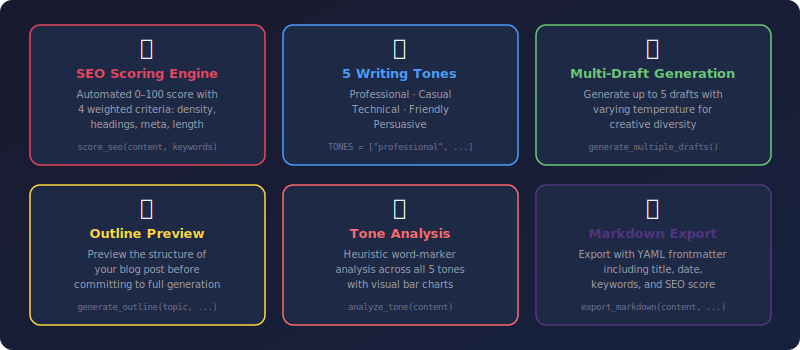
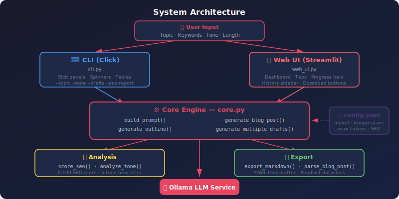

<div align="center">


<br/>


<br/>

<strong>Project #31 of the <a href="https://github.com/kennedyraju55/90-local-llm-projects">90 Local LLM Projects</a> collection</strong>

</div>

<br/>

> **Generate SEO-optimized, publication-ready blog posts using a locally-hosted LLM — no API keys, no cloud costs, complete data privacy.**

---

<p align="center">
<a href="#-why-this-project">Why This Project?</a> •
<a href="#-features">Features</a> •
<a href="#-quick-start">Quick Start</a> •
<a href="#-cli-reference">CLI Reference</a> •
<a href="#-web-ui">Web UI</a> •
<a href="#-architecture">Architecture</a> •
<a href="#-api-reference">API Reference</a> •
<a href="#%EF%B8%8F-configuration">Configuration</a> •
<a href="#-testing">Testing</a> •
<a href="#-faq">FAQ</a> •
<a href="#-contributing">Contributing</a>
</p>

---

## 🤔 Why This Project?

Content creation is time-consuming. While cloud-based AI writing tools exist, they come with recurring costs, data privacy concerns, and vendor lock-in. **Blog Post Generator** brings the power of modern LLMs to your local machine.

| Aspect | ✍️ Manual Writing | 🤖 Blog Post Generator |
|---|---|---|
| **Time per post** | 2–4 hours | 30–60 seconds |
| **SEO optimization** | Manual research | Automated 0–100 scoring |
| **Tone consistency** | Varies by mood | 5 configurable tones |
| **Draft variations** | Rewrite from scratch | Up to 5 drafts in one run |
| **Cost** | Free (but slow) | Free (and fast) |
| **Data privacy** | Depends on tool | 100% local — nothing leaves your machine |
| **Outline planning** | Separate step | Built-in `--outline` preview |
| **Export format** | Copy-paste | Markdown with YAML frontmatter |

---

## ✨ Features

<div align="center">



</div>

<br/>

### 🔍 SEO Scoring Engine

The `score_seo()` function evaluates generated content against **4 weighted criteria** totaling a **0–100 score**:

| Criterion | Max Points | What It Measures |
|---|:---:|---|
| **Keyword Density** | 30 | Target keyword frequency (1–3% optimal range) |
| **Heading Structure** | 25 | Proper use of H1, H2, H3 hierarchy |
| **Meta Description** | 20 | Presence and quality of meta description |
| **Content Length** | 25 | Minimum 300 words (configurable via `config.yaml`) |

Results are displayed as a Rich table with **star ratings** (★★★) in the CLI and **progress bars** in the Streamlit UI.

### 🎨 5 Writing Tones

Choose from five distinct writing styles defined in `TONES`:

- **Professional** — Formal, authoritative language for business and enterprise content
- **Casual** — Conversational, approachable style for personal blogs
- **Technical** — Precise, jargon-appropriate language for developer audiences
- **Friendly** — Warm, engaging tone for community and lifestyle content
- **Persuasive** — Action-oriented, compelling language for marketing and sales

### 📄 Multi-Draft Generation

`generate_multiple_drafts()` produces **up to 5 alternative versions** of your blog post by varying the LLM temperature parameter. Each draft explores a different creative direction while maintaining the same topic and keywords. Compare drafts side-by-side in the Web UI's tabbed interface.

### 📋 Outline Preview

Before committing to a full generation, use `generate_outline()` (or the `--outline` CLI flag) to preview the proposed structure. Review headings, subheadings, and key points — then proceed to full generation only when satisfied.

### 🎭 Tone Analysis

The `analyze_tone()` function performs **heuristic word-marker analysis** across all 5 tones. It scans the generated content for tone-specific vocabulary and returns a percentage breakdown displayed as bar charts in the CLI and Web UI.

### 💾 Markdown Export

`export_markdown()` writes your blog post to disk with a complete **YAML frontmatter** header:

```yaml
---
title: "AI in Healthcare: Transforming Patient Care"
date: "2025-07-16"
keywords: ["AI", "healthcare", "machine learning"]
tone: "professional"
seo_score: 92.5
word_count: 847
---
```

---

## 🚀 Quick Start

### Prerequisites

| Requirement | Version | Purpose |
|---|---|---|
| **Python** | 3.10+ | Runtime |
| **Ollama** | Latest | Local LLM server |
| **LLM Model** | llama3, gemma4, etc. | Text generation |

### 1. Install Ollama & Pull a Model

```bash
# Install Ollama (https://ollama.ai)
# Then start the server and pull a model:
ollama serve
ollama pull llama3
```

### 2. Clone & Install

```bash
git clone https://github.com/kennedyraju55/blog-post-generator.git
cd blog-post-generator
pip install -r requirements.txt
```

### 3. Install as CLI Tool (Optional)

```bash
pip install -e .
# Now you can use: blog-gen --topic "..."
```

### 4. Generate Your First Post

```bash
python -m blog_gen.cli --topic "The Future of AI" \
  --keywords "artificial intelligence,machine learning,deep learning" \
  --tone professional --length 800
```

**Expected output:**

```
╭─ Blog Post Generator ──────────────────────────────────╮
│  📝 Blog Post Generator v2.0.0                         │
╰─────────────────────────────────────────────────────────╯

  Topic:         The Future of AI
  Keywords:      artificial intelligence, machine learning, deep learning
  Tone:          professional
  Target Length:  ~800 words

⠋ Generating blog post via Ollama (llama3)...

╭─ Generated Blog Post ──────────────────────────────────╮
│                                                        │
│  # The Future of AI: What Lies Ahead                   │
│                                                        │
│  > Artificial intelligence is no longer a futuristic    │
│  > concept — it's reshaping industries today...        │
│                                                        │
│  ## Introduction                                       │
│  The landscape of artificial intelligence has evolved   │
│  dramatically over the past decade...                  │
│                                                        │
│  ## The Rise of Deep Learning                          │
│  Machine learning, particularly deep learning, has      │
│  become the backbone of modern AI systems...           │
│                                                        │
╰─────────────────────────────────────────────────────────╯

  ✅ Word count: 823
  ✅ SEO Score:  87/100
```

---

## 💻 CLI Reference

The CLI is built with **Click** and uses **Rich** for beautiful terminal output.

### Entry Point

```bash
# Via module
python -m blog_gen.cli [OPTIONS]

# Via installed entry point
blog-gen [OPTIONS]
```

### Options

| Option | Type | Default | Description |
|---|---|---|---|
| `--topic` | `TEXT` | *required* | The blog post topic |
| `--keywords` | `TEXT` | `None` | Comma-separated SEO keywords |
| `--tone` | `CHOICE` | `professional` | One of: `professional`, `casual`, `technical`, `friendly`, `persuasive` |
| `--length` | `INT` | `800` | Approximate target word count |
| `-o, --output` | `PATH` | `None` | Save raw generated output to a file |
| `--drafts` | `INT (1-5)` | `1` | Number of alternative drafts to generate |
| `--outline` | `FLAG` | `False` | Preview the outline before generating |
| `--seo-report` | `FLAG` | `False` | Display the SEO analysis breakdown table |
| `--export-md` | `PATH` | `None` | Export as markdown with YAML frontmatter |

### Usage Examples

```bash
# Minimal — just a topic
blog-gen --topic "Cloud Computing Trends"

# Casual blog post with keywords
blog-gen --topic "Best Coffee Shops in NYC" \
  --keywords "coffee,NYC,cafe" \
  --tone casual --length 600

# Full pipeline: outline → 3 drafts → SEO report → export
blog-gen --topic "Kubernetes Best Practices" \
  --keywords "kubernetes,k8s,containers,DevOps" \
  --tone technical --length 1200 \
  --outline --drafts 3 --seo-report \
  --export-md k8s-best-practices.md

# Save raw output to file
blog-gen --topic "Remote Work Tips" -o remote-work.txt

# Persuasive marketing copy
blog-gen --topic "Why Your Business Needs AI" \
  --tone persuasive --length 500 \
  --seo-report --export-md ai-for-business.md
```

### SEO Report Output

When using `--seo-report`, the CLI renders a Rich table with star ratings:

```
              SEO Analysis Report
┏━━━━━━━━━━━━━━━━━━━━┳━━━━━━━┳━━━━━┳━━━━━━━━┓
┃ Criterion          ┃ Score ┃ Max ┃ Rating ┃
┡━━━━━━━━━━━━━━━━━━━━╇━━━━━━━╇━━━━━╇━━━━━━━━┩
│ Keyword Density    │  22.5 │  30 │ ★★★☆☆  │
│ Heading Structure  │  25.0 │  25 │ ★★★★★  │
│ Meta Description   │  20.0 │  20 │ ★★★★★  │
│ Content Length     │  25.0 │  25 │ ★★★★★  │
├────────────────────┼───────┼─────┼────────┤
│ TOTAL              │  92.5 │ 100 │        │
└────────────────────┴───────┴─────┴────────┘
```

### Tone Analysis Output

The CLI displays a horizontal bar chart for each detected tone:

```
              Tone Analysis
┏━━━━━━━━━━━━━━━━┳━━━━━━━━┳━━━━━━━━━━━━━━━━━━━━━━┓
┃ Tone           ┃  Score ┃ Distribution         ┃
┡━━━━━━━━━━━━━━━━╇━━━━━━━━╇━━━━━━━━━━━━━━━━━━━━━━┩
│ Professional   │  72.3% │ ████████████████░░░░  │
│ Technical      │  15.1% │ ████░░░░░░░░░░░░░░░░  │
│ Friendly       │   8.4% │ ██░░░░░░░░░░░░░░░░░░  │
│ Casual         │   3.1% │ █░░░░░░░░░░░░░░░░░░░  │
│ Persuasive     │   1.1% │ ░░░░░░░░░░░░░░░░░░░░  │
└────────────────┴────────┴──────────────────────┘
```

---

## 🌐 Web UI

The Streamlit-based web interface provides a full-featured browser experience.

### Launch

```bash
streamlit run src/blog_gen/web_ui.py
# Opens at http://localhost:8501
```

### Web UI Features

| Feature | Description |
|---|---|
| **Topic & Keywords** | Text inputs for blog topic and comma-separated SEO keywords |
| **Tone Selector** | Dropdown with all 5 tones (`professional`, `casual`, `technical`, `friendly`, `persuasive`) |
| **Length Slider** | Adjustable target word count |
| **Multi-Draft Tabs** | Generate up to 5 drafts, each in its own tab for comparison |
| **Outline Preview** | Button to preview blog structure before full generation |
| **SEO Dashboard** | Score gauge with progress bars for each of the 4 criteria |
| **Tone Analysis** | Visual bar chart breakdown of detected tones |
| **Export Buttons** | Download as plain markdown or with YAML frontmatter |
| **Session History** | Sidebar showing all previously generated posts in the current session |

---

## 🏗️ Architecture

<div align="center">



</div>

<br/>

The system follows a clean separation between **interfaces** (CLI, Web UI), the **core engine** (generation, analysis, export), and the **LLM service** (Ollama). All configuration is centralized in `config.yaml` and loaded via `load_config()` with caching.

### Project Structure

```
31-blog-post-generator/
├── src/
│   └── blog_gen/                  # Main package
│       ├── __init__.py            # Package init with version
│       ├── __main__.py            # python -m blog_gen support
│       ├── core.py                # Core engine: generation, SEO, tone, export
│       ├── cli.py                 # Click CLI with Rich output
│       └── web_ui.py              # Streamlit web interface
├── common/                        # Shared LLM client utilities
├── tests/
│   ├── __init__.py
│   ├── conftest.py                # Pytest path setup & fixtures
│   ├── test_core.py               # Unit tests for core functions
│   └── test_cli.py                # CLI integration tests
├── docs/
│   └── images/                    # SVG assets (banner, architecture, features)
├── config.yaml                    # Application configuration
├── setup.py                       # Package setup (entry point: blog-gen)
├── requirements.txt               # Dependencies
├── Makefile                       # Common tasks
├── .env.example                   # Environment variable template
└── README.md                      # This file
```

### Data Flow

```
User Input → build_prompt(topic, keywords, tone, length)
           → Ollama API (POST /api/generate)
           → parse_blog_post(raw_output, keywords, tone) → BlogPost dataclass
           → score_seo(content, keywords) → SEO breakdown dict
           → analyze_tone(content) → tone percentages dict
           → export_markdown(content, filepath, keywords) → .md file
```

---

## 📚 API Reference

The `blog_gen.core` module can be used as a Python library for programmatic blog generation.

### `BlogPost` Dataclass

```python
from dataclasses import dataclass
from datetime import datetime

@dataclass
class BlogPost:
    title: str
    content: str
    meta_description: str
    keywords: list[str]
    tone: str
    seo_score: float
    word_count: int
    created_at: datetime
```

### `generate_blog_post()`

Generate a complete blog post via the local LLM:

```python
from blog_gen.core import generate_blog_post

post = generate_blog_post(
    topic="AI in Healthcare",
    keywords=["machine learning", "diagnosis", "patient care"],
    tone="professional",
    length=800
)

print(post.title)            # "AI in Healthcare: Transforming Patient Care"
print(post.word_count)       # 823
print(post.seo_score)        # 87.5
print(post.meta_description) # "Discover how AI and ML are revolutionizing..."
print(post.tone)             # "professional"
print(post.created_at)       # datetime object
```

### `generate_outline()`

Preview the blog structure before committing to full generation:

```python
from blog_gen.core import generate_outline

outline = generate_outline(
    topic="Cloud Computing",
    keywords=["AWS", "Azure", "serverless"],
    tone="technical"
)

print(outline)
# 1. Introduction to Cloud Computing
# 2. Major Cloud Providers: AWS vs Azure
# 3. The Serverless Revolution
# 4. Cost Optimization Strategies
# 5. Conclusion & Next Steps
```

### `generate_multiple_drafts()`

Generate up to 5 drafts with varying temperature for creative diversity:

```python
from blog_gen.core import generate_multiple_drafts

drafts = generate_multiple_drafts(
    topic="Remote Work Tips",
    keywords=["productivity", "work from home"],
    tone="friendly",
    length=600,
    num_drafts=3  # max 5
)

for i, draft in enumerate(drafts, 1):
    print(f"Draft {i}: {draft.title} ({draft.word_count} words, SEO: {draft.seo_score})")
```

### `score_seo()`

Evaluate content against SEO best practices:

```python
from blog_gen.core import score_seo

seo = score_seo(
    content="# My Blog Post\n\nThis is the content with keywords...",
    keywords=["blog", "content", "keywords"]
)

print(seo)
# {
#     "keyword_density": 22.5,     # out of 30
#     "heading_structure": 25.0,   # out of 25
#     "meta_description": 15.0,    # out of 20
#     "content_length": 25.0,      # out of 25
#     "total": 87.5                # out of 100
# }
```

### `analyze_tone()`

Perform heuristic tone analysis with word markers:

```python
from blog_gen.core import analyze_tone

tone_result = analyze_tone(content="Your blog post content here...")

print(tone_result)
# {
#     "professional": 0.45,
#     "casual": 0.12,
#     "technical": 0.28,
#     "friendly": 0.10,
#     "persuasive": 0.05
# }
```

### `export_markdown()`

Export content to a markdown file with YAML frontmatter:

```python
from blog_gen.core import export_markdown

export_markdown(
    content="# My Blog Post\n\nContent goes here...",
    filepath="output/my-post.md",
    keywords=["AI", "machine learning"]
)
# Creates output/my-post.md with YAML frontmatter
```

### `build_prompt()`

Build the LLM prompt string (useful for debugging or custom pipelines):

```python
from blog_gen.core import build_prompt

prompt = build_prompt(
    topic="AI Trends 2025",
    keywords=["AI", "trends"],
    tone="casual",
    length=600
)

print(prompt)  # Full prompt string sent to Ollama
```

### `load_config()`

Load and cache application configuration:

```python
from blog_gen.core import load_config

config = load_config()

print(config["llm"]["model"])        # "llama3"
print(config["llm"]["temperature"])  # 0.7
print(config["blog"]["max_drafts"])  # 5
```

---

## ⚙️ Configuration

All settings are centralized in `config.yaml` and loaded with caching via `load_config()`:

```yaml
app:
  name: "Blog Post Generator"
  version: "2.0.0"

llm:
  model: "llama3"              # Any Ollama-supported model
  temperature: 0.7             # Creativity level (0.0 = deterministic, 1.0 = creative)
  max_tokens: 2400             # Maximum response tokens

blog:
  default_tone: "professional" # Default writing tone
  default_length: 800          # Default target word count
  max_drafts: 5                # Maximum drafts per generation
  seo:
    min_keyword_density: 0.01  # Minimum keyword frequency (1%)
    max_keyword_density: 0.03  # Maximum keyword frequency (3%)
    min_word_count: 300        # Minimum words for full SEO score

logging:
  level: "INFO"
  format: "%(asctime)s - %(name)s - %(levelname)s - %(message)s"
```

### Configuration Tips

| Setting | Recommendation |
|---|---|
| `llm.model` | Use `llama3` for balanced quality/speed, `gemma4` for latest capabilities |
| `llm.temperature` | Lower (0.3–0.5) for factual content, higher (0.7–0.9) for creative posts |
| `llm.max_tokens` | Increase for longer posts (e.g., `4000` for 1500+ word articles) |
| `blog.default_length` | Set to your most common target word count |
| `seo.min_keyword_density` | Keep at `0.01` unless targeting specific SEO strategies |

---

## 🧪 Testing

The test suite uses **pytest** with **pytest-cov** for coverage reporting.

### Run All Tests

```bash
python -m pytest tests/ -v --tb=short
```

### Run with Coverage

```bash
python -m pytest tests/ -v --cov=blog_gen --cov-report=term-missing
```

### Run Specific Test Files

```bash
# Core function tests
python -m pytest tests/test_core.py -v

# CLI integration tests
python -m pytest tests/test_cli.py -v
```

### Using the Makefile

```bash
make test        # Run all tests
make coverage    # Run with coverage report
make lint        # Run linters
```

---

## 🌍 Local vs Cloud Comparison

| Feature | ☁️ Cloud AI (GPT, Claude) | 🏠 Blog Post Generator |
|---|---|---|
| **Cost** | $0.01–0.10 per post | **Free** (runs locally) |
| **Privacy** | Data sent to third-party servers | **100% local** — nothing leaves your machine |
| **Speed** | Fast (remote GPU) | Depends on hardware (10–60s typical) |
| **Internet required** | ✅ Yes | ❌ No (fully offline) |
| **API keys** | ✅ Required | ❌ Not needed |
| **Rate limits** | ✅ Yes | ❌ No limits |
| **Customization** | Limited to API options | Full control — modify prompts, models, configs |
| **Model choice** | Vendor-locked | Any Ollama model (llama3, gemma4, mistral, etc.) |
| **SEO analysis** | Usually separate tool | **Built-in** 0–100 scoring |
| **Tone control** | Prompt-based (variable) | **5 predefined tones** with analysis |

---

## ❓ FAQ

<details>
<summary><strong>Which LLM models are supported?</strong></summary>

Any model available through Ollama works with Blog Post Generator. Popular choices include:

- **llama3** — Meta's Llama 3 (good all-around performance)
- **gemma4** — Google's Gemma 4 (strong at structured writing)
- **mistral** — Mistral AI (fast, good for shorter posts)
- **phi3** — Microsoft Phi-3 (lightweight, runs on less RAM)

Change the model in `config.yaml` under `llm.model`, or pull a new model with `ollama pull <model-name>`.

</details>

<details>
<summary><strong>How does the SEO scoring work?</strong></summary>

The `score_seo()` function evaluates content across 4 criteria:

1. **Keyword Density (30 pts)** — Checks that target keywords appear at 1–3% frequency (configurable via `seo.min_keyword_density` and `seo.max_keyword_density`)
2. **Heading Structure (25 pts)** — Validates proper H1/H2/H3 hierarchy in markdown
3. **Meta Description (20 pts)** — Checks for a meta description (generated by `parse_blog_post()`)
4. **Content Length (25 pts)** — Ensures the post meets the minimum word count (default: 300, set via `seo.min_word_count`)

Scores are displayed as star ratings in the CLI (`_render_seo_table()`) and progress bars in the Web UI.

</details>

<details>
<summary><strong>Can I use this without the CLI or Web UI?</strong></summary>

Yes! The `blog_gen.core` module is designed to be used as a standalone Python library. Import and call functions directly:

```python
from blog_gen.core import generate_blog_post, score_seo, export_markdown

post = generate_blog_post("My Topic", ["keyword1"], "professional", 800)
seo = score_seo(post.content, ["keyword1"])
export_markdown(post.content, "output.md", ["keyword1"])
```

See the [API Reference](#-api-reference) section for full details.

</details>

<details>
<summary><strong>How do multi-draft generations work?</strong></summary>

When you use `--drafts N` (or the Web UI slider), `generate_multiple_drafts()` calls the LLM `N` times (up to 5) with **varying temperature** values. This produces drafts with different levels of creativity — from conservative and factual to more creative and varied — all for the same topic and keywords. In the Web UI, each draft appears in its own tab for easy comparison.

</details>

<details>
<summary><strong>What hardware do I need?</strong></summary>

- **Minimum:** 8 GB RAM, any modern CPU (will be slow, ~60s per post)
- **Recommended:** 16 GB RAM, modern CPU with AVX2 support (~15–30s per post)
- **Ideal:** 16+ GB RAM, GPU with 8+ GB VRAM for GPU-accelerated inference (~5–10s per post)

Smaller models like `phi3` work well on lower-end hardware. Larger models like `llama3:70b` require 32+ GB RAM.

</details>

---

## 🤝 Contributing

Contributions are welcome! Here's how to get started:

1. **Fork** the repository
2. **Clone** your fork and create a branch:
   ```bash
   git checkout -b feature/amazing-feature
   ```
3. **Install** dev dependencies:
   ```bash
   pip install -e ".[dev]"
   ```
4. **Write tests** for your changes in `tests/`
5. **Ensure all tests pass:**
   ```bash
   python -m pytest tests/ -v --cov=blog_gen
   ```
6. **Commit** and **push:**
   ```bash
   git commit -m "Add amazing feature"
   git push origin feature/amazing-feature
   ```
7. **Open a Pull Request** on GitHub

### Development Guidelines

- Follow existing code style and patterns in `core.py`
- Add tests for all new functions in `test_core.py` or `test_cli.py`
- Update this README if you add new CLI options or API functions
- Keep `config.yaml` backward-compatible when adding new settings

---

## 📄 License

This project is licensed under the **MIT License**. See the [LICENSE](LICENSE) file for details.

You are free to use, modify, and distribute this project for personal and commercial purposes.

---

<div align="center">

<br/>

**[⬆ Back to Top](#)**

<br/>

Part of the **[90 Local LLM Projects](https://github.com/kennedyraju55/90-local-llm-projects)** collection

Made with ❤️ and local LLMs — no cloud required.

<br/>

</div>
