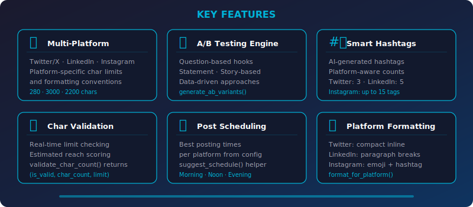
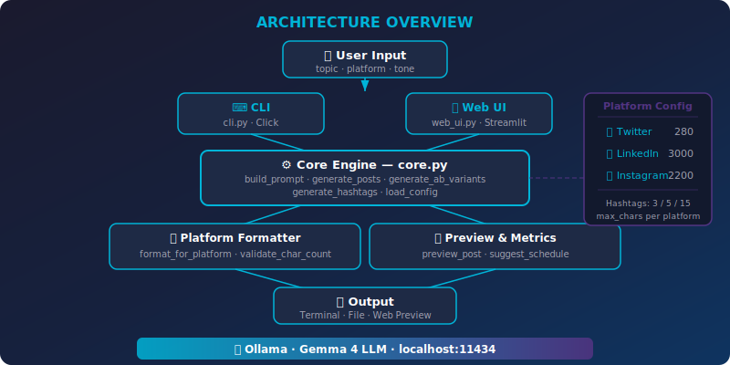

<div align="center">


<br/>

[](https://python.org)
[](https://ollama.ai)
[](https://streamlit.io)
[](https://click.palletsprojects.com)
[](LICENSE)
[]()

<br/>

<strong>Project #32 of the <a href="https://github.com/kennedyraju55/90-local-llm-projects">90 Local LLM Projects</a> collection</strong>

</div>

<br/>

> **✨ Generate platform-perfect, engagement-optimized social media posts for Twitter, LinkedIn, and Instagram — entirely offline using a local LLM through Ollama.**

---

<p align="center">
<a href="#-why-this-project">Why?</a> •
<a href="#-features">Features</a> •
<a href="#-quick-start">Quick Start</a> •
<a href="#-cli-reference">CLI</a> •
<a href="#-web-ui">Web UI</a> •
<a href="#-architecture">Architecture</a> •
<a href="#-api-reference">API</a> •
<a href="#-platform-configuration">Config</a> •
<a href="#-testing">Testing</a> •
<a href="#-faq">FAQ</a>
</p>

---

## 🤔 Why This Project?

Writing social media content that resonates on every platform is tedious when done by hand.
Each platform has its own character limits, hashtag norms, and formatting conventions.
This tool eliminates that friction by letting a local LLM handle the heavy lifting — no
cloud API keys, no subscription fees, and your content never leaves your machine.

| | ❌ Manual Social Media Writing | ✅ Social Media Writer |
|---|---|---|
| **Speed** | 15–30 min per post across platforms | Seconds — all platforms at once |
| **Consistency** | Tone drifts across platforms | Same tone, tailored format per platform |
| **Hashtags** | Guesswork or manual research | AI-generated, platform-aware counts (3 / 5 / 15) |
| **Character Limits** | Copy-paste into the app to check | Real-time validation with reach scoring |
| **A/B Testing** | Write multiple drafts yourself | Auto-generated variants with distinct hooks |
| **Cost** | Cloud API fees or paid tools | 100 % free — runs on your local hardware |
| **Privacy** | Content sent to third-party servers | Everything stays on localhost |
| **Scheduling** | Look up best times manually | Built-in best posting times per platform |

---

## 🎯 Features

<div align="center">



</div>

<br/>

### 🌐 Multi-Platform Support

Generate content tailored to **Twitter/X** (280 chars), **LinkedIn** (3 000 chars), and
**Instagram** (2 200 chars). Each platform gets its own formatting rules, hashtag counts,
and character validation — or use `--all-platforms` to produce posts for every platform in
a single run.

### 🔬 A/B Testing Engine

The `generate_ab_variants()` function creates distinct post variants using four hook
strategies — **question-based**, **statement**, **story-based**, and **data-driven** — so
you can test which opening resonates best with your audience before publishing.

### #️⃣ Smart Hashtag Generator

`generate_hashtags(topic, platform, count)` produces AI-crafted hashtags tuned to each
platform's norms: **3** for Twitter, **5** for LinkedIn, and up to **15** for Instagram.
You can also invoke it standalone via the `--hashtags` CLI flag.

### ✅ Character Validation & Reach Scoring

`validate_char_count(content, platform)` returns a `(is_valid, char_count, limit)` tuple
in real time. The companion `preview_post()` function adds an **estimated reach score**
(0–100), hashtag count, and validity status so you can optimize before posting.

### 📅 Post Scheduling

`suggest_schedule(platform)` pulls the best posting times from `config.yaml` for each
platform — morning, midday, and evening slots — so you always publish when engagement
peaks.

### 🎨 Platform Formatting

`format_for_platform(content, platform)` automatically reformats your content:
- **Twitter** → compact, punchy, inline hashtags
- **LinkedIn** → paragraph breaks, professional structure
- **Instagram** → emoji-rich body with separated hashtag block

### 🎛️ Tone Control

Choose from five tones — `professional`, `casual`, `excited`, `informative`, or `humorous`
— and `build_prompt()` weaves the selected tone into the system prompt sent to the LLM.

### 🌐 Web UI

A full Streamlit dashboard with platform-mimicking preview cards, metrics panels, A/B
comparison views, and one-click copy — all running locally in your browser.

---

## 🚀 Quick Start

### Prerequisites

| Requirement | Version | Purpose |
|---|---|---|
| **Python** | 3.10 + | Runtime |
| **Ollama** | Latest | Local LLM server |
| **Gemma 4** (or any model) | — | Language model pulled into Ollama |
| **common/** module | — | Shared `llm_client` from the parent repo |

### Installation

```bash
# Navigate to the project
cd 32-social-media-writer

# Install Python dependencies
pip install -r requirements.txt

# Install package in editable mode (registers the `social-writer` CLI)
pip install -e .

# — or use the Makefile shortcut —
make install

# Copy the environment template and edit as needed
cp .env.example .env
```

### Your First Post

```bash
# Make sure Ollama is running
ollama serve          # in a separate terminal if not already running

# Generate a Twitter post about AI
social-writer --platform twitter --topic "the future of AI" --tone excited
```

**Example output:**

```
╭──────────────────────────────────────────────────────────╮
│  🐦 Twitter Post — Excited                              │
├──────────────────────────────────────────────────────────┤
│                                                          │
│  🚀 The future of AI isn't coming — it's HERE!           │
│  From self-driving cars to code that writes itself,      │
│  we're living in the sci-fi movie we always dreamed of.  │
│                                                          │
│  Are you building with AI or watching from the           │
│  sidelines? 👀                                           │
│                                                          │
│  #AI #FutureOfTech #Innovation                           │
│                                                          │
├──────────────────────────────────────────────────────────┤
│  ✅ 228 / 280 chars  │  #️⃣  3 hashtags  │  📊 Score: 78  │
╰──────────────────────────────────────────────────────────╯
```


## 🐳 Docker Deployment

Run this project instantly with Docker — no local Python setup needed!

### Quick Start with Docker

```bash
# Clone and start
git clone https://github.com/kennedyraju55/social-media-writer.git
cd social-media-writer
docker compose up

# Access the web UI
open http://localhost:8501
```

### Docker Commands

| Command | Description |
|---------|-------------|
| `docker compose up` | Start app + Ollama |
| `docker compose up -d` | Start in background |
| `docker compose down` | Stop all services |
| `docker compose logs -f` | View live logs |
| `docker compose build --no-cache` | Rebuild from scratch |

### Architecture

```
┌─────────────────┐     ┌─────────────────┐
│   Streamlit UI  │────▶│   Ollama + LLM  │
│   Port 8501     │     │   Port 11434    │
└─────────────────┘     └─────────────────┘
```

> **Note:** First run will download the Gemma 4 model (~5GB). Subsequent starts are instant.

---


---

## ⌨️ CLI Reference

The CLI is built with [Click](https://click.palletsprojects.com) and registered as the
`social-writer` console entry point via `setup.py`.

### Command Syntax

```
social-writer [OPTIONS]
```

### Options

| Flag | Type | Description | Default |
|---|---|---|---|
| `--platform` | `Choice` | Target platform — `twitter`, `linkedin`, or `instagram` | *required unless `--all-platforms`* |
| `--topic` | `String` | The subject of the post | *required* |
| `--tone` | `Choice` | Writing tone — `professional`, `casual`, `excited`, `informative`, `humorous` | `professional` |
| `--variants` | `Int` | Number of post variants to generate | `2` |
| `-o`, `--output` | `Path` | Save generated content to a file | `None` |
| `--hashtags` | `Flag` | Generate standalone hashtag suggestions only | `False` |
| `--schedule` | `Flag` | Display best posting times for the chosen platform | `False` |
| `--ab-test` | `Flag` | Generate A/B test variants with different hook strategies | `False` |
| `--all-platforms` | `Flag` | Generate posts for Twitter, LinkedIn, and Instagram in one run | `False` |

### Usage Examples

```bash
# Basic — LinkedIn post with professional tone (default)
social-writer --platform linkedin --topic "quarterly earnings"

# Multiple variants saved to file
social-writer --platform twitter --topic "product launch" --tone excited --variants 4 -o launch.txt

# A/B test — generates question, statement, story, and data-driven hooks
social-writer --platform twitter --topic "remote work productivity" --ab-test

# Standalone hashtag generation
social-writer --platform instagram --topic "travel photography" --hashtags

# Best posting times
social-writer --platform linkedin --topic "career tips" --schedule

# All platforms at once
social-writer --all-platforms --topic "company rebrand" --tone professional

# Run without installing the package
python src/social_writer/cli.py --platform twitter --topic "open source"
```

The CLI uses Rich tables internally (`_show_preview_table()`) to render post metrics
including character count, validity, hashtag count, and estimated reach score.

---

## 🌐 Web UI

Launch the Streamlit-powered web interface:

```bash
streamlit run src/social_writer/web_ui.py

# — or —
make web
```

### What You Get

| Feature | Details |
|---|---|
| **Platform Tabs** | Dedicated tab for each platform — Twitter/X, LinkedIn, Instagram |
| **Sidebar Controls** | Topic input, tone dropdown, variant slider, action buttons |
| **Preview Cards** | Platform-mimicking cards — dark Twitter card, white LinkedIn card, gradient Instagram card |
| **Character Bar** | 🟢 Green (< 80 %), 🟡 Yellow (80–100 %), 🔴 Red (over limit) |
| **Metrics Dashboard** | Character count, validity, hashtag count, estimated reach score |
| **A/B Comparison** | Side-by-side variant display with different hooks |
| **Hashtag Generator** | Dedicated mode for standalone hashtag suggestions |
| **Posting Schedule** | Best times displayed per platform |
| **Copy-to-Clipboard** | `st.code` blocks for quick copy-paste |

---

## 🏗️ Architecture

<div align="center">



</div>

<br/>

### Data Flow

```
User Input (topic, platform, tone)
     │
     ├──▶ cli.py  (Click CLI)
     │         │
     └──▶ web_ui.py  (Streamlit)
               │
               ▼
         ┌───────────┐
         │  core.py   │  build_prompt() → generate_posts()
         │            │  generate_ab_variants()
         │            │  generate_hashtags()
         └─────┬──────┘
               │  LLM call via common.llm_client
               ▼
         ┌───────────┐
         │  Ollama    │  localhost:11434  •  Gemma 4
         └─────┬──────┘
               │
               ▼
         format_for_platform()  →  validate_char_count()
               │
               ▼
         preview_post()  →  suggest_schedule()
               │
               ▼
         Output (terminal / file / web preview)
```

### Project Tree

```
32-social-media-writer/
├── src/
│   └── social_writer/
│       ├── __init__.py          # Package init with version
│       ├── core.py              # Core engine — prompts, generation, validation, formatting
│       ├── cli.py               # Click CLI — flags, Rich table output
│       └── web_ui.py            # Streamlit web interface
├── tests/
│   ├── __init__.py
│   ├── conftest.py              # Pytest fixtures and path setup
│   ├── test_core.py             # Unit tests for core.py
│   └── test_cli.py              # CLI integration tests
├── common/                      # Shared LLM client from parent repo
├── docs/
│   └── images/
│       ├── banner.svg           # Project banner
│       ├── architecture.svg     # Architecture diagram
│       └── features.svg         # Feature overview
├── config.yaml                  # Platform configs, LLM settings, logging
├── setup.py                     # Package setup with entry points
├── requirements.txt             # Python dependencies
├── Makefile                     # Dev shortcuts (install, test, web, lint)
├── .env.example                 # Environment variable template
└── README.md                    # This file
```

---

## 📖 API Reference

All public functions live in `src/social_writer/core.py`. Import them with:

```python
from social_writer.core import (
    generate_posts,
    generate_ab_variants,
    generate_hashtags,
    preview_post,
    format_for_platform,
    validate_char_count,
    suggest_schedule,
    build_prompt,
    load_config,
    PLATFORMS,
    TONES,
    PLATFORM_CONFIG,
)
```

### `generate_posts(platform, topic, tone, variants)`

Generate one or more social media posts for a given platform.

```python
posts = generate_posts(
    platform="twitter",
    topic="open source contributions",
    tone="excited",
    variants=2,
)

for post in posts:
    print(post.content)       # The generated text
    print(post.hashtags)      # List of hashtag strings
    print(post.char_count)    # Integer character count
    print(post.is_within_limit)  # True / False
    print(post.tone)          # "excited"
    print(post.platform)      # "twitter"
    print(post.created_at)    # datetime
```

Returns a list of `SocialPost` dataclass instances.

### `generate_ab_variants(topic, platform, tone, num_variants)`

Create A/B test variants using distinct hook strategies:

```python
variants = generate_ab_variants(
    topic="remote work productivity",
    platform="linkedin",
    tone="professional",
    num_variants=4,
)

# Each variant uses a different hook strategy:
#   - question-based   ("Have you ever wondered…")
#   - statement         ("Remote work is here to stay.")
#   - story-based       ("Last Tuesday, our team…")
#   - data-driven       ("Studies show 78 % of…")

for v in variants:
    print(f"[{v.tone}] {v.content[:80]}…")
```

### `preview_post(content, platform)`

Get a metrics snapshot before publishing:

```python
metrics = preview_post(
    content="🚀 Excited to share our new feature! #AI #Launch",
    platform="twitter",
)

print(metrics["char_count"])            # 49
print(metrics["is_valid"])              # True
print(metrics["hashtag_count"])         # 2
print(metrics["estimated_reach_score"]) # 0–100 integer
```

### `format_for_platform(content, platform)`

Apply platform-specific formatting rules:

```python
raw = "Check out our latest blog post about AI trends"

twitter_fmt   = format_for_platform(raw, "twitter")    # compact, inline hashtags
linkedin_fmt  = format_for_platform(raw, "linkedin")   # paragraph breaks
instagram_fmt = format_for_platform(raw, "instagram")  # emoji + separated hashtags
```

### `validate_char_count(content, platform)`

Check whether content fits within the platform's character limit:

```python
is_valid, char_count, limit = validate_char_count(
    content="Short and sweet 🐦",
    platform="twitter",
)

print(is_valid)    # True
print(char_count)  # 18
print(limit)       # 280
```

### `suggest_schedule(platform)`

Retrieve optimal posting times from the loaded configuration:

```python
times = suggest_schedule("linkedin")
# ["7:30 AM", "12:00 PM", "5:30 PM"]
```

### `build_prompt(platform, topic, tone, variants)`

Build the system + user prompt that is sent to the LLM:

```python
prompt = build_prompt(
    platform="instagram",
    topic="behind the scenes at a startup",
    tone="humorous",
    variants=1,
)
# Returns a platform-tailored prompt string ready for the LLM
```

### `generate_hashtags(topic, platform, count)`

Standalone hashtag generation without a full post:

```python
tags = generate_hashtags(
    topic="machine learning",
    platform="instagram",
    count=15,
)
# ["#MachineLearning", "#AI", "#DeepLearning", …]
```

### Constants & Config

```python
PLATFORMS        # ["twitter", "linkedin", "instagram"]
TONES            # ["professional", "casual", "excited", "informative", "humorous"]
PLATFORM_CONFIG  # dict with max_chars, hashtag_count per platform

config = load_config()   # Cached YAML config with LLM settings, best_times, etc.
```

---

## ⚙️ Platform Configuration

All platform parameters live in `config.yaml` and are loaded once by `load_config()`
with caching so repeated calls are free.

### Character Limits & Hashtag Counts

| Platform | Max Characters | Default Hashtags | Best Posting Times |
|---|---|---|---|
| 🐦 **Twitter / X** | 280 | 3 | 9:00 AM · 12:00 PM · 5:00 PM |
| 💼 **LinkedIn** | 3 000 | 5 | 7:30 AM · 12:00 PM · 5:30 PM |
| 📸 **Instagram** | 2 200 | 15 | 11:00 AM · 2:00 PM · 7:00 PM |

### Full `config.yaml` Reference

```yaml
app:
  name: "Social Media Writer"
  version: "2.0.0"

llm:
  model: "gemma4"          # Any model pulled into Ollama
  temperature: 0.8         # Higher = more creative (0.0–1.0)
  max_tokens: 2048         # Maximum response length

platforms:
  twitter:
    max_chars: 280
    name: "Twitter/X"
    hashtag_count: 3
    best_times: ["9:00 AM", "12:00 PM", "5:00 PM"]
  linkedin:
    max_chars: 3000
    name: "LinkedIn"
    hashtag_count: 5
    best_times: ["7:30 AM", "12:00 PM", "5:30 PM"]
  instagram:
    max_chars: 2200
    name: "Instagram"
    hashtag_count: 15
    best_times: ["11:00 AM", "2:00 PM", "7:00 PM"]

logging:
  level: "INFO"
  format: "%(asctime)s - %(name)s - %(levelname)s - %(message)s"
```

### Environment Variables

| Variable | Description | Default |
|---|---|---|
| `OLLAMA_HOST` | Ollama server URL | `http://localhost:11434` |
| `OLLAMA_MODEL` | Override the model from `config.yaml` | `gemma4` |
| `LOG_LEVEL` | Logging verbosity (`DEBUG`, `INFO`, `WARNING`, `ERROR`) | `INFO` |

---

## 🧪 Testing

Tests live in `tests/` and cover core logic (`test_core.py`) and CLI integration
(`test_cli.py`).

```bash
# Run the full test suite
pytest tests/ -v

# With coverage reporting
pytest tests/ -v --tb=short --cov=social_writer

# Individual test files
pytest tests/test_core.py -v
pytest tests/test_cli.py -v

# Makefile shortcut
make test
```

### What's Tested

| File | Covers |
|---|---|
| `test_core.py` | `generate_posts`, `validate_char_count`, `format_for_platform`, `preview_post`, `generate_hashtags`, `generate_ab_variants`, `suggest_schedule`, `build_prompt`, `load_config`, `PLATFORM_CONFIG` constants |
| `test_cli.py` | CLI flags (`--platform`, `--topic`, `--tone`, `--variants`, `--hashtags`, `--schedule`, `--ab-test`, `--all-platforms`, `-o`), error handling, Rich table output |

---

## 🏠 Local vs ☁️ Cloud Comparison

| Dimension | 🏠 Social Media Writer (Local) | ☁️ Cloud-Based Tools |
|---|---|---|
| **Privacy** | Content never leaves your machine | Data sent to third-party servers |
| **Cost** | Free — runs on your hardware | Monthly subscriptions or per-call API fees |
| **Latency** | Sub-second on modern GPUs | Network round-trip + queue times |
| **Customisation** | Swap models, tweak prompts, fork freely | Locked to vendor's model and UI |
| **Offline** | Works without internet | Requires constant connectivity |
| **Models** | Any Ollama-compatible model (Gemma, Llama, Mistral …) | Vendor-chosen model only |
| **Rate Limits** | None | Throttled by API quotas |
| **Data Retention** | You control storage | Vendor may retain / train on your data |

---

## ❓ FAQ

<details>
<summary><strong>Which LLM models work with this project?</strong></summary>

Any model available in Ollama works — Gemma 4, Llama 3, Mistral, Phi-3, Qwen, and more.
Set the model name in `config.yaml` under `llm.model` or override it with the
`OLLAMA_MODEL` environment variable. Larger models tend to produce more nuanced content
but require more VRAM.

</details>

<details>
<summary><strong>Can I use this without a GPU?</strong></summary>

Yes. Ollama can run models on CPU, though generation will be slower. For a smooth
experience on CPU-only machines, use smaller quantized models (e.g., `gemma:2b` or
`phi3:mini`).

</details>

<details>
<summary><strong>How do I add a new platform (e.g., Threads, Mastodon)?</strong></summary>

1. Add the platform key to `PLATFORMS` and `PLATFORM_CONFIG` in `core.py` with its
   `max_chars` and `hashtag_count`.
2. Add a corresponding section in `config.yaml` under `platforms:` with `best_times`.
3. Add a formatting branch in `format_for_platform()`.
4. The CLI and Web UI will pick it up automatically since they iterate over `PLATFORMS`.

</details>

<details>
<summary><strong>What does the "estimated reach score" mean?</strong></summary>

`preview_post()` returns an `estimated_reach_score` between 0 and 100. It is a heuristic
based on character usage efficiency, hashtag count, and content structure. It is **not** a
guarantee of actual reach — treat it as a relative quality signal for comparing variants.

</details>

<details>
<summary><strong>Can I generate posts for all platforms at once?</strong></summary>

Yes — use the `--all-platforms` flag:

```bash
social-writer --all-platforms --topic "product launch" --tone excited
```

This iterates over every entry in `PLATFORMS` and generates posts for each one in a single
command, displaying results in a consolidated Rich table.

</details>

---

## 🤝 Contributing

Contributions are welcome! Whether it's a bug fix, a new platform, or improved prompts:

1. **Fork** the repository
2. **Create** a feature branch — `git checkout -b feat/my-feature`
3. **Commit** your changes — `git commit -m "feat: add my feature"`
4. **Push** to your fork — `git push origin feat/my-feature`
5. **Open a Pull Request** against `main`

Please make sure all existing tests pass (`make test`) before submitting.

---

## 📄 License

This project is released under the **MIT License**. See [LICENSE](LICENSE) for details.

---

<div align="center">

<br/>

**Project #32** of the [90 Local LLM Projects](https://github.com/kennedyraju55/90-local-llm-projects) collection

Built with ❤️ using Ollama · Python · Click · Streamlit

<br/>

<sub>
<a href="https://github.com/kennedyraju55/90-local-llm-projects">⬅️ Back to all 90 projects</a>
</sub>

</div>
