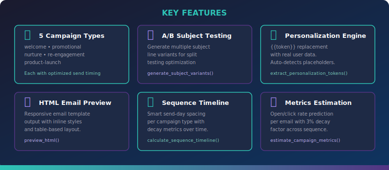

<div align="center">


[](https://python.org)
[](https://ollama.ai)
[](https://streamlit.io)
[](https://click.palletsprojects.com)
[](LICENSE)
[](https://github.com/kennedyraju55/90-local-llm-projects)
[]()

**Part of the [90 Local LLM Projects](https://github.com/kennedyraju55/90-local-llm-projects) collection**

</div>

---

> **Generate professional, conversion-optimized email campaign sequences entirely on your local machine.** No API keys, no cloud dependency, no per-token charges — just an LLM running through Ollama and a Python toolkit that handles prompt engineering, A/B subject testing, personalization, HTML preview, timeline scheduling, and campaign metrics estimation.

---

<div align="center">

[Features](#-features) · [Quick Start](#-quick-start) · [CLI Reference](#%EF%B8%8F-cli-reference) · [Web UI](#-web-ui) · [Architecture](#-architecture) · [API Reference](#-api-reference) · [Campaign Types](#-campaign-types) · [FAQ](#-faq)

</div>

---

## 🤔 Why This Project?

| Challenge | How Email Campaign Writer Solves It |
|---|---|
| **Email copywriting is tedious** | LLM generates complete multi-email sequences with cohesive narratives |
| **A/B testing needs variants** | Automatically produces subject line variants optimized for open rates |
| **Personalization is manual** | `{{token}}` detection and replacement engine handles dynamic content |
| **No local email tooling exists** | Runs entirely offline — your data never leaves your machine |
| **Scheduling is guesswork** | Research-backed send-day spacing for each campaign type with decay modeling |
| **Preview requires ESP tools** | Built-in responsive HTML email preview with inline styles |

---

## ✨ Features



- 📬 **Multi-Email Sequences** — Generate cohesive campaigns with 1–10 emails that build on each other using proven copywriting frameworks (AIDA, PAS)
- 🎯 **5 Campaign Types** — Welcome, promotional, nurture, re-engagement, and product-launch — each with researched send-day spacing
- 🔀 **A/B Subject Line Testing** — Generate multiple subject-line variants with curiosity, urgency, and personalization hooks
- 🧩 **Personalization Engine** — Auto-detect `{{first_name}}`, `{{company}}`, and custom placeholders, then render with real user data
- 🌐 **HTML Email Preview** — Responsive, table-based HTML email template with inline styles compatible with major email clients
- 📅 **Sequence Timeline** — Day-by-day send schedule visualization with type-specific timing
- 📊 **Campaign Metrics** — Open and click rate estimation per email with a 3% per-email decay factor
- 🖥️ **Streamlit Web UI** — Full-featured browser-based campaign builder with real-time preview
- ⌨️ **Rich CLI** — Beautiful terminal output with tables, panels, and progress spinners via Rich
- ⚙️ **YAML Config** — Centralized configuration for LLM model, temperature, campaign defaults, and benchmark metrics

---

## 🚀 Quick Start

### Prerequisites

- **Python 3.10+**
- **[Ollama](https://ollama.ai/)** installed and running

```bash
# Start Ollama and pull a model
ollama serve
ollama pull llama3
```

### Installation

```bash
# Clone the repository
git clone https://github.com/kennedyraju55/email-campaign-writer.git
cd email-campaign-writer

# Install dependencies
pip install -r requirements.txt

# Or install as an editable package with dev extras
pip install -e ".[dev]"
```

### Generate Your First Campaign

```bash
python src/email_campaign/cli.py \
  --product "CloudSync Pro" \
  --audience "small business owners" \
  --type welcome \
  --emails 5
```

**Example output:**

```
╭─ 📧 Email Campaign Writer ─╮
│                              │
╰──────────────────────────────╯
Product:       CloudSync Pro
Audience:      small business owners
Emails:        5
Campaign Type: welcome

╭─ 📧 Email Campaign ──────────────────────────────────────────╮
│                                                               │
│  # Email 1 — Welcome to CloudSync Pro                        │
│                                                               │
│  **Subject A:** Welcome aboard, {{first_name}}! Your files   │
│  are about to get a lot smarter                               │
│  **Subject B:** {{first_name}}, your CloudSync Pro journey   │
│  starts now 🚀                                                │
│                                                               │
│  Hi {{first_name}},                                          │
│                                                               │
│  Thanks for joining CloudSync Pro! You've just made the best │
│  decision for your business's file management...              │
│                                                               │
│  [Get Started Now →]                                         │
│                                                               │
│  ...                                                          │
╰───────────────────────────────────────────────────────────────╯
```


## 🐳 Docker Deployment

Run this project instantly with Docker — no local Python setup needed!

### Quick Start with Docker

```bash
# Clone and start
git clone https://github.com/kennedyraju55/email-campaign-writer.git
cd email-campaign-writer
docker compose up

# Access the web UI
open http://localhost:8501
```

### Docker Commands

| Command | Description |
|---------|-------------|
| `docker compose up` | Start app + Ollama |
| `docker compose up -d` | Start in background |
| `docker compose down` | Stop all services |
| `docker compose logs -f` | View live logs |
| `docker compose build --no-cache` | Rebuild from scratch |

### Architecture

```
┌─────────────────┐     ┌─────────────────┐
│   Streamlit UI  │────▶│   Ollama + LLM  │
│   Port 8501     │     │   Port 11434    │
└─────────────────┘     └─────────────────┘
```

> **Note:** First run will download the Gemma 4 model (~5GB). Subsequent starts are instant.

---


---

## ⌨️ CLI Reference

```bash
python src/email_campaign/cli.py [OPTIONS]
```

### Options

| Option | Type | Description | Default |
|---|---|---|---|
| `--product` | `TEXT` | Product or service name **(required)** | — |
| `--audience` | `TEXT` | Target audience description **(required)** | — |
| `--emails` | `INT` | Number of emails in the sequence (1–10) | `3` |
| `--type` | `CHOICE` | Campaign type: `welcome`, `promotional`, `nurture`, `re-engagement`, `product-launch` | `promotional` |
| `-o, --output` | `PATH` | Save campaign output to a file | — |
| `--subject-test` | `FLAG` | Generate A/B subject line variants table | off |
| `--html-preview` | `FLAG` | Export responsive HTML email preview | off |
| `--timeline` | `FLAG` | Display sequence timeline and estimated metrics | off |
| `--personalize` | `JSON` | JSON string of user data for token replacement | — |

### Usage Examples

#### Basic campaign generation

```bash
python src/email_campaign/cli.py --product "SaaS Tool" --audience "developers"
```

#### Welcome campaign with 5 emails

```bash
python src/email_campaign/cli.py \
  --product "Fitness App" \
  --audience "health enthusiasts" \
  --type welcome --emails 5
```

#### A/B subject line testing

```bash
python src/email_campaign/cli.py \
  --product "Online Course" --audience "marketers" --subject-test
```

```
╭─────────────────── Subject Line A/B Variants ───────────────────╮
│  #  │ Subject Line                                              │
├─────┼───────────────────────────────────────────────────────────│
│  1  │ Stop Wasting Time on Marketing That Doesn't Convert       │
│  2  │ {{first_name}}, Your Competitors Already Know This Secret │
│  3  │ The 3-Step Framework That 10x'd Our Email Open Rates      │
╰─────┴──────────────────────────────────────────────────────────╯
```

#### Show timeline and metrics

```bash
python src/email_campaign/cli.py \
  --product "SaaS Tool" --audience "developers" --timeline
```

```
╭────── 📅 Sequence Timeline ──────╮
│  Day  │ Email Subject             │
├───────┼──────────────────────────│
│    0  │ Email 1 - Subject A       │
│    2  │ Email 2 - Subject A       │
│    4  │ Email 3 - Subject A       │
╰───────┴──────────────────────────╯

╭──── 📊 Estimated Metrics ────╮
│  Metric          │ Value      │
├──────────────────┼───────────│
│  Campaign Type   │ promotional│
│  Total Emails    │ 3          │
│  Avg Open Rate   │ 20.4%      │
│  Avg Click Rate  │ 2.4%       │
╰──────────────────┴───────────╯
```

#### Personalize with user data

```bash
python src/email_campaign/cli.py \
  --product "App" --audience "users" \
  --personalize '{"first_name":"Jane","company":"Acme Corp"}'
```

#### Export HTML preview and save to file

```bash
python src/email_campaign/cli.py \
  --product "Course" --audience "students" \
  --html-preview -o campaign.md
```

---

## 🖥️ Web UI

Launch the Streamlit-based web interface for a visual campaign building experience:

```bash
streamlit run src/email_campaign/web_ui.py
```

The Web UI provides:

| Feature | Description |
|---|---|
| **Campaign Builder** | Input product, audience, campaign type, and email count with form controls |
| **Subject A/B Testing** | Side-by-side comparison of generated subject line variants |
| **Email Preview** | Expandable cards for each email with personalization token highlighting |
| **HTML Preview** | Rendered responsive HTML email in an embedded iframe viewer |
| **Timeline View** | Day-by-day send schedule visualization per campaign type |
| **Metrics Dashboard** | Estimated open/click rate gauges with per-email decay breakdown |
| **Token Editor** | Edit personalization values live and preview rendered results |
| **JSON Export** | Download the full campaign as a structured JSON file |

---

## 🏗️ Architecture


### Project Structure

```
33-email-campaign-writer/
├── src/
│   └── email_campaign/
│       ├── __init__.py          # Public API exports
│       ├── core.py              # Business logic, dataclasses, LLM interaction
│       ├── cli.py               # Click CLI with Rich formatting
│       └── web_ui.py            # Streamlit web application
├── tests/
│   ├── conftest.py              # Pytest configuration & path setup
│   ├── test_core.py             # Core module unit tests
│   └── test_cli.py              # CLI integration tests
├── docs/
│   └── images/
│       ├── banner.svg           # Project banner
│       ├── architecture.svg     # Architecture diagram
│       └── features.svg         # Feature overview graphic
├── config.yaml                  # YAML configuration (LLM, campaign, logging)
├── setup.py                     # Package setup with entry points
├── requirements.txt             # Python dependencies
├── Makefile                     # Dev shortcuts (test, lint, run)
├── .env.example                 # Environment variable template
└── README.md
```

### Data Flow

1. **User Input** — Product name, target audience, campaign type, and email count enter through CLI (`cli.py`) or Web UI (`web_ui.py`)
2. **Prompt Engineering** — `build_prompt()` assembles a structured prompt requesting A/B subjects, preview text, body copy, CTAs, and send timing
3. **LLM Generation** — `generate_campaign()` sends the prompt to Ollama with the configured model, temperature (0.7), and max tokens (4096)
4. **Sequence Building** — `build_email_sequence()` wraps raw LLM output into `Email` dataclasses with type-specific send-day offsets from `_DEFAULT_SEND_DAYS`
5. **Post-Processing** — Personalization tokens are extracted, HTML previews are generated, timelines are calculated, and metrics are estimated with per-email decay factors

---

## 📚 API Reference

### Dataclasses

#### `Email`

```python
from email_campaign.core import Email

email = Email(
    subject_a="Welcome aboard, {{first_name}}!",
    subject_b="{{first_name}}, your journey starts now 🚀",
    preview_text="Everything you need to get started",
    body="Hi {{first_name}},\n\nWelcome to {{product}}...",
    cta_text="Get Started Now",
    cta_url="https://example.com/start",
    send_day=0,
    personalization_tokens=["first_name", "product"],
)

# personalization_tokens auto-populates from body if not provided
email2 = Email(
    subject_a="Subject A",
    subject_b="Subject B",
    preview_text="Preview",
    body="Hello {{first_name}} from {{company}}!",
    cta_text="Click Here",
)
print(email2.personalization_tokens)
# ['company', 'first_name']
```

#### `Campaign`

```python
from email_campaign.core import Campaign, Email

campaign = Campaign(
    name="Welcome Campaign for CloudSync Pro",
    product="CloudSync Pro",
    audience="small business owners",
    campaign_type="welcome",
    emails=[email1, email2, email3],
    # created_at auto-set to datetime.now().isoformat()
)

print(campaign.campaign_type)   # "welcome"
print(len(campaign.emails))     # 3
print(campaign.created_at)      # "2025-01-15T10:30:00.123456"
```

### Campaign Generation

#### `generate_campaign(product, audience, num_emails, campaign_type) → str`

Generates a raw email campaign using the LLM. Returns unstructured text.

```python
from email_campaign.core import generate_campaign

raw_text = generate_campaign(
    product="CloudSync Pro",
    audience="small business owners",
    num_emails=3,
    campaign_type="welcome",
)
print(raw_text[:200])
# "# Email 1 — Welcome to CloudSync Pro\n\n**Subject A:** ..."
```

#### `build_email_sequence(product, audience, num_emails, campaign_type) → Campaign`

Generates a full campaign and returns a structured `Campaign` object with `Email` dataclasses. Each email gets send-day offsets from `_DEFAULT_SEND_DAYS` based on the campaign type.

```python
from email_campaign.core import build_email_sequence

campaign = build_email_sequence(
    product="CloudSync Pro",
    audience="small business owners",
    num_emails=5,
    campaign_type="welcome",
)

print(campaign.name)
# "Welcome Campaign for CloudSync Pro"

for email in campaign.emails:
    print(f"Day {email.send_day}: {email.subject_a}")
# Day 0: Email 1 - Subject A
# Day 1: Email 2 - Subject A
# Day 3: Email 3 - Subject A
# Day 5: Email 4 - Subject A
# Day 7: Email 5 - Subject A
```

### Subject Line Testing

#### `generate_subject_variants(product, audience, num_variants=3) → list[str]`

Generates A/B subject line variants optimized for open rates. Uses curiosity, urgency, and personalization strategies.

```python
from email_campaign.core import generate_subject_variants

variants = generate_subject_variants(
    product="Online Course",
    audience="marketers",
    num_variants=5,
)

for i, variant in enumerate(variants, 1):
    print(f"{i}. {variant}")
# 1. Stop Wasting Time on Marketing That Doesn't Convert
# 2. {{first_name}}, Your Competitors Already Know This Secret
# 3. The 3-Step Framework That 10x'd Our Email Open Rates
# 4. Why 90% of Marketers Get Email Wrong (And How to Fix It)
# 5. Open This If You Want More Conversions This Quarter
```

### Personalization

#### `extract_personalization_tokens(template) → list[str]`

Finds all `{{token}}` placeholders in a template string. Returns a sorted, deduplicated list.

```python
from email_campaign.core import extract_personalization_tokens

tokens = extract_personalization_tokens(
    "Hi {{first_name}}, welcome to {{product}}! "
    "Your team at {{company}} will love this, {{first_name}}."
)
print(tokens)
# ['company', 'first_name', 'product']
```

#### `render_email(email, user_data) → str`

Replaces `{{token}}` placeholders in an email body with actual user data. Tokens not present in `user_data` are left untouched.

```python
from email_campaign.core import Email, render_email

email = Email(
    subject_a="Welcome!",
    subject_b="Hello!",
    preview_text="Get started",
    body="Hi {{first_name}}, welcome to {{product}}! Your code: {{promo_code}}",
    cta_text="Start",
)

rendered = render_email(email, {
    "first_name": "Jane",
    "product": "CloudSync Pro",
})
print(rendered)
# "Hi Jane, welcome to CloudSync Pro! Your code: {{promo_code}}"
```

### HTML Preview

#### `preview_html(email_body) → str`

Wraps email body text in a responsive, table-based HTML email template with inline styles. Compatible with major email clients (Gmail, Outlook, Apple Mail).

```python
from email_campaign.core import preview_html

html = preview_html("Hi Jane,\n\nWelcome to CloudSync Pro!\n\nGet started today.")

# Save to file for browser preview
with open("preview.html", "w") as f:
    f.write(html)

# Output is a complete <!DOCTYPE html> document with:
# - Table-based layout (600px max width)
# - Inline styles for email client compatibility
# - Responsive meta viewport tag
# - Escaped HTML entities for safety
```

### Timeline & Metrics

#### `calculate_sequence_timeline(campaign) → list[tuple[int, str]]`

Returns a list of `(day_number, subject_line)` tuples representing the send schedule.

```python
from email_campaign.core import build_email_sequence, calculate_sequence_timeline

campaign = build_email_sequence("App", "users", 5, "welcome")
timeline = calculate_sequence_timeline(campaign)

for day, subject in timeline:
    print(f"Day {day:>3}: {subject}")
# Day   0: Email 1 - Subject A
# Day   1: Email 2 - Subject A
# Day   3: Email 3 - Subject A
# Day   5: Email 4 - Subject A
# Day   7: Email 5 - Subject A
```

#### `estimate_campaign_metrics(campaign) → dict`

Estimates open and click rates based on campaign type benchmarks from `config.yaml`. Applies a 3% per-email decay factor (minimum 50% of base rate).

```python
from email_campaign.core import build_email_sequence, estimate_campaign_metrics

campaign = build_email_sequence("App", "users", 5, "welcome")
metrics = estimate_campaign_metrics(campaign)

print(f"Campaign Type: {metrics['campaign_type']}")
print(f"Avg Open Rate: {metrics['avg_open_rate']:.1%}")
print(f"Avg Click Rate: {metrics['avg_click_rate']:.1%}")
# Campaign Type: welcome
# Avg Open Rate: 77.1%
# Avg Click Rate: 24.4%

for em in metrics["per_email"]:
    print(f"  Email {em['email_number']}: open={em['estimated_open_rate']:.1%}, click={em['estimated_click_rate']:.1%}")
# Email 1: open=82.0%, click=26.0%
# Email 2: open=79.5%, click=25.2%
# Email 3: open=77.1%, click=24.4%
# Email 4: open=74.6%, click=23.7%
# Email 5: open=72.2%, click=22.9%
```

### Configuration

#### `load_config() → dict`

Loads and caches application configuration from `config.yaml`. Subsequent calls return the cached dict.

```python
from email_campaign.core import load_config

config = load_config()
print(config["llm"]["model"])        # "llama3"
print(config["llm"]["temperature"])  # 0.7
print(config["campaign"]["max_emails"])  # 10
```

---

## 🎯 Campaign Types

Each campaign type has a distinct purpose and optimized send-day spacing based on email marketing best practices:

| Type | Purpose | Send Days (10-email sequence) | Avg Open Rate | Avg Click Rate |
|---|---|---|---|---|
| **welcome** | Onboard new users/subscribers | 0, 1, 3, 5, 7, 10, 14, 18, 21, 28 | 82% | 26% |
| **promotional** | Drive sales and conversions | 0, 2, 4, 7, 10, 14, 17, 21, 25, 30 | 21% | 2.5% |
| **nurture** | Build relationships over time | 0, 3, 7, 10, 14, 21, 28, 35, 42, 49 | 35% | 4.5% |
| **re-engagement** | Win back inactive subscribers | 0, 3, 7, 14, 21, 30, 37, 44, 51, 60 | 28% | 3.5% |
| **product-launch** | Build hype and drive adoption | 0, 1, 3, 5, 7, 10, 14, 17, 21, 28 | 45% | 5.5% |

### Metrics Decay Model

Campaign metrics use a per-email decay factor of 3% (configurable), reflecting the natural drop in engagement across longer sequences. The decay is clamped at a minimum of 50% of the base rate:

```
estimated_rate = base_rate × max(1.0 - (email_index × 0.03), 0.5)
```

---

## ⚙️ Configuration

All settings are centralized in `config.yaml`:

```yaml
app:
  name: "Email Campaign Writer"
  version: "2.0.0"

llm:
  model: "llama3"          # Any Ollama-compatible model
  temperature: 0.7         # Creativity vs. consistency (0.0–1.0)
  max_tokens: 4096         # Maximum generation length

campaign:
  default_type: "promotional"
  default_emails: 3
  max_emails: 10
  metrics:
    welcome:
      avg_open_rate: 0.82
      avg_click_rate: 0.26
    promotional:
      avg_open_rate: 0.21
      avg_click_rate: 0.025
    nurture:
      avg_open_rate: 0.35
      avg_click_rate: 0.045
    re-engagement:
      avg_open_rate: 0.28
      avg_click_rate: 0.035
    product-launch:
      avg_open_rate: 0.45
      avg_click_rate: 0.055

logging:
  level: "INFO"
```

---

## 🧪 Testing

```bash
# Run all tests
pytest tests/ -v

# Run with coverage reporting
pytest tests/ -v --tb=short --cov=email_campaign

# Run only core tests
pytest tests/test_core.py -v

# Run only CLI tests
pytest tests/test_cli.py -v
```

---

## 🔄 Local vs. Cloud Comparison

| Aspect | Email Campaign Writer (Local) | Cloud Email Tools |
|---|---|---|
| **Privacy** | ✅ Data never leaves your machine | ❌ Sent to third-party servers |
| **Cost** | ✅ Free after hardware setup | ❌ Per-token or subscription pricing |
| **Internet** | ✅ Works fully offline | ❌ Requires constant connection |
| **Customization** | ✅ Full control over prompts and config | ⚠️ Limited to provider options |
| **Model Choice** | ✅ Any Ollama-compatible model | ❌ Locked to provider's models |
| **Speed** | ⚠️ Depends on local hardware | ✅ Cloud GPU infrastructure |
| **Scalability** | ⚠️ Single-machine throughput | ✅ Elastic scaling |

---

## ❓ FAQ

<details>
<summary><strong>Which Ollama models work best for email campaigns?</strong></summary>

The project defaults to `llama3` but works with any Ollama-compatible model. For email copywriting, models with strong instruction-following and creative writing abilities perform best. `gemma:7b`, `mistral`, and `llama3:8b` are all good choices. Larger models like `llama3:70b` produce higher quality output but require more RAM and run slower. Set your preferred model in `config.yaml` under `llm.model`.

</details>

<details>
<summary><strong>How do I change the number of subject line variants?</strong></summary>

The `generate_subject_variants()` function accepts a `num_variants` parameter (default: 3). From the CLI, the `--subject-test` flag generates 3 variants. To change the count programmatically:

```python
from email_campaign.core import generate_subject_variants
variants = generate_subject_variants("Product", "audience", num_variants=7)
```

</details>

<details>
<summary><strong>Can I add custom personalization tokens?</strong></summary>

Yes. Use any `{{token_name}}` pattern in your email templates. The `extract_personalization_tokens()` function automatically detects all `{{...}}` placeholders, and `render_email()` replaces them with values from a user data dictionary. Unmatched tokens are left as-is, so you can render partially:

```python
render_email(email, {"first_name": "Jane"})  # other tokens stay as {{token}}
```

</details>

<details>
<summary><strong>How does the send-day timing work?</strong></summary>

Each campaign type has predefined send-day offsets stored in `_DEFAULT_SEND_DAYS`. For example, a welcome campaign sends on days 0, 1, 3, 5, 7, 10, 14, 18, 21, 28 — front-loading emails during onboarding then spacing them out. If the sequence exceeds the predefined offsets, additional emails are spaced 3 days apart from the last defined day.

</details>

<details>
<summary><strong>What does the metrics decay factor mean?</strong></summary>

The `estimate_campaign_metrics()` function applies a 3% decay per email position in the sequence. This models the real-world behavior where later emails in a sequence typically get lower engagement. The formula is `base_rate × (1.0 - index × 0.03)` with a floor at 50% of the base rate. Base rates come from industry benchmarks configured per campaign type in `config.yaml`.

</details>

---

## 🤝 Contributing

Contributions are welcome! Here's how to get started:

1. **Fork** the repository
2. **Create** a feature branch: `git checkout -b feature/amazing-feature`
3. **Install** dev dependencies: `pip install -e ".[dev]"`
4. **Make** your changes and add tests
5. **Run** tests: `pytest tests/ -v`
6. **Commit** with a clear message: `git commit -m "Add amazing feature"`
7. **Push** to your branch: `git push origin feature/amazing-feature`
8. **Open** a Pull Request

### Development Setup

```bash
# Clone and install in dev mode
git clone https://github.com/kennedyraju55/email-campaign-writer.git
cd email-campaign-writer
pip install -e ".[dev]"

# Run tests
pytest tests/ -v --tb=short --cov=email_campaign

# Run the CLI
python src/email_campaign/cli.py --product "Test" --audience "devs" --type welcome

# Launch the web UI
streamlit run src/email_campaign/web_ui.py
```

---

## 📄 License

This project is licensed under the **MIT License**. See the [LICENSE](LICENSE) file for details.

---

<div align="center">

**[⬆ Back to Top](#)**

Built with ❤️ as part of [90 Local LLM Projects](https://github.com/kennedyraju55/90-local-llm-projects) • Project **#33**

*Powered by Ollama · Python · Click · Streamlit · Rich*

</div>
