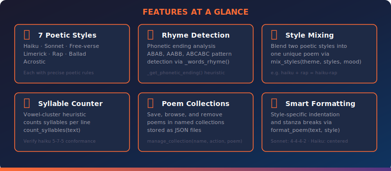
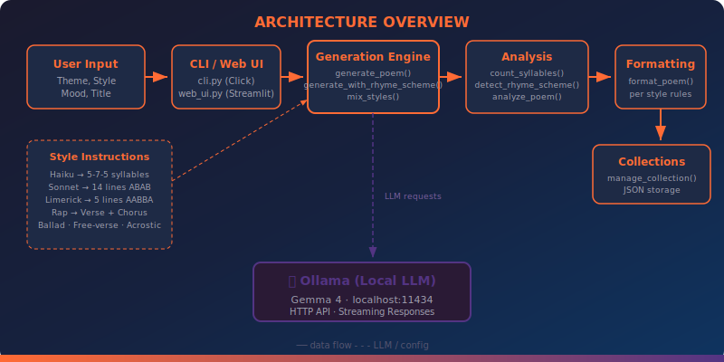

<div align="center">


<br/>

[](https://ollama.com/library/gemma3)
[](https://python.org)
[](https://streamlit.io)
[](https://click.palletsprojects.com)
[](LICENSE)
[](tests/)

<br/>

**Project #34** of the [90 Local LLM Projects](https://github.com/kennedyraju55/90-local-llm-projects) collection

</div>

<br/>

> _"Turn a single theme into a haiku, a sonnet, a rap verse, or a limerick — all locally, all private, all yours."_

<br/>

<p align="center">
  <a href="#-features">Features</a> •
  <a href="#-quick-start">Quick Start</a> •
  <a href="#-cli-reference">CLI Reference</a> •
  <a href="#-web-ui">Web UI</a> •
  <a href="#-architecture">Architecture</a> •
  <a href="#-api-reference">API Reference</a> •
  <a href="#-supported-styles">Styles</a> •
  <a href="#-faq">FAQ</a>
</p>

---

## 💡 Why This Project?

| Challenge | How This Project Solves It |
|---|---|
| Cloud poetry APIs are expensive and send your prompts to third parties | Runs **100 % locally** on Ollama — your words never leave your machine |
| Most generators only produce free-verse | Supports **7 distinct poetic forms** with enforced structural rules |
| No way to verify poetic structure | Built-in **syllable counter** and **rhyme scheme detector** analyze every poem |
| Poems are generated and forgotten | **Collection manager** persists poems as JSON for later browsing |
| Mixing poetic traditions is hard | **Style mixing** blends two forms (e.g., haiku + rap) into one hybrid poem |
| CLI-only is limiting for exploration | Full **Streamlit Web UI** alongside the terminal interface |

---

## ✨ Features

<div align="center">



</div>

<br/>

- 🎭 **7 Poetic Styles** — Haiku (5-7-5), Sonnet (14-line ABAB CDCD EFEF GG), Free-verse, Limerick (AABBA), Rap (verse + chorus), Ballad, and Acrostic
- 🔤 **Rhyme Scheme Detection** — Phonetic-ending analysis detects ABAB, AABB, ABCABC, and other patterns automatically
- 🎨 **Style Mixing** — Blend any two styles into a unique hybrid poem with `mix_styles()`
- 📊 **Syllable Counter** — Vowel-cluster heuristic counts syllables per line for structural verification
- 📚 **Poem Collections** — Save, browse, and remove poems from named JSON collections
- ✨ **Smart Formatting** — Style-specific indentation: haiku centered, sonnet stanzas at 4/8/12, limerick middle indent, rap `[VERSE]`/`[CHORUS]` labels
- 💫 **6 Moods** — Romantic, melancholic, joyful, dark, hopeful, nostalgic — each shifts the LLM's tone
- 🖥️ **Rich CLI** — Beautiful terminal output via Click with Rich panels and tables
- 🌐 **Streamlit Web UI** — Full-featured browser interface with live generation
- ⚙️ **YAML Configuration** — Tune model, temperature, default style, and collections directory

---

## 🚀 Quick Start

### Prerequisites

| Requirement | Version | Purpose |
|---|---|---|
| Python | 3.10+ | Runtime |
| [Ollama](https://ollama.com) | Latest | Local LLM server |
| Gemma 4 (or any model) | — | Language model |

### 1. Install Ollama & Pull a Model

```bash
# Install Ollama (see https://ollama.com for your OS)
ollama serve            # Start the server
ollama pull gemma3      # Pull the default model
```

### 2. Clone & Install

```bash
git clone https://github.com/kennedyraju55/poem-lyrics-generator.git
cd poem-lyrics-generator

pip install -r requirements.txt
pip install -e .
```

### 3. Generate Your First Poem

```bash
poem-gen --theme "cherry blossoms" --style haiku --mood joyful
```

**Example output:**

```
╭─ ✨ Haiku ─────────────────────────────╮
│                                        │
│       Petals softly fall               │
│       Dancing in the warm spring breeze │
│       Pink dreams touch the earth       │
│                                        │
╰────────────────────────────────────────╯
```

```bash
# Analyze the poem's structure
poem-gen --theme "cherry blossoms" --style haiku --mood joyful --analyze
```

```
┌──────────────────────────────────────┐
│         📊 Poem Analysis             │
├──────────────┬───────────────────────┤
│ Lines        │ 3                     │
│ Words        │ 14                    │
│ Rhyme Scheme │ ABC                   │
│ Syllables    │ 5, 7, 5              │
└──────────────┴───────────────────────┘
```

---

## 💻 CLI Reference

The `poem-gen` CLI is built with [Click](https://click.palletsprojects.com/) and uses [Rich](https://rich.readthedocs.io/) for terminal formatting.

### Options

| Option | Description | Default |
|---|---|---|
| `--theme TEXT` | Theme or subject for the poem **(required for generation)** | — |
| `--style TEXT` | Poetic style (`haiku`, `sonnet`, `free-verse`, `limerick`, `rap`, `ballad`, `acrostic`) | `free-verse` |
| `--mood TEXT` | Mood / emotion (`romantic`, `melancholic`, `joyful`, `dark`, `hopeful`, `nostalgic`) | `None` |
| `--title TEXT` | Custom title for the poem | Auto-generated |
| `-o, --output FILE` | Save the generated poem to a file | `None` |
| `--rhyme-scheme TEXT` | Generate following a specific rhyme scheme (e.g., `ABAB`, `AABB`) | `None` |
| `--mix-styles TEXT` | Comma-separated pair of styles to blend (e.g., `"haiku,rap"`) | `None` |
| `--analyze` | Display poem analysis after generation (syllables, rhyme, metrics) | `Off` |
| `--collection TEXT` | Save the generated poem to a named collection | `None` |
| `--list-collection TEXT` | Display all poems stored in a named collection | `None` |

### Usage Examples

```bash
# Generate a sonnet about the ocean
poem-gen --theme "ocean sunset" --style sonnet

# Melancholic free-verse with a custom title
poem-gen --theme "autumn leaves" --mood melancholic --title "Falling Gold"

# Force a specific rhyme scheme
poem-gen --theme "city rain" --rhyme-scheme ABAB

# Mix haiku and rap into a hybrid poem
poem-gen --theme "midnight city" --mix-styles "haiku,rap"

# Generate, analyze, and save to a collection
poem-gen --theme "starlight" --style sonnet --analyze --collection night-sky

# Save output to a text file
poem-gen --theme "winter silence" --style haiku -o winter.txt

# List all poems in a collection
poem-gen --list-collection night-sky
```

### Example: Sonnet with Analysis

```bash
poem-gen --theme "ocean sunset" --style sonnet --analyze
```

```
╭─ ✨ Sonnet ────────────────────────────────────╮
│   Upon the western rim the sun descends,       │
│   A golden orb that kisses azure deep,         │
│   While crimson light across the water bends,  │
│   And shadows slowly from the shoreline creep. │
│                                                │
│   The seagulls cry above the foaming waves,    │
│   As twilight paints the sky in shades of gold,│
│   The ocean hums its dark and ancient staves,  │
│   And whispers secrets only tides have told.   │
│                                                │
│   The horizon blurs where fire meets the sea,  │
│   A molten line of amber, rose, and red,       │
│   The last light fading into memory,           │
│   While stars awaken softly overhead.          │
│                                                │
│   The sun has gone, the sky a velvet dome,     │
│   The ocean sings the wanderer safely home.    │
╰────────────────────────────────────────────────╯

┌──────────────────────────────────────┐
│         📊 Poem Analysis             │
├──────────────┬───────────────────────┤
│ Lines        │ 14                    │
│ Words        │ 112                   │
│ Rhyme Scheme │ ABAB CDCD EFEF GG     │
│ Syllables    │ 10, 10, 10, 10, …     │
└──────────────┴───────────────────────┘
```

---

## 🌐 Web UI

Launch the Streamlit web interface for a full graphical experience:

```bash
streamlit run src/poem_gen/web_ui.py
```

### Web UI Features

| Feature | Description |
|---|---|
| **Theme Input** | Free-text field for any theme or subject |
| **Style Selector** | Dropdown with all 7 supported styles |
| **Mood Picker** | Optional mood selection to shift tone |
| **Rhyme Scheme Override** | Text input for custom rhyme patterns |
| **Style Mixing** | Dual dropdowns to blend two styles |
| **Live Generation** | Real-time poem rendering with formatting |
| **Poem Analysis** | Syllable chart and rhyme scheme detection |
| **Collection Manager** | Save, browse, and download poem collections |

---

## 🏗️ Architecture

<div align="center">



</div>

<br/>

### Data Flow

```
User Input ──▶ CLI (cli.py) / Web UI (web_ui.py)
                │
                ▼
          build_prompt(theme, style, mood, title)
                │
                ▼
         ┌──────────────────────────────┐
         │   Generation Engine          │
         │   ├── generate_poem()        │
         │   ├── generate_with_rhyme()  │
         │   └── mix_styles()           │
         └──────────┬───────────────────┘
                    │  HTTP ──▶ Ollama (localhost:11434)
                    ▼
         ┌──────────────────────────────┐
         │   Analysis                   │
         │   ├── count_syllables()      │
         │   ├── detect_rhyme_scheme()  │
         │   └── analyze_poem()         │
         └──────────┬───────────────────┘
                    ▼
         ┌──────────────────────────────┐
         │   Formatting & Output        │
         │   ├── format_poem()          │
         │   └── manage_collection()    │
         └──────────────────────────────┘
```

### Project Structure

```
34-poem-lyrics-generator/
├── src/poem_gen/
│   ├── __init__.py          # Package metadata & version
│   ├── config.py            # YAML config loader, logging, constants
│   ├── core.py              # Prompt building, LLM generation, analysis, collections
│   ├── cli.py               # Click CLI with Rich output formatting
│   └── web_ui.py            # Streamlit web interface
├── tests/
│   ├── conftest.py          # Shared fixtures & path setup
│   ├── test_core.py         # Unit tests for core logic
│   └── test_cli.py          # CLI integration tests
├── collections/             # Saved poem collections (JSON files)
├── config.yaml              # Application configuration (model, styles, moods)
├── setup.py                 # Package installer (entry point: poem-gen)
├── Makefile                 # Common tasks (test, lint, run)
├── requirements.txt         # Python dependencies
├── .env.example             # Environment variable template
└── docs/
    └── images/              # SVG diagrams for documentation
        ├── banner.svg
        ├── architecture.svg
        └── features.svg
```

---

## 📖 API Reference

All public functions live in `src/poem_gen/core.py`. Import them from the `poem_gen` package.

### Data Classes

#### `Poem`

```python
from poem_gen.core import Poem

poem = Poem(
    title="Sunset Dreams",
    content="Upon the western rim the sun descends...",
    style="sonnet",
    mood="romantic",
    theme="ocean sunset",
    rhyme_scheme="ABAB CDCD EFEF GG",
    syllable_count=[10, 10, 10, 10, 10, 10, 10, 10, 10, 10, 10, 10, 10, 10],
    created_at="2025-01-15T10:30:00"
)

# Serialize to dict (for JSON storage)
data = poem.to_dict()

# Reconstruct from dict
restored = Poem.from_dict(data)
```

#### `PoemCollection`

```python
from poem_gen.core import PoemCollection

collection = PoemCollection(
    name="ocean-poems",
    poems=[poem],
    created_at="2025-01-15T10:30:00"
)

# Serialize / deserialize
data = collection.to_dict()
restored = PoemCollection.from_dict(data)
```

### Generation Functions

#### `generate_poem(theme, style, mood, title)`

Generate a complete poem from a theme using the configured LLM.

```python
from poem_gen.core import generate_poem

poem = generate_poem(
    theme="cherry blossoms",
    style="haiku",
    mood="joyful",
    title="Spring Arrival"
)
print(poem)  # Returns the raw poem text
```

#### `generate_with_rhyme_scheme(theme, scheme, mood)`

Generate a poem that follows a specific rhyme scheme pattern.

```python
from poem_gen.core import generate_with_rhyme_scheme

poem = generate_with_rhyme_scheme(
    theme="lost love",
    scheme="ABAB",
    mood="melancholic"
)
```

#### `mix_styles(theme, styles, mood)`

Blend two poetic styles into a single hybrid poem.

```python
from poem_gen.core import mix_styles

poem = mix_styles(
    theme="midnight city",
    styles=["haiku", "rap"],
    mood="dark"
)
```

#### `build_prompt(theme, style, mood, title)`

Build the raw LLM prompt string with embedded style instructions.

```python
from poem_gen.core import build_prompt

prompt = build_prompt(
    theme="starlight",
    style="sonnet",
    mood="romantic",
    title="Evening Star"
)
print(prompt)
# Includes STYLE_INSTRUCTIONS for sonnet: "14 lines, ABAB CDCD EFEF GG, ..."
```

### Analysis Functions

#### `analyze_poem(text)`

Return a dict with structural metrics for any poem text.

```python
from poem_gen.core import analyze_poem

result = analyze_poem("""Petals softly fall
Dancing in the warm spring breeze
Pink dreams touch the earth""")

# result = {
#     "line_count": 3,
#     "word_count": 14,
#     "syllables_per_line": [5, 7, 5],
#     "detected_rhyme_scheme": "ABC"
# }
```

#### `count_syllables(text)`

Count syllables per line using a vowel-cluster heuristic.

```python
from poem_gen.core import count_syllables

syllables = count_syllables("Dancing in the warm spring breeze")
# Returns syllable counts per line
```

#### `detect_rhyme_scheme(text)`

Detect the rhyme pattern by comparing phonetic endings of line-final words.

```python
from poem_gen.core import detect_rhyme_scheme

scheme = detect_rhyme_scheme("""The sun descends upon the shore,
A golden light on waters deep,
The waves crash on forevermore,
While shadows slowly start to creep.""")
# scheme = "ABAB"
```

### Formatting & Collections

#### `format_poem(poem_text, style)`

Apply style-specific formatting rules to raw poem text.

```python
from poem_gen.core import format_poem

formatted = format_poem(raw_haiku, "haiku")
# Haiku: each line is indented/centered

formatted = format_poem(raw_sonnet, "sonnet")
# Sonnet: blank lines inserted at lines 4, 8, 12 for stanza breaks

formatted = format_poem(raw_limerick, "limerick")
# Limerick: lines 3-4 indented for the middle couplet

formatted = format_poem(raw_rap, "rap")
# Rap: [VERSE] and [CHORUS] labels applied
```

#### `manage_collection(collection_name, action, poem)`

Manage named poem collections stored as JSON files.

```python
from poem_gen.core import manage_collection

# Add a poem to a collection
manage_collection("ocean-poems", "add", poem)

# List all poems in a collection
poems = manage_collection("ocean-poems", "list", None)

# Remove a poem from a collection
manage_collection("ocean-poems", "remove", poem)
```

### Internal Helpers

These functions are used internally by the analysis pipeline:

```python
from poem_gen.core import _get_phonetic_ending, _words_rhyme

# Extract the phonetic ending of a word for rhyme comparison
ending = _get_phonetic_ending("shore")  # e.g., "ore"

# Check if two words rhyme based on phonetic endings
rhymes = _words_rhyme("shore", "more")  # True
rhymes = _words_rhyme("shore", "deep")  # False
```

---

## 🎭 Supported Styles

Each style is enforced through `STYLE_INSTRUCTIONS` — detailed prompting rules passed to the LLM.

| Style | Structure | Key Rules |
|---|---|---|
| **Haiku** | 3 lines | 5-7-5 syllable pattern, nature imagery, no rhyme |
| **Sonnet** | 14 lines | ABAB CDCD EFEF GG rhyme scheme, iambic pentameter |
| **Free-verse** | Variable | No fixed meter or rhyme, emphasis on imagery and rhythm |
| **Limerick** | 5 lines | AABBA rhyme scheme, anapestic meter, humorous tone |
| **Rap** | Verses + Chorus | `[VERSE]` and `[CHORUS]` sections, internal rhymes, rhythmic flow |
| **Ballad** | Quatrains | ABAB or ABCB rhyme, narrative storytelling, 4-line stanzas |
| **Acrostic** | Variable | First letter of each line spells out the theme word |

### Moods

The mood parameter adjusts the LLM's tone and word choice:

| Mood | Effect on Generation |
|---|---|
| `romantic` | Tender, passionate language with love imagery |
| `melancholic` | Wistful, sorrowful tone with themes of loss |
| `joyful` | Bright, uplifting language with celebratory energy |
| `dark` | Brooding, intense imagery with gothic undertones |
| `hopeful` | Optimistic, forward-looking with themes of renewal |
| `nostalgic` | Wistful, memory-laden with references to the past |

---

## 🧪 Testing

Run the full test suite with pytest:

```bash
# Run all tests
pytest tests/ -v

# Run only core logic tests
pytest tests/test_core.py -v

# Run only CLI integration tests
pytest tests/test_cli.py -v

# Run with coverage
pytest tests/ --cov=poem_gen --cov-report=term-missing
```

The test suite covers:

- **`test_core.py`** — Prompt building, syllable counting, rhyme detection, poem analysis, collection management, formatting
- **`test_cli.py`** — CLI option parsing, output format validation, error handling

---

## ⚙️ Configuration

Edit `config.yaml` to customize the generator:

```yaml
llm:
  model: "gemma3"        # Ollama model name
  temperature: 0.9        # Creativity (0.0 = deterministic, 1.0 = creative)
  max_tokens: 2048        # Maximum response length

poem:
  default_style: "free-verse"        # Default style when --style is omitted
  collections_dir: "collections"     # Directory for saved poem collections
```

Environment variables can also be set via `.env` (see `.env.example`).

---

## 🏠 Local vs Cloud

| Aspect | Poem & Lyrics Generator (Local) | Cloud Poetry APIs |
|---|---|---|
| **Privacy** | ✅ All data stays on your machine | ❌ Prompts sent to third-party servers |
| **Cost** | ✅ Free after hardware investment | ❌ Per-token or per-request pricing |
| **Latency** | ⚡ No network round-trip | 🐌 Depends on API response time |
| **Customization** | ✅ Full control over model & config | ❌ Limited to provider's offerings |
| **Offline** | ✅ Works without internet | ❌ Requires internet connection |
| **Model Choice** | ✅ Any Ollama-compatible model | ❌ Locked to provider's models |
| **Poetic Rules** | ✅ Enforced via STYLE_INSTRUCTIONS | ❌ Varies by provider |

---

## ❓ FAQ

<details>
<summary><strong>Which Ollama models work best for poetry?</strong></summary>

Gemma 4 (`gemma3`) produces excellent results with strong adherence to poetic structure. Other good choices include `llama3` and `mistral`. Larger parameter models generally produce better rhymes and meter, but any model Ollama supports will work — just update the `model` field in `config.yaml`.

</details>

<details>
<summary><strong>How does syllable counting work?</strong></summary>

The `count_syllables()` function uses a vowel-cluster heuristic: it counts groups of consecutive vowels in each word as one syllable, with adjustments for silent-e endings and diphthongs. This is an approximation — English syllable counting is notoriously difficult — but it works well enough to verify haiku 5-7-5 structure and sonnet meter.

</details>

<details>
<summary><strong>Can I add my own poetic styles?</strong></summary>

Yes. Add a new style name to the `styles` list in `config.yaml`, then add corresponding instructions to the `STYLE_INSTRUCTIONS` dict in `core.py`. The style will automatically appear in the CLI `--style` option and the Web UI dropdown. You'll also want to add formatting rules in `format_poem()` for proper display.

</details>

<details>
<summary><strong>How does rhyme scheme detection work?</strong></summary>

The `detect_rhyme_scheme()` function extracts the last word of each line, computes its phonetic ending via `_get_phonetic_ending()`, then compares endings pairwise using `_words_rhyme()`. Lines with matching phonetic endings receive the same letter label (A, B, C, etc.), producing patterns like ABAB or AABBA.

</details>

<details>
<summary><strong>Where are poem collections stored?</strong></summary>

Collections are stored as JSON files in the `collections/` directory (configurable via `collections_dir` in `config.yaml`). Each collection file contains a `PoemCollection` object serialized via `to_dict()`, which includes the collection name, creation timestamp, and a list of `Poem` objects with all their metadata.

</details>

---

## 🤝 Contributing

Contributions are welcome! To get started:

1. **Fork** this repository
2. **Clone** your fork: `git clone https://github.com/<your-username>/poem-lyrics-generator.git`
3. **Create a branch**: `git checkout -b feature/your-feature-name`
4. **Install in development mode**: `pip install -e .`
5. **Make your changes** and add tests
6. **Run the test suite**: `pytest tests/ -v`
7. **Commit**: `git commit -m "feat: add your feature description"`
8. **Push**: `git push origin feature/your-feature-name`
9. **Open a Pull Request** against `main`

### Ideas for Contributions

- Add new poetic styles (villanelle, ghazal, tanka, concrete poetry)
- Improve syllable counting with a phonetic dictionary
- Add rhyme suggestion / word recommendation
- Export poems as PDF or formatted HTML
- Multi-language poem generation

---

## 📄 License

This project is licensed under the [MIT License](LICENSE).

---

<div align="center">

**Part of the [90 Local LLM Projects](https://github.com/kennedyraju55/90-local-llm-projects) collection**

Built with 🧡 using Ollama, Python, Click, and Streamlit

<sub>Made by <a href="https://github.com/kennedyraju55">kennedyraju55</a></sub>

</div>
