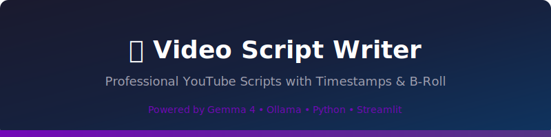
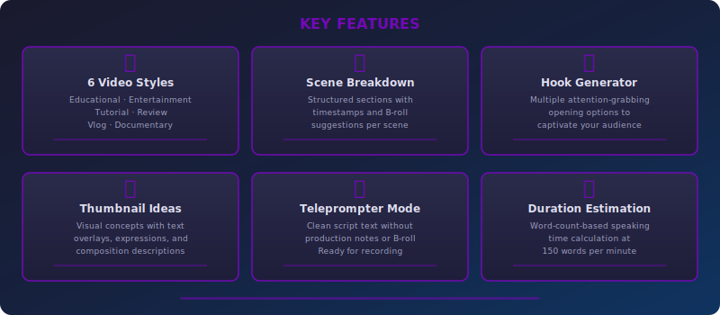
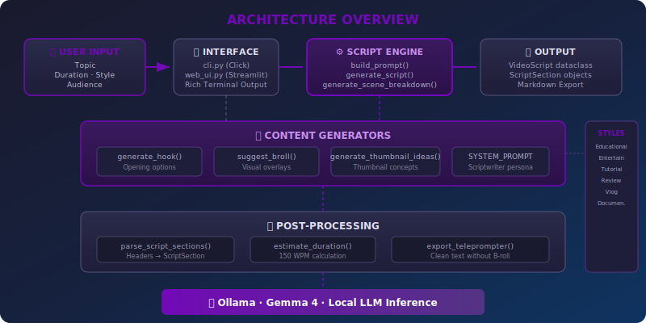

<div align="center">



<br/>

[](https://ollama.com/library/gemma3)
[](https://python.org)
[](https://streamlit.io)
[](https://click.palletsprojects.com)
[](https://github.com/Textualize/rich)
[](LICENSE)

<strong>Project #35 of the <a href="https://github.com/kennedyraju55/90-local-llm-projects">90 Local LLM Projects</a> collection</strong>

</div>

<br/>

> **Generate production-ready YouTube scripts — complete with precise timestamps, B-roll suggestions, on-screen text cues, hook options, and thumbnail concepts — all running locally on your machine through Ollama and Gemma 4.**

---

<p align="center">
  <a href="#-why-this-project">Why?</a> •
  <a href="#-features">Features</a> •
  <a href="#-quick-start">Quick Start</a> •
  <a href="#-cli-reference">CLI</a> •
  <a href="#-web-ui">Web UI</a> •
  <a href="#-architecture">Architecture</a> •
  <a href="#-api-reference">API</a> •
  <a href="#-video-styles">Styles</a> •
  <a href="#-testing">Testing</a> •
  <a href="#-faq">FAQ</a>
</p>

---

## 🤔 Why This Project?

Writing a YouTube script is more than putting words on paper. A solid video needs structure — hooks that grab attention, timestamps so editors know where each section starts, B-roll ideas so footage isn't just a talking head, on-screen text suggestions to reinforce key points, and thumbnail concepts that actually get clicks. Most creators figure all of this out manually, switching between documents, timers, and brainstorming sessions.

**Video Script Writer** collapses that entire workflow into a single command. You give it a topic, pick a style, set a target duration, and get back a structured, timestamped script with every production note a creator or editor would need.

| Without This Tool | With Video Script Writer |
|---|---|
| Write script, then manually add timestamps | Timestamps generated automatically to match target duration |
| Brainstorm B-roll ideas separately | B-roll suggestions embedded per section with camera angles |
| Struggle with opening lines | Multiple hook options generated instantly |
| Design thumbnails by trial and error | Thumbnail concepts with visual descriptions, text overlays, expressions |
| Copy-paste script into teleprompter app | One-command teleprompter export strips production notes |
| Guess if script fits target length | Word-count-based duration estimation at 150 WPM |
| Pay for cloud API calls | 100% local inference through Ollama — zero API costs |

---

## ✨ Features

<div align="center">



</div>

<br/>

| Feature | What It Does |
|---------|-------------|
| 🎬 **Structured Scripts** | Every script follows a professional HOOK → INTRO → MAIN CONTENT → OUTRO flow with precise timestamps |
| 🎨 **6 Video Styles** | `educational`, `entertainment`, `tutorial`, `review`, `vlog`, `documentary` — each changes tone, pacing, and structure |
| 📋 **Scene Breakdown** | Tabular scene-by-scene breakdown with scene number, title, timestamp range, and B-roll notes |
| 🎣 **Hook Generator** | Produces multiple attention-grabbing opening lines tailored to your topic and style |
| 🖼️ **Thumbnail Ideas** | Visual concepts with composition descriptions, text overlays, facial expressions, and color palettes |
| 🎥 **B-Roll Suggestions** | Per-section visual overlay recommendations with camera angles and shot types |
| 📺 **On-Screen Text** | Suggested text overlays and lower-thirds for each section |
| 📖 **Teleprompter Mode** | Exports clean script text — no B-roll notes, no production cues, just what the presenter reads |
| ⏱️ **Duration Estimation** | Calculates estimated speaking time from word count at 150 words per minute |
| 🖥️ **Dual Interface** | Full-featured Click CLI with Rich output **and** a Streamlit web dashboard |
| 📥 **Markdown Export** | Save scripts to `.md` files from CLI (`-o`) or download from the web UI |
| 🦙 **Fully Local** | Runs entirely on your machine via Ollama — no cloud APIs, no subscriptions, no data leaves your computer |

---

## 🚀 Quick Start

### Prerequisites

- **Python 3.10+**
- **[Ollama](https://ollama.com/)** installed and running with a model pulled (e.g., `gemma3`)

### Installation

```bash
# Clone the repository
git clone https://github.com/kennedyraju55/video-script-writer.git
cd video-script-writer

# Install dependencies
pip install -r requirements.txt

# Or install as an editable package (includes dev dependencies)
pip install -e ".[dev]"
```

### Generate Your First Script

```bash
python src/video_script/cli.py --topic "5 Python Tips Every Developer Should Know" --duration 10 --style educational
```

**Example output:**

```
╭─ 🎬 Video Script ─────────────────────────────────────────────────────╮
│                                                                        │
│  ## HOOK [0:00-0:15]                                                   │
│  SCRIPT: "Did you know that 90% of Python developers are missing out   │
│  on these five simple tricks that could cut their debugging time in     │
│  half? Stick around — number three changed everything for me."         │
│  B-ROLL: Fast montage of code snippets being typed, terminal output    │
│  scrolling, developer reaction shots                                   │
│  ON-SCREEN TEXT: "5 Python Tips 🐍"                                    │
│                                                                        │
│  ## INTRO [0:15-1:00]                                                  │
│  SCRIPT: "Hey everyone, welcome back to the channel. Today we're       │
│  diving into five Python tips that range from beginner-friendly to      │
│  genuinely advanced — and I promise at least one of these will be       │
│  new to you, no matter how long you've been coding."                   │
│  B-ROLL: Channel intro animation, subscriber count graphic             │
│  ON-SCREEN TEXT: "Subscribe for more Python content"                   │
│                                                                        │
│  ## MAIN CONTENT: TIP 1 — F-STRINGS BEYOND BASICS [1:00-2:30]         │
│  SCRIPT: "Let's start with f-strings. You probably already use them,   │
│  but did you know you can embed expressions, format specifiers, and    │
│  even call functions directly inside the braces? ..."                  │
│  B-ROLL: Screen recording of VS Code with Python file, close-up of    │
│  f-string syntax highlighting                                          │
│  ON-SCREEN TEXT: "f'{value:.2f}' — Format specifiers inside f-strings" │
│  ...                                                                   │
│                                                                        │
│  ## OUTRO [8:30-10:00]                                                 │
│  SCRIPT: "Those are five tips that every Python developer should have  │
│  in their toolkit. Drop a comment and tell me which one was new to     │
│  you — I read every single comment. Hit subscribe if you want more     │
│  content like this, and I'll see you in the next one."                 │
│  B-ROLL: Like/subscribe animation, end screen with related videos     │
│  ON-SCREEN TEXT: "Comment your favorite tip! 👇"                       │
│                                                                        │
╰────────────────────────────────────────────────────────────────────────╯

📊 Word count: 1,487 | Estimated speaking time: ~9.9 min | Sections: 8
```

### More Examples

```bash
# Generate hook options for a video opening
python src/video_script/cli.py --topic "AI in 2025" --hooks

# Scene breakdown in table format
python src/video_script/cli.py --topic "Cooking Basics" --duration 15 --scene-breakdown

# Thumbnail ideas for a vlog
python src/video_script/cli.py --topic "Solo Travel Japan" --style vlog --thumbnails

# Teleprompter-ready output (no B-roll or production notes)
python src/video_script/cli.py --topic "iPhone 16 Review" --style review --teleprompter

# Full script saved to file with all extras
python src/video_script/cli.py --topic "Machine Learning 101" --duration 20 --style tutorial \
    --audience "beginners" --hooks --thumbnails --scene-breakdown -o ml_script.md

# If installed as a package
video-script --topic "Python Tips" --duration 8 --hooks --thumbnails
```

---

## 💻 CLI Reference

The CLI is built with [Click](https://click.palletsprojects.com/) and uses [Rich](https://github.com/Textualize/rich) for terminal output — tables, panels, colored text, and progress indicators.

### Options

| Option | Type | Default | Description |
|--------|------|---------|-------------|
| `--topic` | `TEXT` | *(required)* | The video topic or title to generate a script for |
| `--duration` | `INT` | `10` | Target video duration in minutes (1–60) |
| `--style` | `CHOICE` | `educational` | Video style: `educational`, `entertainment`, `tutorial`, `review`, `vlog`, `documentary` |
| `--audience` | `TEXT` | `None` | Target audience description (e.g., `"beginners"`, `"senior developers"`) |
| `-o`, `--output` | `PATH` | `None` | Save the generated script to a Markdown file |
| `--hooks` | `FLAG` | `off` | Generate multiple hook/opening options displayed in Rich panels |
| `--thumbnails` | `FLAG` | `off` | Generate thumbnail concepts with visual descriptions |
| `--scene-breakdown` | `FLAG` | `off` | Display a Rich table with scene #, title, timestamp, and B-roll columns |
| `--teleprompter` | `FLAG` | `off` | Output clean script text without any production notes |

### Output Modes

The CLI adapts its output based on the flags you pass:

```bash
# Default: Full script with timestamps, B-roll, and on-screen text
python src/video_script/cli.py --topic "Docker for Beginners" --duration 12 --style tutorial

# Hooks only: Displays multiple hook options in Rich panels
python src/video_script/cli.py --topic "Docker for Beginners" --hooks

# Scene breakdown: Rich table with numbered scenes
python src/video_script/cli.py --topic "Docker for Beginners" --scene-breakdown

# Teleprompter: Clean, readable text for recording
python src/video_script/cli.py --topic "Docker for Beginners" --teleprompter

# Combined: Script + hooks + thumbnails + scene breakdown
python src/video_script/cli.py --topic "Docker for Beginners" --hooks --thumbnails --scene-breakdown
```

---

## 🌐 Web UI

Launch the Streamlit dashboard:

```bash
streamlit run src/video_script/web_ui.py
```

The web interface provides a complete visual workflow:

| Section | What You Get |
|---------|-------------|
| **Sidebar Controls** | Topic input, duration slider (1–60 min), style dropdown, audience field |
| **Script Output** | Full formatted script with timestamps, B-roll notes, and on-screen text |
| **Hook Generator** | Multiple hook options displayed in columns — click to copy |
| **Scene Timeline** | Visual timeline with expandable scene breakdown |
| **Thumbnail Gallery** | Card layout of thumbnail concepts with visual descriptions |
| **Teleprompter View** | Large, clean text for recording — toggleable mode |
| **Metrics Bar** | Word count, estimated duration, and section count |
| **Export** | Download the complete script as a Markdown file |

---

## 🏗️ Architecture

<div align="center">



</div>

<br/>

### Project Structure

```
35-video-script-writer/
├── src/
│   └── video_script/
│       ├── __init__.py          # Package metadata and version
│       ├── core.py              # Business logic: dataclasses, prompts, LLM calls,
│       │                        #   parsing, estimation, and export utilities
│       ├── cli.py               # Click CLI with Rich terminal output
│       └── web_ui.py            # Streamlit web dashboard
├── tests/
│   ├── conftest.py              # Shared pytest fixtures (mock LLM, sample scripts)
│   ├── test_core.py             # Unit tests for core logic and dataclasses
│   └── test_cli.py              # Integration tests for CLI commands
├── docs/
│   └── images/                  # SVG diagrams (banner, architecture, features)
├── config.yaml                  # App configuration (model, defaults, styles)
├── setup.py                     # Package installer with console_scripts entry point
├── requirements.txt             # Runtime dependencies
├── Makefile                     # Dev workflow (test, lint, run, install)
├── .env.example                 # Environment variable template
└── README.md
```

### Data Flow

1. **User Input** — Topic, duration, style, and optional audience arrive via CLI arguments or the Streamlit sidebar
2. **Prompt Construction** — `build_prompt()` assembles a structured prompt requesting HOOK, INTRO, MAIN CONTENT, and OUTRO sections with TIMESTAMP, SCRIPT, B-ROLL, and ON-SCREEN TEXT blocks
3. **LLM Generation** — `generate_script()` sends the prompt to Ollama and receives raw text; the `SYSTEM_PROMPT` establishes a professional YouTube scriptwriter persona
4. **Content Enrichment** — Optional parallel calls to `generate_hook()`, `suggest_broll()`, `generate_thumbnail_ideas()`, and `generate_scene_breakdown()`
5. **Parsing** — `parse_script_sections()` converts raw markdown text (## headers, TIMESTAMP/SCRIPT/B-ROLL/ON-SCREEN TEXT markers) into typed `ScriptSection` objects
6. **Post-Processing** — `estimate_duration()` calculates speaking time at 150 WPM; `export_teleprompter()` strips production notes
7. **Output** — Results are rendered as Rich panels/tables in the CLI or as Streamlit components in the web UI

---

## 📚 API Reference

The `video_script.core` module exposes all the building blocks you need to integrate script generation into your own tools.

### Dataclasses

#### `ScriptSection`

Represents a single section of the video script (e.g., Hook, Intro, a main content section, Outro).

```python
from video_script.core import ScriptSection

section = ScriptSection(
    title="TIP 1 — F-STRINGS BEYOND BASICS",
    timestamp_start="1:00",
    timestamp_end="2:30",
    script_text="Let's start with f-strings. You probably already use them, but...",
    broll_suggestions=["Screen recording of VS Code", "Close-up of syntax highlighting"],
    onscreen_text="f'{value:.2f}' — Format specifiers inside f-strings"
)

# Access the formatted timestamp range
print(section.timestamp)    # "1:00-2:30"
print(section.title)        # "TIP 1 — F-STRINGS BEYOND BASICS"
```

**Fields:**

| Field | Type | Description |
|-------|------|-------------|
| `title` | `str` | Section heading (e.g., `"HOOK"`, `"INTRO"`, `"MAIN CONTENT: TIP 1"`) |
| `timestamp_start` | `str` | Start time (e.g., `"0:00"`, `"1:30"`) |
| `timestamp_end` | `str` | End time (e.g., `"0:15"`, `"3:00"`) |
| `script_text` | `str` | The actual spoken words for this section |
| `broll_suggestions` | `list[str]` | Visual overlay recommendations |
| `onscreen_text` | `str` | Suggested on-screen text or graphics |

**Properties:**

| Property | Returns | Description |
|----------|---------|-------------|
| `timestamp` | `str` | Formatted `"start-end"` string (e.g., `"1:00-2:30"`) |

---

#### `VideoScript`

The top-level container for a complete generated script.

```python
from video_script.core import VideoScript

# Returned by generate_script()
script = VideoScript(
    topic="5 Python Tips Every Developer Should Know",
    style="educational",
    duration_minutes=10,
    sections=[section1, section2, section3],  # list of ScriptSection
    hook="Did you know that 90% of Python developers...",
    thumbnail_ideas=["Developer with surprised expression, code on screen"],
    raw_text="## HOOK [0:00-0:15]\n...",
    created_at="2025-01-15T10:30:00"
)

# Computed properties
print(script.word_count)           # 1487
print(script.estimated_duration)   # 9.9 (minutes, based on 150 WPM)
print(script.full_text)            # Combined text from all sections
```

**Fields:**

| Field | Type | Description |
|-------|------|-------------|
| `topic` | `str` | The video topic |
| `style` | `str` | One of the six video styles |
| `duration_minutes` | `int` | Target duration in minutes |
| `sections` | `list[ScriptSection]` | Parsed script sections |
| `hook` | `str` | The opening hook text |
| `thumbnail_ideas` | `list[str]` | Generated thumbnail concepts |
| `raw_text` | `str` | Raw LLM output before parsing |
| `created_at` | `str` | ISO 8601 timestamp of generation |

**Properties:**

| Property | Returns | Description |
|----------|---------|-------------|
| `word_count` | `int` | Total words across all sections |
| `estimated_duration` | `float` | Speaking time in minutes (word_count / 150) |
| `full_text` | `str` | Concatenated script text from all sections |

---

### Core Functions

#### `generate_script(topic, duration, style, audience)`

The primary entry point. Builds a prompt, sends it to the LLM, parses the response, and returns a complete `VideoScript`.

```python
from video_script.core import generate_script

script = generate_script(
    topic="Building a REST API with FastAPI",
    duration=15,
    style="tutorial",
    audience="intermediate Python developers"
)

print(f"Generated {len(script.sections)} sections")
print(f"Word count: {script.word_count}")
print(f"Estimated duration: {script.estimated_duration:.1f} min")

for section in script.sections:
    print(f"  [{section.timestamp}] {section.title}")
```

---

#### `build_prompt(topic, duration, style, audience)`

Constructs the structured prompt sent to the LLM. The prompt requests specific sections (HOOK, INTRO, MAIN CONTENT, OUTRO) with markers for TIMESTAMP, SCRIPT, B-ROLL, and ON-SCREEN TEXT.

```python
from video_script.core import build_prompt

prompt = build_prompt(
    topic="Rust vs Go in 2025",
    duration=12,
    style="review",
    audience="backend developers"
)

print(prompt)
# Outputs the full structured prompt that will be sent to the LLM
```

---

#### `generate_scene_breakdown(topic, duration, style)`

Returns a list of `ScriptSection` objects representing a scene-by-scene breakdown of the video, without generating the full script text.

```python
from video_script.core import generate_scene_breakdown

scenes = generate_scene_breakdown(
    topic="How to Start a YouTube Channel",
    duration=20,
    style="educational"
)

for i, scene in enumerate(scenes, 1):
    print(f"Scene {i}: {scene.title} [{scene.timestamp}]")
    print(f"  B-Roll: {', '.join(scene.broll_suggestions)}")
```

---

#### `generate_hook(topic, style, num_hooks)`

Generates multiple hook/opening options for the video. Each hook is a different angle to grab viewer attention.

```python
from video_script.core import generate_hook

hooks = generate_hook(
    topic="Why Most Startups Fail",
    style="documentary",
    num_hooks=3
)

for i, hook in enumerate(hooks, 1):
    print(f"Hook {i}: {hook}")
```

---

#### `suggest_broll(topic, section_text, num_suggestions)`

Generates B-roll ideas for a specific section of the script, including camera angles and shot descriptions.

```python
from video_script.core import suggest_broll

suggestions = suggest_broll(
    topic="Coffee Brewing Methods",
    section_text="The pour-over method gives you the most control over extraction...",
    num_suggestions=5
)

for idea in suggestions:
    print(f"  • {idea}")
# e.g., "Close-up of water being poured in a slow circular motion over coffee grounds"
# e.g., "Time-lapse of coffee dripping through the filter into the carafe"
```

---

#### `generate_thumbnail_ideas(topic, style, num_ideas)`

Produces thumbnail concepts with visual descriptions, text overlay suggestions, facial expressions, and composition notes.

```python
from video_script.core import generate_thumbnail_ideas

ideas = generate_thumbnail_ideas(
    topic="10 VS Code Extensions You Need",
    style="educational",
    num_ideas=3
)

for idea in ideas:
    print(idea)
# e.g., "Split screen: left side shows a cluttered VS Code, right side shows a clean,
#         organized editor. Text overlay: 'BEFORE → AFTER'. Expression: amazed/pointing."
```

---

#### `estimate_duration(script_text, wpm)`

Calculates the estimated speaking time for a script based on word count and words per minute.

```python
from video_script.core import estimate_duration, WORDS_PER_MINUTE

script_text = "This is my script text with many words..."
duration = estimate_duration(script_text, wpm=WORDS_PER_MINUTE)

print(f"Estimated speaking time: {duration:.1f} minutes")
# Uses WORDS_PER_MINUTE = 150 by default
```

---

#### `export_teleprompter(script)`

Takes a `VideoScript` object and returns clean text suitable for a teleprompter — all B-roll notes, on-screen text cues, and production annotations are stripped out.

```python
from video_script.core import generate_script, export_teleprompter

script = generate_script(topic="Python Decorators Explained", duration=8, style="tutorial")
clean_text = export_teleprompter(script)

print(clean_text)
# Outputs only the spoken words — no [B-ROLL], [ON-SCREEN TEXT], or timestamp markers
```

---

#### `parse_script_sections(raw_text)`

Parses raw LLM output into structured `ScriptSection` objects. Expects `##` headers with timestamp ranges and SCRIPT/B-ROLL/ON-SCREEN TEXT markers.

```python
from video_script.core import parse_script_sections

raw = """
## HOOK [0:00-0:15]
TIMESTAMP: 0:00-0:15
SCRIPT: Did you know that most developers only use 10% of Git's features?
B-ROLL: Fast montage of terminal commands, git log output scrolling
ON-SCREEN TEXT: "Git Tips You Didn't Know"

## INTRO [0:15-1:00]
TIMESTAMP: 0:15-1:00
SCRIPT: Hey everyone, welcome back. Today we're covering five Git commands...
B-ROLL: Channel intro animation, GitHub profile page
ON-SCREEN TEXT: "5 Git Commands"
"""

sections = parse_script_sections(raw)
for s in sections:
    print(f"{s.title} [{s.timestamp}]: {s.script_text[:60]}...")
```

---

### Constants

```python
from video_script.core import STYLES, DEFAULT_STYLE, DEFAULT_DURATION, MAX_DURATION, WORDS_PER_MINUTE

print(STYLES)            # ["educational", "entertainment", "tutorial", "review", "vlog", "documentary"]
print(DEFAULT_STYLE)     # "educational"
print(DEFAULT_DURATION)  # 10
print(MAX_DURATION)      # 60
print(WORDS_PER_MINUTE)  # 150
```

---

## 🎨 Video Styles

Each style changes the tone, structure, pacing, and vocabulary of the generated script:

| Style | Tone | Typical Structure | Best For |
|-------|------|-------------------|----------|
| 🎓 **Educational** | Clear, structured, informative | Hook → concept introduction → step-by-step explanation → key takeaways → CTA | Tutorials, explainers, how-to guides |
| 🎭 **Entertainment** | Energetic, punchy, personality-driven | Shocking hook → rapid-fire segments → audience interaction → cliffhanger | Top-10 lists, reactions, challenges |
| 🛠️ **Tutorial** | Patient, hands-on, instructional | Problem statement → prerequisites → walkthrough → common mistakes → summary | Coding demos, DIY, setup guides |
| ⭐ **Review** | Analytical, balanced, detail-oriented | First impressions → features deep dive → pros/cons → verdict → comparison | Product reviews, software comparisons |
| 📹 **Vlog** | Conversational, personal, authentic | Scene-setting → narrative arc → personal reflections → candid moments → wrap-up | Travel, day-in-the-life, behind-the-scenes |
| 🎞️ **Documentary** | Authoritative, research-heavy, narrative | Cold open → context/history → investigation → expert perspectives → conclusion | Investigative pieces, deep dives, essays |

**Usage:**

```bash
# Each style produces a distinctly different script
python src/video_script/cli.py --topic "The History of JavaScript" --style documentary --duration 20
python src/video_script/cli.py --topic "The History of JavaScript" --style entertainment --duration 10
python src/video_script/cli.py --topic "The History of JavaScript" --style educational --duration 15
```

---

## 🧪 Testing

```bash
# Run the full test suite
pytest tests/ -v

# Run with coverage report
pytest tests/ -v --cov=video_script --cov-report=term-missing

# Run only core logic tests
pytest tests/test_core.py -v

# Run only CLI integration tests
pytest tests/test_cli.py -v
```

Tests cover:
- `ScriptSection` and `VideoScript` dataclass properties and field validation
- `build_prompt()` output structure for all six styles
- `parse_script_sections()` with valid, malformed, and edge-case inputs
- `estimate_duration()` accuracy against known word counts
- `export_teleprompter()` stripping of all production annotations
- CLI option parsing, flag combinations, and output formatting
- Error handling for missing topics, invalid styles, and out-of-range durations

---

## 🏠 Local vs ☁️ Cloud

| Aspect | Video Script Writer (Local) | Cloud-Based Alternatives |
|--------|----------------------------|--------------------------|
| **Privacy** | Scripts never leave your machine | Scripts sent to third-party servers |
| **Cost** | Free after hardware investment | Per-token API charges add up |
| **Speed** | Depends on your GPU/CPU | Consistent but rate-limited |
| **Customization** | Full control over prompts and models | Limited to provider's API |
| **Offline** | Works without internet | Requires internet connection |
| **Model Choice** | Any Ollama-compatible model | Locked to provider's offerings |
| **Data Retention** | You control everything | Provider may retain data |
| **Latency** | No network round-trip | Network latency on every call |

---

## ❓ FAQ

<details>
<summary><strong>Which LLM models work best with this tool?</strong></summary>

The tool works with any model available through Ollama. **Gemma 4** is the recommended default — it produces well-structured scripts with natural-sounding dialogue and follows the timestamp/B-roll format reliably. Other models like `llama3`, `mistral`, or `phi3` also work well. Larger models (13B+ parameters) tend to produce richer B-roll suggestions and more creative hooks. Configure the model in `config.yaml` under `llm.model`.

</details>

<details>
<summary><strong>How accurate are the timestamp calculations?</strong></summary>

Timestamps are generated to fill the target duration you specify. The duration estimation uses a default rate of **150 words per minute** (`WORDS_PER_MINUTE = 150`), which is the standard average speaking pace for YouTube content. The actual speaking speed varies by person — fast speakers might be closer to 170 WPM, slower presenters around 130 WPM. You can adjust the `wpm` parameter in `estimate_duration()` for more accurate estimates.

</details>

<details>
<summary><strong>Can I use this for non-YouTube content?</strong></summary>

Yes. While the prompts are optimized for YouTube-style videos, the output works for any video format — online courses, corporate training videos, TikTok/Shorts scripts (set duration to 1 minute), podcast outlines, or presentation scripts. The B-roll suggestions and on-screen text cues are useful for any visual medium. Use `--style documentary` for more formal content or `--style vlog` for casual formats.

</details>

<details>
<summary><strong>How do I change the default model or settings?</strong></summary>

Edit `config.yaml` in the project root:

```yaml
llm:
  model: "gemma3"          # Change to any Ollama model
  temperature: 0.7         # Higher = more creative, lower = more focused
  max_tokens: 4096         # Maximum response length
video:
  default_style: "educational"
  default_duration: 10
  max_duration: 60
  words_per_minute: 150
```

You can also override defaults at runtime via CLI flags (`--duration`, `--style`) or the Streamlit sidebar controls.

</details>

<details>
<summary><strong>What happens if the generated script is shorter or longer than my target duration?</strong></summary>

The tool instructs the LLM to write for the target duration at ~150 WPM. After generation, `estimate_duration()` reports the actual estimated time. If the script comes up short, you can regenerate with a slightly longer target. If it's too long, the teleprompter export (`export_teleprompter()`) gives you clean text you can trim. The `--scene-breakdown` flag helps you identify which sections to cut or expand.

</details>

---

## 🤝 Contributing

Contributions are welcome! This project is part of the [90 Local LLM Projects](https://github.com/kennedyraju55/90-local-llm-projects) collection.

1. **Fork** the repository
2. **Create** a feature branch: `git checkout -b feature/your-feature-name`
3. **Make** your changes and add tests
4. **Run** the test suite: `pytest tests/ -v`
5. **Commit** with a descriptive message: `git commit -m "feat: add support for custom prompt templates"`
6. **Push** to your branch: `git push origin feature/your-feature-name`
7. **Open** a Pull Request against `main`

### Development Setup

```bash
# Install with dev dependencies
pip install -e ".[dev]"

# Run tests
make test

# Run linter
make lint
```

---

## 📄 License

This project is licensed under the **MIT License**. See the [LICENSE](LICENSE) file for details.

---

<div align="center">

**Project #35** of [90 Local LLM Projects](https://github.com/kennedyraju55/90-local-llm-projects) by [@kennedyraju55](https://github.com/kennedyraju55)

Built with 🎬 for creators who want production-ready scripts without leaving their terminal.

<br/>

<sub>Powered by Ollama · Gemma 4 · Python · Click · Rich · Streamlit</sub>

</div>
