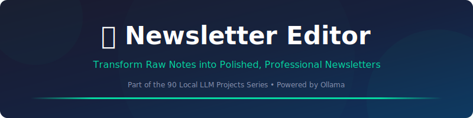
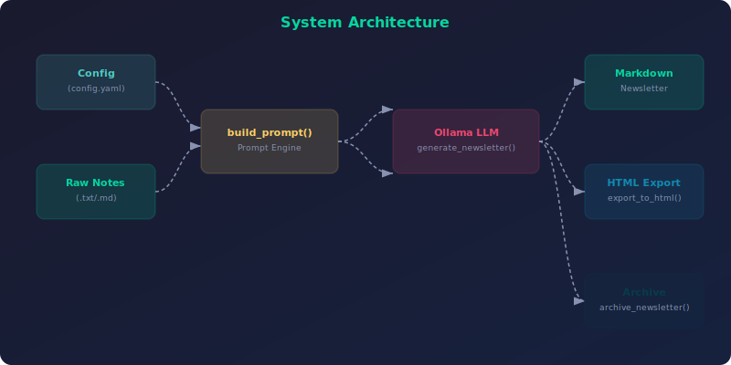

<div align="center">



<br><br>

[](https://python.org)
[](https://ollama.com)
[](LICENSE)
[](https://streamlit.io)
[](CONTRIBUTING.md)

**Transform Raw Notes into Polished, Professional Newsletters**

[Quick Start](#-quick-start) •
[Features](#-features) •
[CLI Reference](#-cli-reference) •
[Web UI](#-web-ui) •
[Architecture](#-architecture) •
[API Reference](#-api-reference) •
[Configuration](#%EF%B8%8F-configuration) •
[FAQ](#-faq)

</div>

---

## 📋 Table of Contents

- [Why Newsletter Editor?](#-why-newsletter-editor)
- [Features](#-features)
- [Quick Start](#-quick-start)
- [CLI Reference](#-cli-reference)
- [Web UI](#-web-ui)
- [Architecture](#-architecture)
- [API Reference](#-api-reference)
- [Configuration](#%EF%B8%8F-configuration)
- [Testing](#-testing)
- [Local vs Cloud LLMs](#-local-vs-cloud-llms)
- [FAQ](#-faq)
- [Contributing](#-contributing)
- [License](#-license)

---

## 🤔 Why Newsletter Editor?

> **Project 36 of the [90 Local LLM Projects](https://github.com/kennedyraju55/90-local-llm-projects) series** — building real-world AI tools that run entirely on your local machine.

| ✅ Why This Tool | ❌ The Problem It Solves |
|-----------------|------------------------|
| 📧 Email newsletters are still #1 ROI channel | Manual formatting takes hours per issue |
| 🧠 AI understands your raw notes contextually | Template systems require rigid structure |
| 🎯 Segment-aware content reaches the right readers | One-size-fits-all reduces engagement |
| ⚡ Generate in seconds, not hours | Consistency suffers under deadline pressure |


---

## ✨ Features

<div align="center">


</div>

<br>

### 📋 6 Section Templates

News Roundup, Deep Dive, Tips & Tricks, Spotlight, Events, Reader Q&A.

### 👥 4 Subscriber Segments

All, New Welcome, Premium Exclusive, Inactive Re-engagement.

### 🎨 5 Writing Tones

Informative, Casual, Witty, Formal, Friendly — adapt to audience.

### 📦 Archive Management

Auto-archive with timestamps, browse history, metadata tracking.

### 🌐 HTML Email Export

Styled HTML output with responsive design, ready for email delivery.

### ⚡ CLI + Web UI

Full Click CLI with 4 commands plus Streamlit web interface.

---

## 🚀 Quick Start

### Prerequisites

- **Python 3.9+** — [Download](https://www.python.org/downloads/)
- **Ollama** — [Install Ollama](https://ollama.com/download)
- A pulled model (e.g., `ollama pull llama3.1:8b`)

### Installation

```bash
# Clone the repository
git clone https://github.com/kennedyraju55/newsletter-editor.git
cd newsletter-editor

# Create virtual environment
python -m venv venv
source venv/bin/activate  # Windows: venv\Scripts\activate

# Install dependencies
pip install -r requirements.txt

# Install the package
pip install -e .
```

### Environment Setup

```bash
# Copy environment template
cp .env.example .env

# Edit with your settings
# OLLAMA_HOST=http://localhost:11434
# OLLAMA_MODEL=llama3.1:8b
```

### Your First Run

```bash
newsletter-editor generate --input notes.txt --name "Weekly Tech Digest" --tone witty --template news_roundup --html
```

<details>
<summary><strong>📋 Example Output</strong> (click to expand)</summary>

```
📧 Newsletter Editor - Generating...

━━━━━━━━━━━━━━━━━━━━━━━━━━━━━━━━━━━━━━━━
📰 Weekly Tech Digest
━━━━━━━━━━━━━━━━━━━━━━━━━━━━━━━━━━━━━━━━

# 🗞️ Weekly Tech Digest

## 📰 Top Stories This Week
- **AI Coding Assistants Hit Mainstream** — GitHub Copilot...
- **Rust Adoption Surges in 2024** — Mozilla's language...

## 🔍 Deep Dive: Local LLMs
Running models on your own hardware isn't just possible...

## 💡 Tips & Tricks
1. Use `ollama pull` to download models instantly
2. Set temperature to 0.3 for factual content...

## 📅 Upcoming Events
| Date | Event | Location |
|------|-------|----------|
| Jan 15 | AI Summit | Virtual |

✅ Newsletter generated (4 sections, witty tone)
📄 HTML exported: Weekly_Tech_Digest.html
📦 Archived: weekly_tech_digest_20240115_143022.md
```

</details>

---

## 🖥️ CLI Reference

```bash
newsletter-editor --help
```

**Global Options:**

| Option | Description | Default |
|--------|-------------|---------|
| `--config` | Path to configuration file | `config.yaml` |
| `--verbose` | Enable debug logging | `False` |


### `newsletter-editor generate`

Generate a polished newsletter from raw notes.

| Option | Description | Default |
|--------|-------------|----------|
| `--input` | Path to raw notes file | `Required` |
| `--name` | Newsletter name/title | `Required` |
| `--sections` | Number of sections | `4` |
| `--tone` | Writing tone (informative/casual/witty/formal/friendly) | `informative` |
| `--template` | Section template (news_roundup/deep_dive/tips_tricks/spotlight/upcoming_events/reader_qa) | `None` |
| `--segment` | Subscriber segment (all/new/premium/inactive) | `None` |
| `--output, -o` | Save output to file | `None` |
| `--html` | Also export as HTML | `False` |
| `--archive/--no-archive` | Archive the generated newsletter | `True` |


### `newsletter-editor templates`

List available section templates.


### `newsletter-editor segments`

List available subscriber segments.


### `newsletter-editor archive`

List archived newsletters with metadata.


---

## 🌐 Web UI

Newsletter Editor includes a beautiful **Streamlit** web interface for users who prefer a graphical experience.

### Launch the Web UI

```bash
# Using Streamlit directly
streamlit run src/newsletter_editor/web_ui.py

# Or using Make
make web
```

### Web UI Features

- 🎨 **Intuitive Interface** — Clean, modern design with sidebar controls
- ⚡ **Real-time Generation** — Watch content generate with live streaming
- 📋 **Copy & Export** — One-click copy to clipboard or download as file
- 🔧 **All CLI Options** — Every CLI feature available through dropdowns and toggles
- 📱 **Responsive Design** — Works on desktop and mobile browsers

> **Tip:** The Web UI runs at `http://localhost:8501` by default. Share it on your local network for team access.

---

## 🏗️ Architecture

<div align="center">



</div>

### How It Works

1. **Input Processing** — Raw input is loaded and validated
2. **Prompt Engineering** — `build_prompt()` constructs an optimized prompt with context-specific instructions
3. **LLM Generation** — The prompt is sent to Ollama with a specialized system prompt: *"Expert newsletter editor & curator"*
4. **Post-Processing** — Output is formatted, validated, and optionally exported
5. **Storage** — Results are saved for future reference and iteration

### Project Structure

```
36-newsletter-editor/
├── src/
│   └── newsletter_editor/
│       ├── __init__.py
│       ├── core.py          # Business logic, templates, LLM integration
│       ├── cli.py           # Click CLI with 4 commands
│       └── web_ui.py        # Streamlit web interface
├── tests/
│   └── test_core.py         # Unit tests
├── docs/
│   └── images/
│       ├── banner.svg       # Project banner
│       ├── architecture.svg # System architecture
│       └── features.svg     # Feature showcase
├── config.yaml              # LLM & newsletter configuration
├── setup.py                 # Package installation
├── requirements.txt         # Python dependencies
├── Makefile                 # Build automation
├── .env.example             # Environment template
└── README.md                # This file
```

### Technology Stack

| Component | Technology | Purpose |
|-----------|-----------|---------|
| 🧠 LLM Backend | Ollama | Local model inference (privacy-first) |
| 🐍 Language | Python 3.9+ | Core application logic |
| ⌨️ CLI Framework | Click | Command-line interface with rich help |
| 🌐 Web Framework | Streamlit | Interactive web UI |
| 📊 Output | Rich | Beautiful terminal formatting |
| ⚙️ Config | YAML | Flexible configuration management |
| 📦 Packaging | setuptools | pip-installable package |

---

## 📚 API Reference

All functions are importable from `newsletter_editor.core`:

```python
from newsletter_editor.core import *
```

#### `load_config(config_path: Optional[str] = None)` → `dict`

Loads YAML configuration, deep-merges with defaults.

```python
from newsletter_editor.core import load_config

result = load_config(config_path)
```

---

#### `read_input_file(filepath: str)` → `str`

Reads raw notes/content from a text file.

```python
from newsletter_editor.core import read_input_file

result = read_input_file(filepath)
```

---

#### `get_section_templates()` → `dict`

Returns all 6 section template definitions.

```python
from newsletter_editor.core import get_section_templates

result = get_section_templates()
```

---

#### `get_subscriber_segments()` → `dict`

Returns all 4 subscriber segment definitions.

```python
from newsletter_editor.core import get_subscriber_segments

result = get_subscriber_segments()
```

---

#### `build_prompt(raw_content, name, sections, tone, template=None, segment=None)` → `str`

Constructs the LLM prompt with template hints and segment guidance.

```python
from newsletter_editor.core import build_prompt

result = build_prompt(raw_content)
```

---

#### `generate_newsletter(raw_content, name, sections, tone, template=None, segment=None, config=None)` → `str`

Generates newsletter via LLM with expert editor system prompt.

```python
from newsletter_editor.core import generate_newsletter

result = generate_newsletter(raw_content)
```

---

#### `export_to_html(markdown_content, newsletter_name)` → `str`

Converts markdown newsletter to styled, responsive HTML.

```python
from newsletter_editor.core import export_to_html

result = export_to_html(markdown_content)
```

---

#### `archive_newsletter(content, name, config=None)` → `str`

Archives newsletter with timestamp-based filename.

```python
from newsletter_editor.core import archive_newsletter

result = archive_newsletter(content)
```

---

#### `list_archive(config=None)` → `list[dict]`

Lists archived newsletters with filename, path, size, modified date.

```python
from newsletter_editor.core import list_archive

result = list_archive(config)
```

---


---

## ⚙️ Configuration

### config.yaml

```yaml
llm:
  model: "llama3.1:8b"        # Ollama model name
  temperature: 0.7            # Creativity (0.0-1.0)
  max_tokens: 4096           # Maximum output length
  host: "http://localhost:11434"  # Ollama server URL
```

### Environment Variables

| Variable | Description | Default |
|----------|-------------|---------|
| `OLLAMA_HOST` | Ollama server URL | `http://localhost:11434` |
| `OLLAMA_MODEL` | Default model name | `llama3.1:8b` |

### Configuration Priority

```
CLI flags → Environment variables → config.yaml → Built-in defaults
```

---

## 🧪 Testing

```bash
# Run all tests
python -m pytest tests/ -v

# Run with coverage
python -m pytest tests/ --cov=newsletter_editor --cov-report=term-missing

# Run specific test file
python -m pytest tests/test_core.py -v

# Using Make
make test
```

---

## ☁️ Local vs Cloud LLMs

| Aspect | 🏠 Local (Ollama) | ☁️ Cloud (OpenAI/etc.) |
|--------|-------------------|----------------------|
| **Privacy** | ✅ Data never leaves your machine | ❌ Data sent to third-party servers |
| **Cost** | ✅ Free after hardware investment | ❌ Per-token pricing adds up |
| **Speed** | ⚡ No network latency | 🌐 Depends on internet speed |
| **Availability** | ✅ Works offline, always available | ❌ Requires internet, may have outages |
| **Models** | 🔄 Growing selection (Llama, Mistral) | ✅ Latest models (GPT-4, Claude) |
| **Quality** | 🟡 Good for most tasks | ✅ State-of-the-art for complex tasks |
| **Setup** | 🔧 One-time Ollama install | ✅ API key and go |
| **Customization** | ✅ Fine-tune your own models | 🟡 Limited to provider options |

> **Our recommendation:** Start with local models for development and privacy-sensitive content. Switch to cloud only if you need cutting-edge model quality for production.

---

## ❓ FAQ

<details>
<summary><strong>What LLM models work best?</strong></summary>
<br>

Any Ollama-compatible model works. We recommend `llama3.1:8b` for speed or `llama3.1:70b` for quality. Mistral and Mixtral also produce excellent newsletter content.

</details>

<details>
<summary><strong>Can I customize the HTML email template?</strong></summary>
<br>

Yes! The `export_to_html()` function uses embedded CSS that you can modify. The default template is responsive with a max-width of 680px, optimized for email clients.

</details>

<details>
<summary><strong>How does the archive system work?</strong></summary>
<br>

Every generated newsletter is automatically saved with a timestamp (e.g., `weekly_digest_20240115_143022.md`). Use `newsletter-editor archive` to browse your history.

</details>

<details>
<summary><strong>Can I add my own section templates?</strong></summary>
<br>

Absolutely. Add new templates to the `SECTION_TEMPLATES` dict in `core.py`. Each template needs a `name`, `description`, and `hint` for the LLM.

</details>

<details>
<summary><strong>Does it support multiple languages?</strong></summary>
<br>

The LLM can generate content in any language it was trained on. Add language instructions to your tone or use a custom prompt via the config file.

</details>


---

## 🤝 Contributing

Contributions are welcome! Here's how to get started:

1. **Fork** the repository
2. **Create** a feature branch (`git checkout -b feature/amazing-feature`)
3. **Commit** your changes (`git commit -m 'Add amazing feature'`)
4. **Push** to the branch (`git push origin feature/amazing-feature`)
5. **Open** a Pull Request

### Development Setup

```bash
# Clone your fork
git clone https://github.com/YOUR_USERNAME/newsletter-editor.git
cd newsletter-editor

# Install dev dependencies
pip install -r requirements.txt
pip install -e ".[dev]"

# Run tests before submitting
python -m pytest tests/ -v
```

### Code Style

- Follow **PEP 8** for Python code
- Use **type hints** for function signatures
- Write **docstrings** for all public functions
- Add **tests** for new features

---

## 📄 License

This project is licensed under the **MIT License** — see the [LICENSE](LICENSE) file for details.

---

<div align="center">

### 🌟 Part of the [90 Local LLM Projects](https://github.com/kennedyraju55/90-local-llm-projects) Series

*Building real-world AI tools that run entirely on your local machine.*

**Project 36 of 90** — 📧 Newsletter Editor

[⬅️ Previous Project](../README.md) •
[📋 All Projects](https://github.com/kennedyraju55/90-local-llm-projects) •
[➡️ Next Project](../README.md)

---

<sub>Built with ❤️ using Ollama & Python | Star ⭐ if you find this useful!</sub>

</div>
