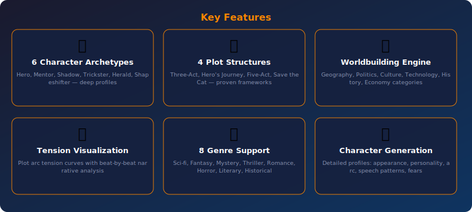
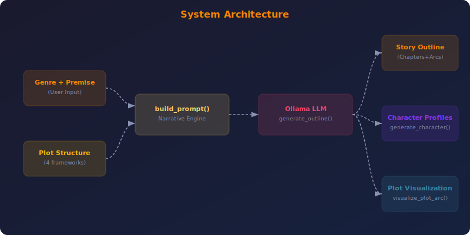

<div align="center">


<br><br>

[](https://python.org)
[](https://ollama.com)
[](LICENSE)
[](https://streamlit.io)
[](CONTRIBUTING.md)

**Craft Compelling Novel & Story Outlines with AI-Powered Narrative Design**

[Quick Start](#-quick-start) •
[Features](#-features) •
[CLI Reference](#-cli-reference) •
[Web UI](#-web-ui) •
[Architecture](#-architecture) •
[API Reference](#-api-reference) •
[Configuration](#%EF%B8%8F-configuration) •
[FAQ](#-faq)

</div>

---

## 📋 Table of Contents

- [Why Story Outline Generator?](#-why-story-outline-generator)
- [Features](#-features)
- [Quick Start](#-quick-start)
- [CLI Reference](#-cli-reference)
- [Web UI](#-web-ui)
- [Architecture](#-architecture)
- [API Reference](#-api-reference)
- [Configuration](#%EF%B8%8F-configuration)
- [Testing](#-testing)
- [Local vs Cloud LLMs](#-local-vs-cloud-llms)
- [FAQ](#-faq)
- [Contributing](#-contributing)
- [License](#-license)

---

## 🤔 Why Story Outline Generator?

> **Project 37 of the [90 Local LLM Projects](https://github.com/kennedyraju55/90-local-llm-projects) series** — building real-world AI tools that run entirely on your local machine.

| ✅ Why This Tool | ❌ The Problem It Solves |
|-----------------|------------------------|
| 📖 Story structure is the foundation of great fiction | Outlining by hand is slow and inconsistent |
| 🎭 Deep character archetypes create memorable characters | Flat characters kill reader engagement |
| 📐 Proven plot frameworks prevent saggy middles | Winging it leads to plot holes |
| 🌍 Rich worldbuilding creates immersive settings | Inconsistent worlds break reader trust |


---

## ✨ Features

<div align="center">



</div>

<br>

### 🎭 6 Character Archetypes

Hero, Mentor, Shadow, Trickster, Herald, Shapeshifter — deep profiles.

### 📐 4 Plot Structures

Three-Act, Hero's Journey, Five-Act, Save the Cat — proven frameworks.

### 🌍 Worldbuilding Engine

Geography, Politics, Culture, Technology, History, Economy categories.

### 📊 Tension Visualization

Plot arc tension curves with beat-by-beat narrative analysis.

### 📚 8 Genre Support

Sci-fi, Fantasy, Mystery, Thriller, Romance, Horror, Literary, Historical.

### 🧬 Character Generation

Detailed profiles: appearance, personality, arc, speech patterns, fears.

---

## 🚀 Quick Start

### Prerequisites

- **Python 3.9+** — [Download](https://www.python.org/downloads/)
- **Ollama** — [Install Ollama](https://ollama.com/download)
- A pulled model (e.g., `ollama pull llama3.1:8b`)

### Installation

```bash
# Clone the repository
git clone https://github.com/kennedyraju55/story-outline-generator.git
cd story-outline-generator

# Create virtual environment
python -m venv venv
source venv/bin/activate  # Windows: venv\Scripts\activate

# Install dependencies
pip install -r requirements.txt

# Install the package
pip install -e .
```

### Environment Setup

```bash
# Copy environment template
cp .env.example .env

# Edit with your settings
# OLLAMA_HOST=http://localhost:11434
# OLLAMA_MODEL=llama3.1:8b
```

### Your First Run

```bash
story-gen generate --genre sci-fi --premise "A colony ship discovers its destination planet is already inhabited" --chapters 12 --characters 5 --structure heros_journey --worldbuilding
```

<details>
<summary><strong>📋 Example Output</strong> (click to expand)</summary>

```
📖 Story Outline Generator - Crafting your narrative...

━━━━━━━━━━━━━━━━━━━━━━━━━━━━━━━━━━━━━━━━
🎬 Story Outline: Sci-Fi | Hero's Journey | 12 Chapters
━━━━━━━━━━━━━━━━━━━━━━━━━━━━━━━━━━━━━━━━

# 🌟 "The Last Horizon"

## 📖 Story Overview
- **Title Options:** The Last Horizon | Beyond the Drift | Colony's Edge
- **Logline:** When the colony ship *Meridian* arrives at Kepler-442b...
- **Theme:** First contact, colonialism, coexistence
- **Setting:** 2387, interstellar colony ship & alien civilization

## 🎭 Characters (5)
1. **Captain Elena Vasquez** (Protagonist/Hero) — Determined...
2. **Dr. Kai Chen** (Mentor) — Ship's xenobiologist...
3. **Admiral Stone** (Shadow) — Military commander who sees...

## 📐 Plot Structure (Hero's Journey)
| Beat | Chapter | Description |
|------|---------|-------------|
| Ordinary World | Ch 1-2 | Life aboard the Meridian... |
| Call to Adventure | Ch 3 | First contact signal detected... |

## 🌍 Worldbuilding
### Geography: Binary star system with...
### Politics: Ship governed by Council of Seven...

✅ Outline generated (12 chapters, 5 characters)
```

</details>

---

## 🖥️ CLI Reference

```bash
story-gen --help
```

**Global Options:**

| Option | Description | Default |
|--------|-------------|---------|
| `--config` | Path to configuration file | `config.yaml` |
| `--verbose` | Enable debug logging | `False` |


### `story-gen generate`

Generate a complete story outline.

| Option | Description | Default |
|--------|-------------|----------|
| `--genre` | Story genre (sci-fi/fantasy/mystery/thriller/romance/horror/literary/historical) | `Required` |
| `--premise` | Story premise or concept | `Required` |
| `--chapters` | Number of chapters | `10` |
| `--characters` | Number of main characters | `4` |
| `--structure` | Plot structure (three_act/heros_journey/five_act/save_the_cat) | `None` |
| `--worldbuilding/--no-worldbuilding` | Include worldbuilding details | `False` |
| `--output, -o` | Save output to file | `None` |


### `story-gen character`

Generate a detailed character profile.

| Option | Description | Default |
|--------|-------------|----------|
| `--name` | Character name | `Required` |
| `--role` | Character role (protagonist/antagonist/etc) | `Required` |
| `--genre` | Story genre for context | `fantasy` |
| `--archetype` | Character archetype (hero/mentor/shadow/trickster/herald/shapeshifter) | `None` |


### `story-gen archetypes`

List available character archetypes with traits.


### `story-gen structures`

List available plot structures with beats.


---

## 🌐 Web UI

Story Outline Generator includes a beautiful **Streamlit** web interface for users who prefer a graphical experience.

### Launch the Web UI

```bash
# Using Streamlit directly
streamlit run src/story_gen/web_ui.py

# Or using Make
make web
```

### Web UI Features

- 🎨 **Intuitive Interface** — Clean, modern design with sidebar controls
- ⚡ **Real-time Generation** — Watch content generate with live streaming
- 📋 **Copy & Export** — One-click copy to clipboard or download as file
- 🔧 **All CLI Options** — Every CLI feature available through dropdowns and toggles
- 📱 **Responsive Design** — Works on desktop and mobile browsers

> **Tip:** The Web UI runs at `http://localhost:8501` by default. Share it on your local network for team access.

---

## 🏗️ Architecture

<div align="center">



</div>

### How It Works

1. **Input Processing** — Raw input is loaded and validated
2. **Prompt Engineering** — `build_prompt()` constructs an optimized prompt with context-specific instructions
3. **LLM Generation** — The prompt is sent to Ollama with a specialized system prompt: *"Bestselling novelist & story development expert"*
4. **Post-Processing** — Output is formatted, validated, and optionally exported
5. **Storage** — Results are saved for future reference and iteration

### Project Structure

```
37-story-outline-generator/
├── src/
│   └── story_gen/
│       ├── __init__.py
│       ├── core.py          # Narrative engine, archetypes, plot structures
│       ├── cli.py           # Click CLI with 4 commands
│       └── web_ui.py        # Streamlit web interface
├── tests/
│   └── test_core.py         # Unit tests
├── docs/
│   └── images/
│       ├── banner.svg       # Project banner
│       ├── architecture.svg # System architecture
│       └── features.svg     # Feature showcase
├── config.yaml              # LLM & story configuration
├── setup.py                 # Package installation
├── requirements.txt         # Python dependencies
├── Makefile                 # Build automation
├── .env.example             # Environment template
└── README.md                # This file
```

### Technology Stack

| Component | Technology | Purpose |
|-----------|-----------|---------|
| 🧠 LLM Backend | Ollama | Local model inference (privacy-first) |
| 🐍 Language | Python 3.9+ | Core application logic |
| ⌨️ CLI Framework | Click | Command-line interface with rich help |
| 🌐 Web Framework | Streamlit | Interactive web UI |
| 📊 Output | Rich | Beautiful terminal formatting |
| ⚙️ Config | YAML | Flexible configuration management |
| 📦 Packaging | setuptools | pip-installable package |

---

## 📚 API Reference

All functions are importable from `story_gen.core`:

```python
from story_gen.core import *
```

#### `load_config(config_path: Optional[str] = None)` → `dict`

Loads YAML configuration, deep-merges with defaults.

```python
from story_gen.core import load_config

result = load_config(config_path)
```

---

#### `get_character_archetypes()` → `dict`

Returns all 6 character archetype definitions with traits.

```python
from story_gen.core import get_character_archetypes

result = get_character_archetypes()
```

---

#### `get_plot_structures()` → `dict`

Returns all 4 plot structure definitions with beats.

```python
from story_gen.core import get_plot_structures

result = get_plot_structures()
```

---

#### `get_worldbuilding_categories()` → `dict`

Returns all 6 worldbuilding category definitions.

```python
from story_gen.core import get_worldbuilding_categories

result = get_worldbuilding_categories()
```

---

#### `build_prompt(genre, premise, chapters, characters, plot_structure=None, worldbuilding=False)` → `str`

Constructs detailed story outline prompt with structure and worldbuilding.

```python
from story_gen.core import build_prompt

result = build_prompt(genre)
```

---

#### `generate_outline(genre, premise, chapters, characters, plot_structure=None, worldbuilding=False, config=None)` → `str`

Generates full story outline via LLM with novelist system prompt.

```python
from story_gen.core import generate_outline

result = generate_outline(genre)
```

---

#### `generate_character_profile(name, role, genre, archetype=None, config=None)` → `str`

Generates detailed character profile with appearance, personality, arc.

```python
from story_gen.core import generate_character_profile

result = generate_character_profile(name)
```

---

#### `visualize_plot_arc(structure: str = 'three_act')` → `list[dict]`

Returns plot arc data with beat positions and tension values.

```python
from story_gen.core import visualize_plot_arc

result = visualize_plot_arc(structure)
```

---


---

## ⚙️ Configuration

### config.yaml

```yaml
llm:
  model: "llama3.1:8b"        # Ollama model name
  temperature: 0.8            # Creativity (0.0-1.0)
  max_tokens: 4096           # Maximum output length
  host: "http://localhost:11434"  # Ollama server URL
```

### Environment Variables

| Variable | Description | Default |
|----------|-------------|---------|
| `OLLAMA_HOST` | Ollama server URL | `http://localhost:11434` |
| `OLLAMA_MODEL` | Default model name | `llama3.1:8b` |

### Configuration Priority

```
CLI flags → Environment variables → config.yaml → Built-in defaults
```

---

## 🧪 Testing

```bash
# Run all tests
python -m pytest tests/ -v

# Run with coverage
python -m pytest tests/ --cov=story_gen --cov-report=term-missing

# Run specific test file
python -m pytest tests/test_core.py -v

# Using Make
make test
```

---

## ☁️ Local vs Cloud LLMs

| Aspect | 🏠 Local (Ollama) | ☁️ Cloud (OpenAI/etc.) |
|--------|-------------------|----------------------|
| **Privacy** | ✅ Data never leaves your machine | ❌ Data sent to third-party servers |
| **Cost** | ✅ Free after hardware investment | ❌ Per-token pricing adds up |
| **Speed** | ⚡ No network latency | 🌐 Depends on internet speed |
| **Availability** | ✅ Works offline, always available | ❌ Requires internet, may have outages |
| **Models** | 🔄 Growing selection (Llama, Mistral) | ✅ Latest models (GPT-4, Claude) |
| **Quality** | 🟡 Good for most tasks | ✅ State-of-the-art for complex tasks |
| **Setup** | 🔧 One-time Ollama install | ✅ API key and go |
| **Customization** | ✅ Fine-tune your own models | 🟡 Limited to provider options |

> **Our recommendation:** Start with local models for development and privacy-sensitive content. Switch to cloud only if you need cutting-edge model quality for production.

---

## ❓ FAQ

<details>
<summary><strong>Which plot structure should I choose?</strong></summary>
<br>

**Three-Act** is great for beginners and screenplays. **Hero's Journey** works best for adventure/fantasy. **Five-Act** suits literary fiction. **Save the Cat** is perfect for commercial fiction with its 14 specific beats.

</details>

<details>
<summary><strong>Can I generate outlines for screenplays?</strong></summary>
<br>

Yes! Use `--structure three_act` or `five_act` for screenplay-friendly formats. The chapter breakdown maps naturally to screenplay scenes and sequences.

</details>

<details>
<summary><strong>How detailed are the character profiles?</strong></summary>
<br>

Very detailed. Each profile includes: physical appearance, personality traits, background/history, motivations, fears, speech patterns, key relationships, and a full character arc from beginning to end.

</details>

<details>
<summary><strong>Can I combine multiple genres?</strong></summary>
<br>

While the CLI accepts one genre, you can include genre-blending instructions in your premise. E.g., `--genre sci-fi --premise 'A noir detective mystery set on a space station'` works great.

</details>

<details>
<summary><strong>What's the tension visualization?</strong></summary>
<br>

The `visualize_plot_arc()` function generates data points showing narrative tension at each beat of your chosen structure. The tension peaks around 70% of the story (the climax) following classic narrative theory.

</details>


---

## 🤝 Contributing

Contributions are welcome! Here's how to get started:

1. **Fork** the repository
2. **Create** a feature branch (`git checkout -b feature/amazing-feature`)
3. **Commit** your changes (`git commit -m 'Add amazing feature'`)
4. **Push** to the branch (`git push origin feature/amazing-feature`)
5. **Open** a Pull Request

### Development Setup

```bash
# Clone your fork
git clone https://github.com/YOUR_USERNAME/story-outline-generator.git
cd story-outline-generator

# Install dev dependencies
pip install -r requirements.txt
pip install -e ".[dev]"

# Run tests before submitting
python -m pytest tests/ -v
```

### Code Style

- Follow **PEP 8** for Python code
- Use **type hints** for function signatures
- Write **docstrings** for all public functions
- Add **tests** for new features

---

## 📄 License

This project is licensed under the **MIT License** — see the [LICENSE](LICENSE) file for details.

---

<div align="center">

### 🌟 Part of the [90 Local LLM Projects](https://github.com/kennedyraju55/90-local-llm-projects) Series

*Building real-world AI tools that run entirely on your local machine.*

**Project 37 of 90** — 📖 Story Outline Generator

[⬅️ Previous Project](../README.md) •
[📋 All Projects](https://github.com/kennedyraju55/90-local-llm-projects) •
[➡️ Next Project](../README.md)

---

<sub>Built with ❤️ using Ollama & Python | Star ⭐ if you find this useful!</sub>

</div>
