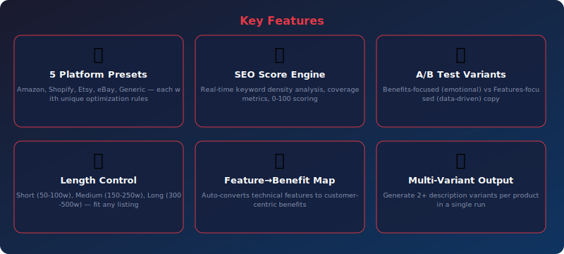
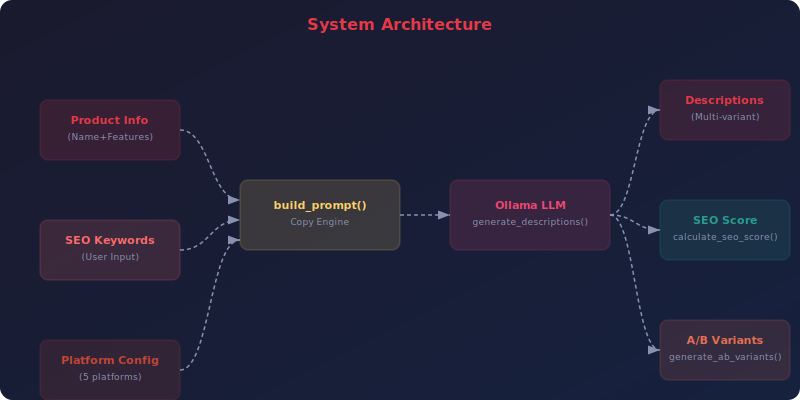

<div align="center">


<br><br>

[](https://python.org)
[](https://ollama.com)
[](LICENSE)
[](https://streamlit.io)
[](CONTRIBUTING.md)

**Generate SEO-Optimized E-Commerce Descriptions That Convert**

[Quick Start](#-quick-start) •
[Features](#-features) •
[CLI Reference](#-cli-reference) •
[Web UI](#-web-ui) •
[Architecture](#-architecture) •
[API Reference](#-api-reference) •
[Configuration](#%EF%B8%8F-configuration) •
[FAQ](#-faq)

</div>

---

## 📋 Table of Contents

- [Why Product Description Writer?](#-why-product-description-writer)
- [Features](#-features)
- [Quick Start](#-quick-start)
- [CLI Reference](#-cli-reference)
- [Web UI](#-web-ui)
- [Architecture](#-architecture)
- [API Reference](#-api-reference)
- [Configuration](#%EF%B8%8F-configuration)
- [Testing](#-testing)
- [Local vs Cloud LLMs](#-local-vs-cloud-llms)
- [FAQ](#-faq)
- [Contributing](#-contributing)
- [License](#-license)

---

## 🤔 Why Product Description Writer?

> **Project 38 of the [90 Local LLM Projects](https://github.com/kennedyraju55/90-local-llm-projects) series** — building real-world AI tools that run entirely on your local machine.

| ✅ Why This Tool | ❌ The Problem It Solves |
|-----------------|------------------------|
| 🛒 Product descriptions directly impact conversion rates | Writing unique copy for every SKU is exhausting |
| 🔍 SEO-optimized listings rank higher in search | Manual keyword integration feels unnatural |
| 🏪 Each platform has unique rules and limits | One description doesn't fit Amazon AND Etsy |
| 🔄 A/B testing reveals what actually converts | Guessing which copy works wastes ad spend |


---

## ✨ Features

<div align="center">



</div>

<br>

### 🏪 5 Platform Presets

Amazon, Shopify, Etsy, eBay, Generic — each with unique optimization rules.

### 🔍 SEO Score Engine

Real-time keyword density analysis, coverage metrics, 0-100 scoring.

### 🔄 A/B Test Variants

Benefits-focused (emotional) vs Features-focused (data-driven) copy.

### 📏 Length Control

Short (50-100w), Medium (150-250w), Long (300-500w) — fit any listing.

### 💡 Feature→Benefit Map

Auto-converts technical features to customer-centric benefits.

### 📊 Multi-Variant Output

Generate 2+ description variants per product in a single run.

---

## 🚀 Quick Start

### Prerequisites

- **Python 3.9+** — [Download](https://www.python.org/downloads/)
- **Ollama** — [Install Ollama](https://ollama.com/download)
- A pulled model (e.g., `ollama pull llama3.1:8b`)

### Installation

```bash
# Clone the repository
git clone https://github.com/kennedyraju55/product-description-writer.git
cd product-description-writer

# Create virtual environment
python -m venv venv
source venv/bin/activate  # Windows: venv\Scripts\activate

# Install dependencies
pip install -r requirements.txt

# Install the package
pip install -e .
```

### Environment Setup

```bash
# Copy environment template
cp .env.example .env

# Edit with your settings
# OLLAMA_HOST=http://localhost:11434
# OLLAMA_MODEL=llama3.1:8b
```

### Your First Run

```bash
product-writer generate --product "Wireless Noise-Canceling Headphones" --features "bluetooth,noise-canceling,40hr battery,lightweight" --platform amazon --length medium --keywords "wireless headphones,noise canceling,bluetooth headphones"
```

<details>
<summary><strong>📋 Example Output</strong> (click to expand)</summary>

```
🛒 Product Description Writer - Generating...

━━━━━━━━━━━━━━━━━━━━━━━━━━━━━━━━━━━━━━━━
🏪 Platform: Amazon | Length: Medium | Variants: 2
━━━━━━━━━━━━━━━━━━━━━━━━━━━━━━━━━━━━━━━━

## 📝 Variant 1

**Title:** Premium Wireless Noise-Canceling Headphones...
**Short Description:** Experience pure audio bliss with...

**Full Description:**
Transform your listening experience with our premium...

**Bullet Points:**
• 🎧 Advanced Active Noise Cancellation blocks 98% of...
• ⚡ 40-hour marathon battery life — charge weekly, not daily
• 🪶 Ultra-lightweight 250g design for all-day comfort
• 📱 Bluetooth 5.3 with multipoint connection

**SEO Keywords:** wireless headphones, noise canceling...

━━━━━━━━━━━━━━━━━━━━━━━━━━━━━━━━━━━━━━━━
📊 SEO Analysis
━━━━━━━━━━━━━━━━━━━━━━━━━━━━━━━━━━━━━━━━
Overall Score: 87/100
Keyword Coverage: 100% (3/3 keywords found)
Word Count: 218 words
```

</details>

---

## 🖥️ CLI Reference

```bash
product-writer --help
```

**Global Options:**

| Option | Description | Default |
|--------|-------------|---------|
| `--config` | Path to configuration file | `config.yaml` |
| `--verbose` | Enable debug logging | `False` |


### `product-writer generate`

Generate product descriptions.

| Option | Description | Default |
|--------|-------------|----------|
| `--product` | Product name | `Required` |
| `--features` | Comma-separated product features | `""` |
| `--platform` | E-commerce platform (amazon/shopify/etsy/ebay/generic) | `generic` |
| `--length` | Description length (short/medium/long) | `medium` |
| `--variants` | Number of description variants | `2` |
| `--keywords` | Comma-separated SEO keywords | `""` |
| `--output, -o` | Save output to file | `None` |


### `product-writer platforms`

List supported e-commerce platforms with specs.


### `product-writer benefits`

Map features to customer benefits.

| Option | Description | Default |
|--------|-------------|----------|
| `--features` | Comma-separated features to map | `Required` |


---

## 🌐 Web UI

Product Description Writer includes a beautiful **Streamlit** web interface for users who prefer a graphical experience.

### Launch the Web UI

```bash
# Using Streamlit directly
streamlit run src/product_writer/web_ui.py

# Or using Make
make web
```

### Web UI Features

- 🎨 **Intuitive Interface** — Clean, modern design with sidebar controls
- ⚡ **Real-time Generation** — Watch content generate with live streaming
- 📋 **Copy & Export** — One-click copy to clipboard or download as file
- 🔧 **All CLI Options** — Every CLI feature available through dropdowns and toggles
- 📱 **Responsive Design** — Works on desktop and mobile browsers

> **Tip:** The Web UI runs at `http://localhost:8501` by default. Share it on your local network for team access.

---

## 🏗️ Architecture

<div align="center">



</div>

### How It Works

1. **Input Processing** — Raw input is loaded and validated
2. **Prompt Engineering** — `build_prompt()` constructs an optimized prompt with context-specific instructions
3. **LLM Generation** — The prompt is sent to Ollama with a specialized system prompt: *"Expert e-commerce copywriter & SEO specialist"*
4. **Post-Processing** — Output is formatted, validated, and optionally exported
5. **Storage** — Results are saved for future reference and iteration

### Project Structure

```
38-product-description-writer/
├── src/
│   └── product_writer/
│       ├── __init__.py
│       ├── core.py          # Copy engine, SEO scoring, platform configs
│       ├── cli.py           # Click CLI with 3 commands
│       └── web_ui.py        # Streamlit web interface
├── tests/
│   └── test_core.py         # Unit tests
├── docs/
│   └── images/
│       ├── banner.svg       # Project banner
│       ├── architecture.svg # System architecture
│       └── features.svg     # Feature showcase
├── config.yaml              # LLM & product configuration
├── setup.py                 # Package installation
├── requirements.txt         # Python dependencies
├── Makefile                 # Build automation
├── .env.example             # Environment template
└── README.md                # This file
```

### Technology Stack

| Component | Technology | Purpose |
|-----------|-----------|---------|
| 🧠 LLM Backend | Ollama | Local model inference (privacy-first) |
| 🐍 Language | Python 3.9+ | Core application logic |
| ⌨️ CLI Framework | Click | Command-line interface with rich help |
| 🌐 Web Framework | Streamlit | Interactive web UI |
| 📊 Output | Rich | Beautiful terminal formatting |
| ⚙️ Config | YAML | Flexible configuration management |
| 📦 Packaging | setuptools | pip-installable package |

---

## 📚 API Reference

All functions are importable from `product_writer.core`:

```python
from product_writer.core import *
```

#### `load_config(config_path: Optional[str] = None)` → `dict`

Loads YAML configuration, deep-merges with defaults.

```python
from product_writer.core import load_config

result = load_config(config_path)
```

---

#### `get_platform_configs()` → `dict`

Returns all 5 platform configurations with limits and tips.

```python
from product_writer.core import get_platform_configs

result = get_platform_configs()
```

---

#### `get_feature_benefit_map()` → `dict`

Returns 8 predefined feature-to-benefit mappings.

```python
from product_writer.core import get_feature_benefit_map

result = get_feature_benefit_map()
```

---

#### `map_features_to_benefits(features: list[str])` → `list[dict]`

Maps product features to customer benefits using predefined + generic fallback.

```python
from product_writer.core import map_features_to_benefits

result = map_features_to_benefits(features)
```

---

#### `calculate_seo_score(text: str, keywords: list[str])` → `dict`

Calculates SEO score (0-100) with keyword coverage, density, word count.

```python
from product_writer.core import calculate_seo_score

result = calculate_seo_score(text)
```

---

#### `build_prompt(product, features, platform, length, variants, keywords=None)` → `str`

Constructs product description prompt with platform-specific optimization.

```python
from product_writer.core import build_prompt

result = build_prompt(product)
```

---

#### `generate_descriptions(product, features, platform, length, variants, keywords=None, config=None)` → `str`

Generates product descriptions via LLM with copywriter system prompt.

```python
from product_writer.core import generate_descriptions

result = generate_descriptions(product)
```

---

#### `generate_ab_variants(product, features, platform, config=None)` → `dict`

Generates A/B test variants: benefits-focused vs features-focused copy.

```python
from product_writer.core import generate_ab_variants

result = generate_ab_variants(product)
```

---


---

## ⚙️ Configuration

### config.yaml

```yaml
llm:
  model: "llama3.1:8b"        # Ollama model name
  temperature: 0.7            # Creativity (0.0-1.0)
  max_tokens: 4096           # Maximum output length
  host: "http://localhost:11434"  # Ollama server URL
```

### Environment Variables

| Variable | Description | Default |
|----------|-------------|---------|
| `OLLAMA_HOST` | Ollama server URL | `http://localhost:11434` |
| `OLLAMA_MODEL` | Default model name | `llama3.1:8b` |

### Configuration Priority

```
CLI flags → Environment variables → config.yaml → Built-in defaults
```

---

## 🧪 Testing

```bash
# Run all tests
python -m pytest tests/ -v

# Run with coverage
python -m pytest tests/ --cov=product_writer --cov-report=term-missing

# Run specific test file
python -m pytest tests/test_core.py -v

# Using Make
make test
```

---

## ☁️ Local vs Cloud LLMs

| Aspect | 🏠 Local (Ollama) | ☁️ Cloud (OpenAI/etc.) |
|--------|-------------------|----------------------|
| **Privacy** | ✅ Data never leaves your machine | ❌ Data sent to third-party servers |
| **Cost** | ✅ Free after hardware investment | ❌ Per-token pricing adds up |
| **Speed** | ⚡ No network latency | 🌐 Depends on internet speed |
| **Availability** | ✅ Works offline, always available | ❌ Requires internet, may have outages |
| **Models** | 🔄 Growing selection (Llama, Mistral) | ✅ Latest models (GPT-4, Claude) |
| **Quality** | 🟡 Good for most tasks | ✅ State-of-the-art for complex tasks |
| **Setup** | 🔧 One-time Ollama install | ✅ API key and go |
| **Customization** | ✅ Fine-tune your own models | 🟡 Limited to provider options |

> **Our recommendation:** Start with local models for development and privacy-sensitive content. Switch to cloud only if you need cutting-edge model quality for production.

---

## ❓ FAQ

<details>
<summary><strong>Which platform should I choose?</strong></summary>
<br>

Choose the platform where you'll list the product. Each preset has platform-specific title limits, character counts, and optimization strategies. Use `generic` if you sell on your own website.

</details>

<details>
<summary><strong>How accurate is the SEO score?</strong></summary>
<br>

The SEO score measures keyword density, coverage, and placement. It's a solid starting point — aim for 70+ for good rankings. For advanced SEO, combine with tools like Ahrefs or SEMrush.

</details>

<details>
<summary><strong>Can I generate descriptions in bulk?</strong></summary>
<br>

Yes! Write a script that loops through your product catalog and calls `generate_descriptions()` for each item. The CLI also supports piping output to files with `--output`.

</details>

<details>
<summary><strong>What are A/B variants?</strong></summary>
<br>

Variant A uses emotional, benefits-focused copy ('Experience pure sound bliss'). Variant B uses data-driven, features-focused copy ('40dB noise reduction, 20Hz-20kHz'). Test both to see what converts.

</details>

<details>
<summary><strong>Does it support non-English products?</strong></summary>
<br>

Yes. The LLM generates in whatever language context you provide. Include language hints in the product name or features for best results.

</details>


---

## 🤝 Contributing

Contributions are welcome! Here's how to get started:

1. **Fork** the repository
2. **Create** a feature branch (`git checkout -b feature/amazing-feature`)
3. **Commit** your changes (`git commit -m 'Add amazing feature'`)
4. **Push** to the branch (`git push origin feature/amazing-feature`)
5. **Open** a Pull Request

### Development Setup

```bash
# Clone your fork
git clone https://github.com/YOUR_USERNAME/product-description-writer.git
cd product-description-writer

# Install dev dependencies
pip install -r requirements.txt
pip install -e ".[dev]"

# Run tests before submitting
python -m pytest tests/ -v
```

### Code Style

- Follow **PEP 8** for Python code
- Use **type hints** for function signatures
- Write **docstrings** for all public functions
- Add **tests** for new features

---

## 📄 License

This project is licensed under the **MIT License** — see the [LICENSE](LICENSE) file for details.

---

<div align="center">

### 🌟 Part of the [90 Local LLM Projects](https://github.com/kennedyraju55/90-local-llm-projects) Series

*Building real-world AI tools that run entirely on your local machine.*

**Project 38 of 90** — 🛒 Product Description Writer

[⬅️ Previous Project](../README.md) •
[📋 All Projects](https://github.com/kennedyraju55/90-local-llm-projects) •
[➡️ Next Project](../README.md)

---

<sub>Built with ❤️ using Ollama & Python | Star ⭐ if you find this useful!</sub>

</div>
