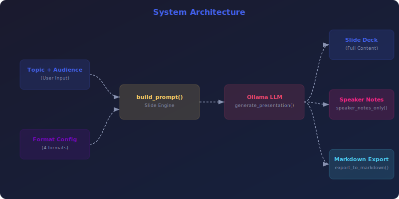

<div align="center">


<br><br>

[](https://python.org)
[](https://ollama.com)
[](LICENSE)
[](https://streamlit.io)
[](CONTRIBUTING.md)
[]()

**Generate Slide Decks with Speaker Notes & Visual Suggestions**

[Quick Start](#-quick-start) •
[Features](#-features) •
[CLI Reference](#-cli-reference) •
[Web UI](#-web-ui) •
[Architecture](#-architecture) •
[API Reference](#-api-reference) •
[Configuration](#%EF%B8%8F-configuration) •
[FAQ](#-faq)

</div>

---

## 📋 Table of Contents

- [Why Presentation Generator?](#-why-presentation-generator)
- [Features](#-features)
- [Quick Start](#-quick-start)
- [CLI Reference](#-cli-reference)
- [Web UI](#-web-ui)
- [Architecture](#-architecture)
- [API Reference](#-api-reference)
- [Configuration](#%EF%B8%8F-configuration)
- [Testing](#-testing)
- [Local vs Cloud LLMs](#-local-vs-cloud-llms)
- [FAQ](#-faq)
- [Contributing](#-contributing)
- [License](#-license)

---

## 🤔 Why Presentation Generator?

> **Project 39 of the [90 Local LLM Projects](https://github.com/kennedyraju55/90-local-llm-projects) series** — building real-world AI tools that run entirely on your local machine.

| ✅ Why This Tool | ❌ The Problem It Solves |
|-----------------|------------------------|
| 📊 Great slides require structure AND creativity | Starting from blank slides causes analysis paralysis |
| 🎤 Speaker notes are critical but often skipped | Writing notes after slides feels redundant |
| ⏱️ Timing makes or breaks a presentation | Guessing duration leads to rushed endings |
| 🎨 Visual suggestions elevate amateur decks | Knowing which chart type to use is a skill gap |


---

## ✨ Features

<div align="center">


</div>

<br>

### 🎬 4 Presentation Formats

Standard, Pecha Kucha (20×20), Lightning Talk, Keynote-style.

### 📑 9 Slide Templates

Title, Agenda, Content, Data, Quote, Comparison, Timeline, Q&A, Closing.

### 🎤 Speaker Notes

3-5 sentence conversational notes per slide for confident delivery.

### 🎨 Visual Suggestions

AI recommends charts, diagrams, hero images, icon grids per slide.

### ⏱️ Timing Estimates

Per-slide and total timing based on format and speaking pace (130 WPM).

### 📄 Markdown Export

Clean markdown output ready for conversion to PowerPoint or Keynote.

---

## 🚀 Quick Start

### Prerequisites

- **Python 3.9+** — [Download](https://www.python.org/downloads/)
- **Ollama** — [Install Ollama](https://ollama.com/download)
- A pulled model (e.g., `ollama pull llama3.1:8b`)

### Installation

```bash
# Clone the repository
git clone https://github.com/kennedyraju55/presentation-generator.git
cd presentation-generator

# Create virtual environment
python -m venv venv
source venv/bin/activate  # Windows: venv\Scripts\activate

# Install dependencies
pip install -r requirements.txt

# Install the package
pip install -e .
```

### Environment Setup

```bash
# Copy environment template
cp .env.example .env

# Edit with your settings
# OLLAMA_HOST=http://localhost:11434
# OLLAMA_MODEL=llama3.1:8b
```

### Your First Run

```bash
presentation-gen generate --topic "Introduction to Machine Learning" --slides 10 --audience "engineering team" --format standard --notes-only
```

<details>
<summary><strong>📋 Example Output</strong> (click to expand)</summary>

```
📊 Presentation Generator - Building your deck...

━━━━━━━━━━━━━━━━━━━━━━━━━━━━━━━━━━━━━━━━
🎬 Format: Standard | Slides: 10 | Audience: Engineering Team
⏱️  Estimated Time: 30m 0s (180s per slide)
━━━━━━━━━━━━━━━━━━━━━━━━━━━━━━━━━━━━━━━━


## 🐳 Docker Deployment

Run this project instantly with Docker — no local Python setup needed!

### Quick Start with Docker

```bash
# Clone and start
git clone https://github.com/kennedyraju55/presentation-generator.git
cd presentation-generator
docker compose up

# Access the web UI
open http://localhost:8501
```

### Docker Commands

| Command | Description |
|---------|-------------|
| `docker compose up` | Start app + Ollama |
| `docker compose up -d` | Start in background |
| `docker compose down` | Stop all services |
| `docker compose logs -f` | View live logs |
| `docker compose build --no-cache` | Rebuild from scratch |

### Architecture

```
┌─────────────────┐     ┌─────────────────┐
│   Streamlit UI  │────▶│   Ollama + LLM  │
│   Port 8501     │     │   Port 11434    │
└─────────────────┘     └─────────────────┘
```

> **Note:** First run will download the Gemma 4 model (~5GB). Subsequent starts are instant.

---


## Slide 1: Title Slide
# Introduction to Machine Learning
### Demystifying AI for Engineering Teams
📊 Visual: Hero image with neural network visualization
🎤 Notes: Welcome everyone. Today we'll demystify ML...

## Slide 2: Agenda
- What is Machine Learning?
- Types of ML (Supervised, Unsupervised, Reinforcement)
- Real-world applications in our stack
- Getting started with your first model
📊 Visual: Icons grid showing agenda items
🎤 Notes: Here's our roadmap for today...

## Slide 3: What is Machine Learning?
- Algorithms that learn from data without explicit programming
- Pattern recognition at scale
- "A computer program learns from experience E..."
📊 Visual: Flow diagram — Data → Model → Predictions
🎤 Notes: At its core, ML is about teaching computers...

✅ Presentation generated (10 slides, standard format)
⏱️  Total estimated time: 30m 0s
```

</details>

---

## 🖥️ CLI Reference

```bash
presentation-gen --help
```

**Global Options:**

| Option | Description | Default |
|--------|-------------|---------|
| `--config` | Path to configuration file | `config.yaml` |
| `--verbose` | Enable debug logging | `False` |


### `presentation-gen generate`

Generate a full presentation.

| Option | Description | Default |
|--------|-------------|----------|
| `--topic` | Presentation topic | `Required` |
| `--slides` | Number of slides | `12` |
| `--audience` | Target audience | `general` |
| `--format` | Format (standard/pecha-kucha/lightning/keynote) | `standard` |
| `--output, -o` | Save output to file | `None` |
| `--notes-only` | Extract speaker notes only | `False` |


### `presentation-gen formats`

List available presentation formats.


### `presentation-gen slide_types`

List available slide templates.


### `presentation-gen timing`

Estimate presentation timing.

| Option | Description | Default |
|--------|-------------|----------|
| `--slides` | Number of slides | `12` |
| `--format` | Format type | `standard` |


---

## 🌐 Web UI

Presentation Generator includes a beautiful **Streamlit** web interface for users who prefer a graphical experience.

### Launch the Web UI

```bash
# Using Streamlit directly
streamlit run src/presentation_gen/web_ui.py

# Or using Make
make web
```

### Web UI Features

- 🎨 **Intuitive Interface** — Clean, modern design with sidebar controls
- ⚡ **Real-time Generation** — Watch content generate with live streaming
- 📋 **Copy & Export** — One-click copy to clipboard or download as file
- 🔧 **All CLI Options** — Every CLI feature available through dropdowns and toggles
- 📱 **Responsive Design** — Works on desktop and mobile browsers

> **Tip:** The Web UI runs at `http://localhost:8501` by default. Share it on your local network for team access.

---

## 🏗️ Architecture

<div align="center">



</div>

### How It Works

1. **Input Processing** — Raw input is loaded and validated
2. **Prompt Engineering** — `build_prompt()` constructs an optimized prompt with context-specific instructions
3. **LLM Generation** — The prompt is sent to Ollama with a specialized system prompt: *"Presentation design expert & public speaking coach"*
4. **Post-Processing** — Output is formatted, validated, and optionally exported
5. **Storage** — Results are saved for future reference and iteration

### Project Structure

```
39-presentation-generator/
├── src/
│   └── presentation_gen/
│       ├── __init__.py
│       ├── core.py          # Slide engine, formats, timing, visual suggestions
│       ├── cli.py           # Click CLI with 4 commands
│       └── web_ui.py        # Streamlit web interface
├── tests/
│   └── test_core.py         # Unit tests
├── docs/
│   └── images/
│       ├── banner.svg       # Project banner
│       ├── architecture.svg # System architecture
│       └── features.svg     # Feature showcase
├── config.yaml              # LLM & presentation configuration
├── setup.py                 # Package installation
├── requirements.txt         # Python dependencies
├── Makefile                 # Build automation
├── .env.example             # Environment template
└── README.md                # This file
```

### Technology Stack

| Component | Technology | Purpose |
|-----------|-----------|---------|
| 🧠 LLM Backend | Ollama | Local model inference (privacy-first) |
| 🐍 Language | Python 3.9+ | Core application logic |
| ⌨️ CLI Framework | Click | Command-line interface with rich help |
| 🌐 Web Framework | Streamlit | Interactive web UI |
| 📊 Output | Rich | Beautiful terminal formatting |
| ⚙️ Config | YAML | Flexible configuration management |
| 📦 Packaging | setuptools | pip-installable package |

---

## 📚 API Reference

All functions are importable from `presentation_gen.core`:

```python
from presentation_gen.core import *
```

#### `load_config(config_path: Optional[str] = None)` → `dict`

Loads YAML configuration, deep-merges with defaults.

```python
from presentation_gen.core import load_config

result = load_config(config_path)
```

---

#### `get_formats()` → `dict`

Returns all 4 presentation format definitions.

```python
from presentation_gen.core import get_formats

result = get_formats()
```

---

#### `get_slide_templates()` → `dict`

Returns all 9 slide template definitions.

```python
from presentation_gen.core import get_slide_templates

result = get_slide_templates()
```

---

#### `get_visual_suggestions()` → `dict`

Returns all 8 visual suggestion types.

```python
from presentation_gen.core import get_visual_suggestions

result = get_visual_suggestions()
```

---

#### `estimate_timing(slides: int, format_type: str, config=None)` → `dict`

Calculates total time, per-slide time, formatted string.

```python
from presentation_gen.core import estimate_timing

result = estimate_timing(slides)
```

---

#### `build_prompt(topic, slides, audience, format_type)` → `str`

Constructs presentation generation prompt with slide templates.

```python
from presentation_gen.core import build_prompt

result = build_prompt(topic)
```

---

#### `generate_presentation(topic, slides, audience, format_type, config=None)` → `str`

Generates full presentation via LLM with design expert system prompt.

```python
from presentation_gen.core import generate_presentation

result = generate_presentation(topic)
```

---

#### `export_to_markdown(content, topic)` → `str`

Exports presentation to clean markdown with header.

```python
from presentation_gen.core import export_to_markdown

result = export_to_markdown(content)
```

---

#### `generate_speaker_notes_only(content)` → `str`

Extracts speaker notes from presentation for practice.

```python
from presentation_gen.core import generate_speaker_notes_only

result = generate_speaker_notes_only(content)
```

---


---

## ⚙️ Configuration

### config.yaml

```yaml
llm:
  model: "llama3.1:8b"        # Ollama model name
  temperature: 0.7            # Creativity (0.0-1.0)
  max_tokens: 4096           # Maximum output length
  host: "http://localhost:11434"  # Ollama server URL
```

### Environment Variables

| Variable | Description | Default |
|----------|-------------|---------|
| `OLLAMA_HOST` | Ollama server URL | `http://localhost:11434` |
| `OLLAMA_MODEL` | Default model name | `llama3.1:8b` |

### Configuration Priority

```
CLI flags → Environment variables → config.yaml → Built-in defaults
```

---

## 🧪 Testing

```bash
# Run all tests
python -m pytest tests/ -v

# Run with coverage
python -m pytest tests/ --cov=presentation_gen --cov-report=term-missing

# Run specific test file
python -m pytest tests/test_core.py -v

# Using Make
make test
```

---

## ☁️ Local vs Cloud LLMs

| Aspect | 🏠 Local (Ollama) | ☁️ Cloud (OpenAI/etc.) |
|--------|-------------------|----------------------|
| **Privacy** | ✅ Data never leaves your machine | ❌ Data sent to third-party servers |
| **Cost** | ✅ Free after hardware investment | ❌ Per-token pricing adds up |
| **Speed** | ⚡ No network latency | 🌐 Depends on internet speed |
| **Availability** | ✅ Works offline, always available | ❌ Requires internet, may have outages |
| **Models** | 🔄 Growing selection (Llama, Mistral) | ✅ Latest models (GPT-4, Claude) |
| **Quality** | 🟡 Good for most tasks | ✅ State-of-the-art for complex tasks |
| **Setup** | 🔧 One-time Ollama install | ✅ API key and go |
| **Customization** | ✅ Fine-tune your own models | 🟡 Limited to provider options |

> **Our recommendation:** Start with local models for development and privacy-sensitive content. Switch to cloud only if you need cutting-edge model quality for production.

---

## ❓ FAQ

<details>
<summary><strong>What's the difference between presentation formats?</strong></summary>
<br>

**Standard**: 180s/slide, typical business presentation. **Pecha Kucha**: 20 slides × 20s, fast-paced. **Lightning**: 5-min talk with 60s/slide. **Keynote**: 300s/slide, deep-dive TED-style.

</details>

<details>
<summary><strong>Can I convert the output to PowerPoint?</strong></summary>
<br>

Yes! The markdown output can be converted to PPTX using tools like `pandoc`, `Marp`, or `md2pptx`. The slide structure maps cleanly to presentation software.

</details>

<details>
<summary><strong>How does the timing estimation work?</strong></summary>
<br>

Timing is calculated based on format-specific seconds-per-slide values and a default speaking pace of 130 words per minute. Use the `timing` command for quick estimates.

</details>

<details>
<summary><strong>Can I customize slide templates?</strong></summary>
<br>

Yes. Modify `SLIDE_TEMPLATES` in `core.py` to add custom slide types. Each template defines a name, description, and content structure that guides the LLM.

</details>

<details>
<summary><strong>Does it support team collaboration?</strong></summary>
<br>

The markdown output is version-control friendly. Store presentations in Git, collaborate via pull requests, and use the Web UI for non-technical team members.

</details>


---

## 🤝 Contributing

Contributions are welcome! Here's how to get started:

1. **Fork** the repository
2. **Create** a feature branch (`git checkout -b feature/amazing-feature`)
3. **Commit** your changes (`git commit -m 'Add amazing feature'`)
4. **Push** to the branch (`git push origin feature/amazing-feature`)
5. **Open** a Pull Request

### Development Setup

```bash
# Clone your fork
git clone https://github.com/YOUR_USERNAME/presentation-generator.git
cd presentation-generator

# Install dev dependencies
pip install -r requirements.txt
pip install -e ".[dev]"

# Run tests before submitting
python -m pytest tests/ -v
```

### Code Style

- Follow **PEP 8** for Python code
- Use **type hints** for function signatures
- Write **docstrings** for all public functions
- Add **tests** for new features

---

## 📄 License

This project is licensed under the **MIT License** — see the [LICENSE](LICENSE) file for details.

---

<div align="center">

### 🌟 Part of the [90 Local LLM Projects](https://github.com/kennedyraju55/90-local-llm-projects) Series

*Building real-world AI tools that run entirely on your local machine.*

**Project 39 of 90** — 📊 Presentation Generator

[⬅️ Previous Project](../README.md) •
[📋 All Projects](https://github.com/kennedyraju55/90-local-llm-projects) •
[➡️ Next Project](../README.md)

---

<sub>Built with ❤️ using Ollama & Python | Star ⭐ if you find this useful!</sub>

</div>
