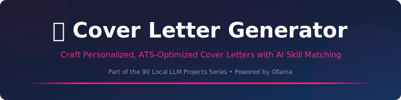
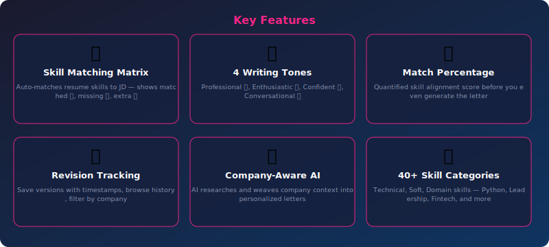
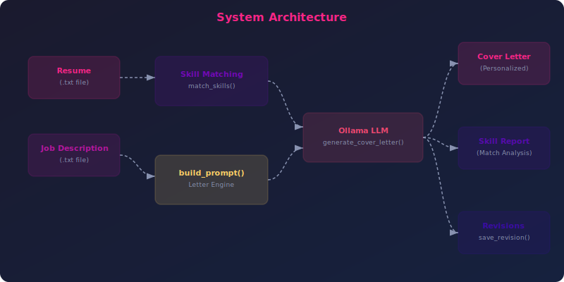

<div align="center">



<br><br>

[](https://python.org)
[](https://ollama.com)
[](LICENSE)
[](https://streamlit.io)
[](CONTRIBUTING.md)

**Craft Personalized, ATS-Optimized Cover Letters with AI Skill Matching**

[Quick Start](#-quick-start) •
[Features](#-features) •
[CLI Reference](#-cli-reference) •
[Web UI](#-web-ui) •
[Architecture](#-architecture) •
[API Reference](#-api-reference) •
[Configuration](#%EF%B8%8F-configuration) •
[FAQ](#-faq)

</div>

---

## 📋 Table of Contents

- [Why Cover Letter Generator?](#-why-cover-letter-generator)
- [Features](#-features)
- [Quick Start](#-quick-start)
- [CLI Reference](#-cli-reference)
- [Web UI](#-web-ui)
- [Architecture](#-architecture)
- [API Reference](#-api-reference)
- [Configuration](#%EF%B8%8F-configuration)
- [Testing](#-testing)
- [Local vs Cloud LLMs](#-local-vs-cloud-llms)
- [FAQ](#-faq)
- [Contributing](#-contributing)
- [License](#-license)

---

## 🤔 Why Cover Letter Generator?

> **Project 40 of the [90 Local LLM Projects](https://github.com/kennedyraju55/90-local-llm-projects) series** — building real-world AI tools that run entirely on your local machine.

| ✅ Why This Tool | ❌ The Problem It Solves |
|-----------------|------------------------|
| 💼 Personalized cover letters get 50% more interviews | Generic templates get filtered by ATS systems |
| 🎯 Skill matching reveals your real alignment | Guessing which skills to highlight wastes space |
| 🏢 Company-specific letters show genuine interest | Copy-paste letters are obvious to recruiters |
| 📝 Revision tracking lets you iterate to perfection | Losing track of versions causes confusion |


---

## ✨ Features

<div align="center">



</div>

<br>

### 🎯 Skill Matching Matrix

Auto-matches resume skills to JD — shows matched ✅, missing ❌, extra 💡.

### 🎨 4 Writing Tones

Professional 👔, Enthusiastic 🔥, Confident 💪, Conversational 💬.

### 📊 Match Percentage

Quantified skill alignment score before you even generate the letter.

### 📝 Revision Tracking

Save versions with timestamps, browse history, filter by company.

### 🏢 Company-Aware AI

AI researches and weaves company context into personalized letters.

### 🔍 40+ Skill Categories

Technical, Soft, Domain skills — Python, Leadership, Fintech, and more.

---

## 🚀 Quick Start

### Prerequisites

- **Python 3.9+** — [Download](https://www.python.org/downloads/)
- **Ollama** — [Install Ollama](https://ollama.com/download)
- A pulled model (e.g., `ollama pull llama3.1:8b`)

### Installation

```bash
# Clone the repository
git clone https://github.com/kennedyraju55/cover-letter-generator.git
cd cover-letter-generator

# Create virtual environment
python -m venv venv
source venv/bin/activate  # Windows: venv\Scripts\activate

# Install dependencies
pip install -r requirements.txt

# Install the package
pip install -e .
```

### Environment Setup

```bash
# Copy environment template
cp .env.example .env

# Edit with your settings
# OLLAMA_HOST=http://localhost:11434
# OLLAMA_MODEL=llama3.1:8b
```

### Your First Run

```bash
cover-letter-gen generate --resume resume.txt --job-description jd.txt --company "Google" --tone confident --name "Alex Chen" --show-skills
```

<details>
<summary><strong>📋 Example Output</strong> (click to expand)</summary>

```
💼 Cover Letter Generator - Analyzing & Generating...

━━━━━━━━━━━━━━━━━━━━━━━━━━━━━━━━━━━━━━━━
🎯 Skill Matching Analysis
━━━━━━━━━━━━━━━━━━━━━━━━━━━━━━━━━━━━━━━━

✅ Matched Skills:
  Technical: Python, JavaScript, React, AWS, Docker
  Soft: Leadership, Communication, Problem-solving
  Domain: SaaS, B2B

❌ Missing from Resume:
  Technical: Kubernetes, Terraform
  Domain: Enterprise

💡 Extra Skills (highlight these!):
  Technical: ML/AI, Node.js
  Soft: Mentoring

📊 Overall Match: 78%

━━━━━━━━━━━━━━━━━━━━━━━━━━━━━━━━━━━━━━━━
💼 Generated Cover Letter (Confident Tone)
━━━━━━━━━━━━━━━━━━━━━━━━━━━━━━━━━━━━━━━━

Dear Google Hiring Team,

In three years, I transformed a startup's MVP into a platform
serving 2M+ users — and I'm ready to bring that same...

...My track record speaks through metrics: 40% reduction
in deployment time through CI/CD pipeline optimization,
98.5% uptime across distributed microservices...

Sincerely,
Alex Chen

✅ Cover letter generated (387 words, confident tone)
📊 Match: 78% | 📝 Saved as revision v1
```

</details>

---

## 🖥️ CLI Reference

```bash
cover-letter-gen --help
```

**Global Options:**

| Option | Description | Default |
|--------|-------------|---------|
| `--config` | Path to configuration file | `config.yaml` |
| `--verbose` | Enable debug logging | `False` |


### `cover-letter-gen generate`

Generate a personalized cover letter.

| Option | Description | Default |
|--------|-------------|----------|
| `--resume` | Path to resume text file | `Required` |
| `--job-description` | Path to job description text file | `Required` |
| `--company` | Company name | `Required` |
| `--tone` | Writing tone (professional/enthusiastic/confident/conversational) | `professional` |
| `--name` | Your name | `None` |
| `--output, -o` | Save output to file | `None` |
| `--show-skills` | Show skill matching analysis | `False` |


### `cover-letter-gen tones`

List available writing tones.


### `cover-letter-gen revisions`

List saved revision history.

| Option | Description | Default |
|--------|-------------|----------|
| `--company` | Filter by company name | `None` |


### `cover-letter-gen skills`

Analyze skill match between resume and JD.

| Option | Description | Default |
|--------|-------------|----------|
| `--resume` | Path to resume file | `Required` |
| `--job-description` | Path to job description file | `Required` |


---

## 🌐 Web UI

Cover Letter Generator includes a beautiful **Streamlit** web interface for users who prefer a graphical experience.

### Launch the Web UI

```bash
# Using Streamlit directly
streamlit run src/cover_letter_gen/web_ui.py

# Or using Make
make web
```

### Web UI Features

- 🎨 **Intuitive Interface** — Clean, modern design with sidebar controls
- ⚡ **Real-time Generation** — Watch content generate with live streaming
- 📋 **Copy & Export** — One-click copy to clipboard or download as file
- 🔧 **All CLI Options** — Every CLI feature available through dropdowns and toggles
- 📱 **Responsive Design** — Works on desktop and mobile browsers

> **Tip:** The Web UI runs at `http://localhost:8501` by default. Share it on your local network for team access.

---

## 🏗️ Architecture

<div align="center">



</div>

### How It Works

1. **Input Processing** — Raw input is loaded and validated
2. **Prompt Engineering** — `build_prompt()` constructs an optimized prompt with context-specific instructions
3. **LLM Generation** — The prompt is sent to Ollama with a specialized system prompt: *"Professional career coach & expert cover letter writer"*
4. **Post-Processing** — Output is formatted, validated, and optionally exported
5. **Storage** — Results are saved for future reference and iteration

### Project Structure

```
40-cover-letter-generator/
├── src/
│   └── cover_letter_gen/
│       ├── __init__.py
│       ├── core.py          # Skill matching, letter engine, revision system
│       ├── cli.py           # Click CLI with 4 commands
│       └── web_ui.py        # Streamlit web interface
├── tests/
│   └── test_core.py         # Unit tests
├── docs/
│   └── images/
│       ├── banner.svg       # Project banner
│       ├── architecture.svg # System architecture
│       └── features.svg     # Feature showcase
├── config.yaml              # LLM & cover letter configuration
├── setup.py                 # Package installation
├── requirements.txt         # Python dependencies
├── Makefile                 # Build automation
├── .env.example             # Environment template
└── README.md                # This file
```

### Technology Stack

| Component | Technology | Purpose |
|-----------|-----------|---------|
| 🧠 LLM Backend | Ollama | Local model inference (privacy-first) |
| 🐍 Language | Python 3.9+ | Core application logic |
| ⌨️ CLI Framework | Click | Command-line interface with rich help |
| 🌐 Web Framework | Streamlit | Interactive web UI |
| 📊 Output | Rich | Beautiful terminal formatting |
| ⚙️ Config | YAML | Flexible configuration management |
| 📦 Packaging | setuptools | pip-installable package |

---

## 📚 API Reference

All functions are importable from `cover_letter_gen.core`:

```python
from cover_letter_gen.core import *
```

#### `load_config(config_path: Optional[str] = None)` → `dict`

Loads YAML configuration, deep-merges with defaults.

```python
from cover_letter_gen.core import load_config

result = load_config(config_path)
```

---

#### `get_tones()` → `dict`

Returns all 4 tone definitions with descriptions and icons.

```python
from cover_letter_gen.core import get_tones

result = get_tones()
```

---

#### `read_file(filepath: str, label: str = 'File')` → `str`

Reads content from text file with error handling.

```python
from cover_letter_gen.core import read_file

result = read_file(filepath)
```

---

#### `extract_skills(text: str)` → `dict`

Extracts and categorizes skills (technical, soft, domain) from text.

```python
from cover_letter_gen.core import extract_skills

result = extract_skills(text)
```

---

#### `match_skills(resume_text: str, jd_text: str)` → `dict`

Creates skill matching matrix: matched, missing, extra, match_percentage.

```python
from cover_letter_gen.core import match_skills

result = match_skills(resume_text)
```

---

#### `build_prompt(resume, job_description, company, tone, name=None, skill_match=None)` → `str`

Constructs personalized cover letter prompt with skill analysis.

```python
from cover_letter_gen.core import build_prompt

result = build_prompt(resume)
```

---

#### `generate_cover_letter(resume, job_description, company, tone, name=None, skill_match=None, config=None)` → `str`

Generates cover letter via LLM with career coach system prompt.

```python
from cover_letter_gen.core import generate_cover_letter

result = generate_cover_letter(resume)
```

---

#### `save_revision(content, company, revision_num, config=None)` → `str`

Saves revision with version number and timestamp.

```python
from cover_letter_gen.core import save_revision

result = save_revision(content)
```

---

#### `list_revisions(company=None, config=None)` → `list[dict]`

Lists saved revisions, optionally filtered by company.

```python
from cover_letter_gen.core import list_revisions

result = list_revisions(company)
```

---


---

## ⚙️ Configuration

### config.yaml

```yaml
llm:
  model: "llama3.1:8b"        # Ollama model name
  temperature: 0.7            # Creativity (0.0-1.0)
  max_tokens: 2048           # Maximum output length
  host: "http://localhost:11434"  # Ollama server URL
```

### Environment Variables

| Variable | Description | Default |
|----------|-------------|---------|
| `OLLAMA_HOST` | Ollama server URL | `http://localhost:11434` |
| `OLLAMA_MODEL` | Default model name | `llama3.1:8b` |

### Configuration Priority

```
CLI flags → Environment variables → config.yaml → Built-in defaults
```

---

## 🧪 Testing

```bash
# Run all tests
python -m pytest tests/ -v

# Run with coverage
python -m pytest tests/ --cov=cover_letter_gen --cov-report=term-missing

# Run specific test file
python -m pytest tests/test_core.py -v

# Using Make
make test
```

---

## ☁️ Local vs Cloud LLMs

| Aspect | 🏠 Local (Ollama) | ☁️ Cloud (OpenAI/etc.) |
|--------|-------------------|----------------------|
| **Privacy** | ✅ Data never leaves your machine | ❌ Data sent to third-party servers |
| **Cost** | ✅ Free after hardware investment | ❌ Per-token pricing adds up |
| **Speed** | ⚡ No network latency | 🌐 Depends on internet speed |
| **Availability** | ✅ Works offline, always available | ❌ Requires internet, may have outages |
| **Models** | 🔄 Growing selection (Llama, Mistral) | ✅ Latest models (GPT-4, Claude) |
| **Quality** | 🟡 Good for most tasks | ✅ State-of-the-art for complex tasks |
| **Setup** | 🔧 One-time Ollama install | ✅ API key and go |
| **Customization** | ✅ Fine-tune your own models | 🟡 Limited to provider options |

> **Our recommendation:** Start with local models for development and privacy-sensitive content. Switch to cloud only if you need cutting-edge model quality for production.

---

## ❓ FAQ

<details>
<summary><strong>How does skill matching work?</strong></summary>
<br>

The system scans both your resume and the job description for 40+ predefined skills across 3 categories (technical, soft, domain). It then creates a matrix showing matched ✅, missing ❌, and extra 💡 skills with an overall match percentage.

</details>

<details>
<summary><strong>What's the ideal match percentage?</strong></summary>
<br>

70%+ is a strong match. 50-70% means you should address gaps creatively in your letter. Below 50% — consider upskilling first. The AI will highlight your transferable skills regardless.

</details>

<details>
<summary><strong>Can I use PDF resumes?</strong></summary>
<br>

Currently, the tool accepts `.txt` files. Convert your PDF to text using `pdftotext` or paste the content. This ensures clean text extraction without formatting artifacts.

</details>

<details>
<summary><strong>How does revision tracking work?</strong></summary>
<br>

Each generated letter is saved with the company name, version number, and timestamp (e.g., `google_v1_20240115.md`). Use `cover-letter-gen revisions --company Google` to browse your history.

</details>

<details>
<summary><strong>Does the AI actually research the company?</strong></summary>
<br>

The AI uses the company name and any context from the job description to weave in company-specific references. For best results, include the company's mission or recent news in your job description file.

</details>


---

## 🤝 Contributing

Contributions are welcome! Here's how to get started:

1. **Fork** the repository
2. **Create** a feature branch (`git checkout -b feature/amazing-feature`)
3. **Commit** your changes (`git commit -m 'Add amazing feature'`)
4. **Push** to the branch (`git push origin feature/amazing-feature`)
5. **Open** a Pull Request

### Development Setup

```bash
# Clone your fork
git clone https://github.com/YOUR_USERNAME/cover-letter-generator.git
cd cover-letter-generator

# Install dev dependencies
pip install -r requirements.txt
pip install -e ".[dev]"

# Run tests before submitting
python -m pytest tests/ -v
```

### Code Style

- Follow **PEP 8** for Python code
- Use **type hints** for function signatures
- Write **docstrings** for all public functions
- Add **tests** for new features

---

## 📄 License

This project is licensed under the **MIT License** — see the [LICENSE](LICENSE) file for details.

---

<div align="center">

### 🌟 Part of the [90 Local LLM Projects](https://github.com/kennedyraju55/90-local-llm-projects) Series

*Building real-world AI tools that run entirely on your local machine.*

**Project 40 of 90** — 💼 Cover Letter Generator

[⬅️ Previous Project](../README.md) •
[📋 All Projects](https://github.com/kennedyraju55/90-local-llm-projects) •
[➡️ Next Project](../README.md)

---

<sub>Built with ❤️ using Ollama & Python | Star ⭐ if you find this useful!</sub>

</div>
