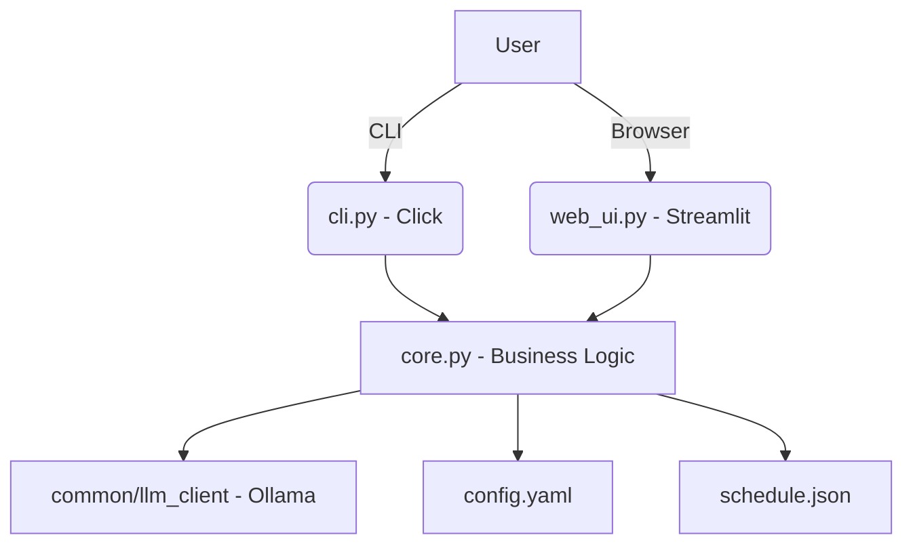

# 📅 Smart Calendar Assistant


> **AI-powered schedule optimization, conflict detection, and productivity analysis** using a local LLM via Ollama. Includes a rich CLI **and** a Streamlit web UI.

---

## 🏗️ Architecture



---

## ✨ Features

| Feature | Description |
|---------|-------------|
| 📅 **Schedule Viewer** | Beautiful table display of events with priority badges |
| ✨ **AI Optimization** | LLM-powered schedule rearrangement suggestions |
| 💡 **Meeting Suggester** | Find the best available time slots for new meetings |
| 📊 **Workload Analysis** | AI-driven evaluation of work-life balance |
| ⚠️ **Conflict Detection** | Automatic detection of overlapping events |
| 🏆 **Priority Scoring** | Multi-factor priority ranking (label + attendees + duration) |
| 📋 **Daily Agenda** | Filtered & sorted agenda for any date |
| 🌍 **Timezone Support** | Convert events across IANA timezones |
| 🖥️ **Web UI** | Full-featured Streamlit dashboard |
| ⚙️ **Config-driven** | YAML configuration for all settings |

---

## 📦 Installation

### Prerequisites

- **Python 3.10+**
- **[Ollama](https://ollama.ai/)** running locally
  ```bash
  ollama serve
  ollama pull llama3
  ```

### Quick Start

```bash
# Clone & enter the project
cd 61-smart-calendar-assistant

# Install with pip
pip install -e ".[dev]"

# Or install dependencies only
pip install -r requirements.txt
```

### Using Make

```bash
make install    # Install in editable mode with dev deps
make test       # Run test suite
make lint       # Compile-check core modules
make run-cli    # Launch CLI
make run-web    # Launch Streamlit web UI
make clean      # Remove build artifacts
```

---

## 🖥️ CLI Usage

The CLI uses Click subcommands. Pass `--schedule` / `-s` before the subcommand to load events.

### View schedule

```bash
python -m calendar_assistant.cli -s schedule.json view
```

### Optimize schedule (AI)

```bash
python -m calendar_assistant.cli -s schedule.json optimize
```

### Suggest meeting time (AI)

```bash
python -m calendar_assistant.cli -s schedule.json suggest --duration 45 --attendees "Alice, Bob"
```

### Analyze workload (AI)

```bash
python -m calendar_assistant.cli -s schedule.json workload
```

### Detect conflicts

```bash
python -m calendar_assistant.cli -s schedule.json conflicts --timezone America/New_York
```

### Daily agenda

```bash
python -m calendar_assistant.cli -s schedule.json agenda --date 2025-01-15
```

### Priority ranking

```bash
python -m calendar_assistant.cli -s schedule.json priority
```

---

## 🌐 Web UI

Launch the Streamlit dashboard:

```bash
streamlit run src/calendar_assistant/web_ui.py
```

The web UI provides:

- **Calendar View** — Browse all events with priority badges
- **Add Event** — Form to create new events
- **Daily Agenda** — Date picker with sorted agenda
- **Optimization** — AI schedule optimization & meeting suggestions
- **Conflict Detection** — One-click overlap finder
- **Workload Analysis** — AI productivity insights

Upload a `schedule.json` from the sidebar to get started.

---

## ⚙️ Configuration

All settings live in `config.yaml`:

```yaml
app:
  name: "Smart Calendar Assistant"
  version: "1.0.0"
  log_level: "INFO"
  data_dir: "./data"

calendar:
  default_timezone: "UTC"
  working_hours:
    start: "09:00"
    end: "17:00"
  break_duration_minutes: 15
  min_meeting_gap_minutes: 10
  priority_levels:
    critical: 5
    high: 4
    medium: 3
    low: 2
    optional: 1

llm:
  model: "llama3"
  temperature: 0.6
  system_prompt: "You are an expert calendar and productivity assistant."
```

Environment variables can also be set via `.env` (see `.env.example`).

---

## 📂 Project Structure

```
61-smart-calendar-assistant/
├── src/
│   └── calendar_assistant/
│       ├── __init__.py        # Package metadata & version
│       ├── core.py            # Business logic (schedule, conflicts, priority, agenda)
│       ├── cli.py             # Click CLI interface
│       └── web_ui.py          # Streamlit web dashboard
├── tests/
│   ├── __init__.py
│   └── test_core.py           # Comprehensive test suite
├── config.yaml                # Application configuration
├── setup.py                   # Package setup (pip install -e .)
├── requirements.txt           # Python dependencies
├── Makefile                   # Dev shortcuts
├── .env.example               # Environment variable template
└── README.md                  # This file
```

---

## 📝 Schedule JSON Format

```json
[
  {
    "title": "Team Standup",
    "start": "2025-01-15T09:00",
    "end": "2025-01-15T09:30",
    "priority": "high",
    "attendees": ["Alice", "Bob"],
    "location": "Room 42",
    "description": "Daily sync"
  }
]
```

---

## 🧪 Testing

```bash
# Run all tests
pytest tests/ -v

# With coverage
pytest tests/ -v --cov=calendar_assistant --cov-report=term-missing
```

---

## 🤝 Contributing

Contributions are welcome! Please follow these steps:

1. **Fork** the repository
2. **Create** a feature branch (`git checkout -b feature/amazing-feature`)
3. **Commit** your changes (`git commit -m 'Add amazing feature'`)
4. **Push** to the branch (`git push origin feature/amazing-feature`)
5. **Open** a Pull Request

Please ensure all tests pass before submitting.

---

## 📄 License

This project is licensed under the **MIT License**. See [LICENSE](LICENSE) for details.
