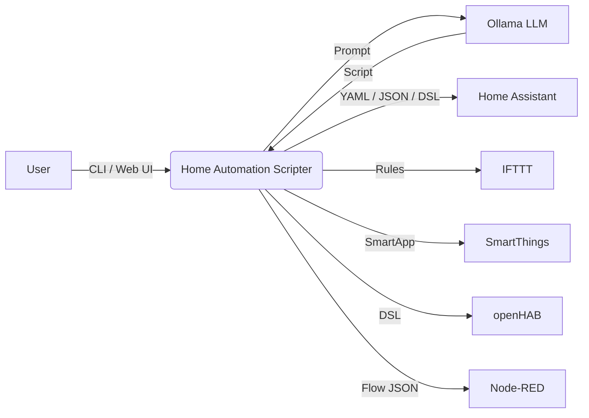

# 🏠 Home Automation Scripter

> Generate production-ready home automation scripts from natural language using a local LLM via Ollama.

---

## ✨ Features

- 🗣️ **Natural Language Rules** — describe automations in plain English
- 🌐 **Multi-Platform** — Home Assistant, IFTTT, SmartThings, openHAB, Node-RED
- 📦 **Template Library** — 6+ pre-built templates (motion lights, thermostat schedules, security alerts, …)
- ✅ **Script Validation** — platform-aware syntax checks
- 🔍 **Script Explainer** — understand existing automation scripts
- 💡 **Smart Suggestions** — get automation ideas based on your devices
- 💾 **Rule Storage** — save, list, and delete generated rules
- 🖥️ **Web UI** — Streamlit dashboard for visual rule building
- ⏰ **Scheduling Support** — cron-format scheduling configuration
- 🎨 **Rich CLI** — syntax-highlighted output with tables and panels

---

## 🏗️ Architecture

```
66-home-automation-scripter/
├── src/home_automation/
│   ├── __init__.py          # Package metadata & version
│   ├── core.py              # Business logic, templates, validation
│   ├── cli.py               # Click CLI interface
│   └── web_ui.py            # Streamlit web dashboard
├── tests/
│   ├── __init__.py
│   └── test_core.py         # Pytest test suite
├── config.yaml              # Runtime configuration
├── setup.py                 # Packaging & entry-points
├── Makefile                 # Dev shortcuts
├── .env.example             # Environment variables template
├── requirements.txt         # Python dependencies
└── README.md                # This file
```



---

## 🚀 Installation

### From Source

```bash
git clone <repo-url>
cd 66-home-automation-scripter
pip install -r requirements.txt
```

### As a Package

```bash
pip install -e .
```

### Prerequisites

- Python 3.10+
- [Ollama](https://ollama.ai/) running locally with a supported model (e.g. `llama3.2`)

---

## 💻 CLI Usage

All commands support `--verbose` for debug logging and `--config` to specify a custom config file.

### Generate an Automation Script

```bash
home-automation generate --rule "turn off lights at 11pm" --platform homeassistant
home-automation generate --rule "adjust thermostat when nobody is home" --platform ifttt --save
home-automation generate -r "lock doors at midnight" -p smartthings -o script.yaml
```

### Explain a Script

```bash
home-automation explain --script automation.yaml --platform homeassistant
home-automation explain -s "automation:\n  alias: test" -p openhab
```

### Get Suggestions

```bash
home-automation suggest --devices "lights, thermostat, motion sensor, door lock"
```

### List Saved Rules

```bash
home-automation list
```

### Browse Templates

```bash
home-automation templates
home-automation templates --category lighting
```

### Delete a Rule

```bash
home-automation delete --id 3
```

---

## 🖥️ Web UI

Launch the Streamlit dashboard:

```bash
streamlit run src/home_automation/web_ui.py
```

The web UI provides four pages:

| Page | Description |
|------|-------------|
| **Rule Builder** | Enter a rule in plain English, generate & validate scripts, save rules |
| **Template Browser** | Browse pre-built templates by category, fill parameters, generate |
| **Saved Rules** | View all saved rules in a table, delete unwanted rules |
| **Script Explainer** | Paste an existing script and get a plain-English explanation |

> If Ollama is not running the UI falls back to **mock mode** so you can still explore the interface.

---

## ⚙️ Configuration

Edit `config.yaml` to customise behaviour:

```yaml
llm:
  model: "llama3.2"
  temperature: 0.4
  max_tokens: 2000

platforms:
  - homeassistant
  - ifttt
  - smartthings
  - openhab
  - nodered

default_platform: "homeassistant"
rules_file: "automation_rules.json"

logging:
  level: "INFO"
  file: "home_automation.log"

scheduling:
  enabled: false
  cron_format: true
```

Environment variables (see `.env.example`):

| Variable | Default | Description |
|----------|---------|-------------|
| `OLLAMA_HOST` | `http://localhost:11434` | Ollama API endpoint |
| `OLLAMA_MODEL` | `llama3.2` | LLM model name |
| `LOG_LEVEL` | `INFO` | Logging verbosity |
| `HOME_AUTOMATION_CONFIG` | `config.yaml` | Config file path |

---

## 📦 Template Library

Pre-built templates you can use out of the box:

| Template | Category | Description |
|----------|----------|-------------|
| `motion_light` | lighting | Turn on light on motion, off after delay |
| `thermostat_schedule` | climate | Set temperature by time of day |
| `security_alert` | security | Notify when door opens while away |
| `good_morning` | routine | Morning routine: lights, thermostat, briefing |
| `energy_saver` | energy | Turn off devices when no one is home |
| `bedtime` | routine | Dim lights, lock doors, lower temperature |

Use via CLI: `home-automation templates` or via the Web UI Template Browser.

---

## 📚 API Reference

### `core.py` — Key Functions

| Function | Description |
|----------|-------------|
| `load_config(path)` | Load YAML config with defaults |
| `load_rules(config)` | Load saved rules from JSON |
| `save_rule(rule, config)` | Persist a new rule |
| `delete_rule(rule_id, config)` | Delete a rule by ID |
| `validate_script(script, platform)` | Validate script syntax |
| `generate_automation(rule, platform, config)` | Generate script via LLM |
| `explain_automation(script, platform, config)` | Explain script via LLM |
| `suggest_automations(devices, config)` | Suggest automations via LLM |
| `list_templates(category)` | List available templates |
| `get_template(template_id)` | Get template details |
| `get_template_categories()` | List template categories |
| `generate_from_template(id, platform, params)` | Render a template |

---

## 🧪 Testing

```bash
python -m pytest tests/ -v
```

Tests mock the LLM client so no running Ollama instance is required.

---

## 🤝 Contributing

1. Fork the repository
2. Create a feature branch (`git checkout -b feature/amazing-feature`)
3. Make your changes and add tests
4. Run the test suite (`python -m pytest tests/ -v`)
5. Commit your changes (`git commit -m 'Add amazing feature'`)
6. Push to the branch (`git push origin feature/amazing-feature`)
7. Open a Pull Request

---

## 📄 License

This project is licensed under the MIT License.
